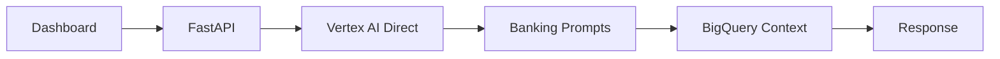
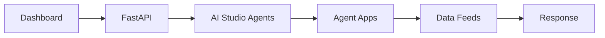

# Google AI Studio Integration Option

## Current vs AI Studio Comparison

### Current Implementation (Recommended)


### AI Studio Alternative


## If You Want to Try AI Studio

### Steps to Integrate:
1. **Create Agent in AI Studio**
   - Go to https://aistudio.google.com/
   - Create new conversational agent
   - Upload banking knowledge base

2. **Modify Backend to Use AI Studio**
   ```python
   # Instead of direct Vertex AI calls
   # Use AI Studio API endpoints
   ```

3. **Benefits of AI Studio**
   - Pre-built agent templates
   - Easy knowledge base management
   - Built-in conversation flows
   - Visual agent builder

4. **Drawbacks**
   - Less control over responses
   - Separate management interface
   - May not access BigQuery as seamlessly

## Recommendation for Hackathon

**Stick with current approach** because:
- ✅ Already working end-to-end
- ✅ More technical depth
- ✅ Better banking-specific integration
- ✅ Live data context from BigQuery
- ✅ Judges will see custom implementation vs template usage

## Quick Test: Current AI Features Working

Try these commands to see your conversational AI in action:

```bash
# Test banking chat agent
curl -X POST \
  -H "Content-Type: application/json" \
  -d '{"message": "What should I recommend to a high net worth client?"}' \
  https://apialchemistproject-backend-608187465720.us-central1.run.app/chat

# Test NBA recommendations
curl https://apialchemistproject-backend-608187465720.us-central1.run.app/nba

# Test message drafting
curl -X POST \
  -H "Content-Type: application/json" \
  -d '{"context": "portfolio review for wealthy client"}' \
  https://apialchemistproject-backend-608187465720.us-central1.run.app/draft
```
