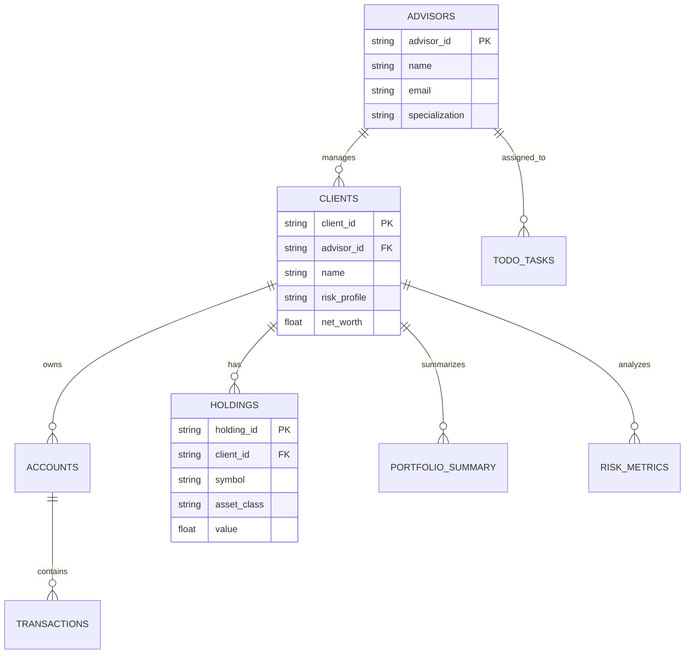

# API Reference & Database Schema Guide

## 🔗 Complete API Endpoints Reference

### Base URL: `https://apialchemistproject-backend-608187465720.us-central1.run.app`

---

## 1. Authentication & Health Checks

### GET `/` - Root Health Check
```bash
curl https://apialchemistproject-backend-608187465720.us-central1.run.app/
```
**Response:**
```json
{
    "message": "Private Banking Advisor Copilot backend is running"
}
```

### GET `/auth-check` - Authentication Verification
```bash
curl https://apialchemistproject-backend-608187465720.us-central1.run.app/auth-check
```
**Response:**
```json
{
    "status": "authenticated",
    "message": "Backend authentication successful",
    "project_id": "apialchemists-1-47b9",
    "timestamp": "2025-08-07"
}
```

---

## 2. Core Banking Features

### GET `/todo` - Daily Task Management
**Purpose**: Fetch and prioritize advisor tasks using AI
**Database**: `todo_tasks` table
**AI Model**: Gemini Pro for task prioritization

```bash
curl https://apialchemistproject-backend-608187465720.us-central1.run.app/todo
```

**Database Query:**
```sql
SELECT task 
FROM `apialchemists-1-47b9.apialchemists.todo_tasks` 
ORDER BY priority ASC 
LIMIT 10
```

**AI Processing:**
```python
prompt = f"Prioritize these tasks for a bank advisor: {', '.join(tasks)}. Return a numbered list."
model = GenerativeModel("gemini-pro")
response = model.generate_content(prompt)
```

**Response Format:**
```json
{
    "todo": [
        "1. Review high-priority client portfolios",
        "2. Prepare quarterly investment reports", 
        "3. Schedule client check-in calls",
        "4. Analyze market trends for recommendations",
        "5. Update compliance documentation"
    ]
}
```

---

### GET `/nba` - Next Best Actions
**Purpose**: AI-powered action recommendations based on client activity
**Database**: `transactions`, `accounts`, `clients` tables (JOINed)
**AI Model**: Gemini Pro for action suggestions

```bash
curl https://apialchemistproject-backend-608187465720.us-central1.run.app/nba
```

**Complex Database Query:**
```sql
SELECT t.transaction_id, t.amount, t.category, t.date, a.client_id 
FROM `apialchemists-1-47b9.apialchemists.transactions` t
JOIN `apialchemists-1-47b9.apialchemists.accounts` a ON t.account_id = a.account_id
ORDER BY t.date DESC 
LIMIT 5
```

**AI Prompt:**
```python
prompt = f"""
Based on recent client activity: {', '.join(recent_activity)}
Suggest 3 next best actions for a private bank advisor.
Format as bullet points.
"""
```

**Response:**
```json
{
    "next_best_actions": [
        "Review client's recent transactions for rebalancing opportunities",
        "Schedule follow-up meeting for portfolio review", 
        "Send personalized market update email to top clients"
    ]
}
```

---

### POST `/draft-message` - Message Generation
**Purpose**: AI-generated professional client communications
**Database**: `clients` table for personalization
**AI Model**: Gemini Pro with banking prompts

```bash
curl -X POST \
  -H "Content-Type: application/json" \
  -d '{"text": "quarterly review", "client_id": "client123"}' \
  https://apialchemistproject-backend-608187465720.us-central1.run.app/draft-message
```

**Request Body:**
```json
{
    "text": "quarterly portfolio review",
    "client_id": "client_123" // optional
}
```

**Database Query (if client_id provided):**
```sql
SELECT name, email, phone 
FROM `apialchemists-1-47b9.apialchemists.clients` 
WHERE client_id = 'client123' 
LIMIT 1
```

**AI Processing:**
```python
prompt = MESSAGE_DRAFTING_PROMPT.format(
    system_prompt=BANKING_ADVISOR_SYSTEM_PROMPT,
    context=context,
    client_name=client_context.split(':')[1].split('(')[0].strip() if client_context else "Valued Client",
    message_type="Email Update",
    key_points=f"Context: {context}"
)
```

**Response:**
```json
{
    "draft": "Dear Ms. Smith,\n\nI hope this message finds you well. I wanted to reach out regarding your quarterly portfolio review and provide you with a personalized update...\n\nBest regards,\nYour Private Banking Advisor"
}
```

---

### POST `/calendar-invite` - Meeting Scheduling
**Purpose**: AI-powered meeting detail parsing and structuring
**AI Model**: Gemini Pro for meeting parsing

```bash
curl -X POST \
  -H "Content-Type: application/json" \
  -d '{"details": "Meet with Alice tomorrow at 2pm for portfolio review"}' \
  https://apialchemistproject-backend-608187465720.us-central1.run.app/calendar-invite
```

**AI Processing:**
```python
prompt = f"""
Parse this meeting request and suggest calendar event details:
"{details}"

Return in format:
Title: [meeting title]
Description: [meeting description]
Duration: [suggested duration in minutes]
"""
```

**Response:**
```json
{
    "invite_status": "Calendar invite prepared: Title: Portfolio Review with Alice\nDescription: Quarterly portfolio review meeting\nDuration: 60 minutes",
    "structured_details": "Title: Portfolio Review with Alice..."
}
```

---

### POST `/summarize` - Content Analysis
**Purpose**: Banking-focused content summarization and insights
**AI Model**: Gemini Pro with summarization prompts

```bash
curl -X POST \
  -H "Content-Type: application/json" \
  -d '{"text": "Market report: Federal Reserve announces rate hike..."}' \
  https://apialchemistproject-backend-608187465720.us-central1.run.app/summarize
```

**AI Processing:**
```python
prompt = CONTENT_SUMMARIZATION_PROMPT.format(
    system_prompt=BANKING_ADVISOR_SYSTEM_PROMPT,
    content=text
)
```

**Response:**
```json
{
    "summary": "**Executive Summary**: Key insights from provided content.\n\n**Key Points**:\n• Federal Reserve rate increase impacts bond portfolios\n• Tech sector volatility affects growth investments\n\n**Action Items**: Review client bond allocations and risk tolerance.\n\n**Relevance**: High relevance for client portfolio management decisions."
}
```

---

### POST `/ingest-data` - Data Upload
**Purpose**: Upload client data to Google Cloud Storage
**Storage**: Google Cloud Storage bucket "apialchemists"

```bash
curl -X POST \
  -H "Content-Type: application/json" \
  -d '{"data": "Client: John Doe, Net Worth: $3M, Risk: Moderate", "type": "text"}' \
  https://apialchemistproject-backend-608187465720.us-central1.run.app/ingest-data
```

**Storage Logic:**
```python
# Upload to Cloud Storage
storage_client = storage.Client()
bucket_name = "apialchemists"
bucket = storage_client.bucket(bucket_name)

# Generate unique filename
timestamp = datetime.datetime.now().strftime("%Y%m%d_%H%M%S")
blob_name = f"advisor-data/ingested_data_{timestamp}.{file_type}"

blob = bucket.blob(blob_name)
blob.upload_from_string(ingest_content)
```

**Response:**
```json
{
    "ingest_status": "✅ Data successfully uploaded to Cloud Storage",
    "file_location": "gs://apialchemists/advisor-data/ingested_data_20250807_143022.txt",
    "file_size": 256,
    "timestamp": "20250807_143022",
    "bucket": "apialchemists",
    "next_steps": "File stored in Cloud Storage. Integration with BigQuery available for analysis."
}
```

---

## 3. Advanced Analytics Endpoints

### GET `/dashboard-metrics` - Dashboard Data
**Purpose**: Comprehensive dashboard metrics with visualizations
**Database**: Multiple tables (holdings, clients, advisors, transactions)
**AI Model**: Gemini Pro for insights generation

```bash
curl https://apialchemistproject-backend-608187465720.us-central1.run.app/dashboard-metrics
```

**Complex Queries Executed:**
1. **KPI Summary:**
```sql
WITH portfolio_summary AS (
    SELECT 
        COUNT(DISTINCT c.client_id) as total_clients,
        COUNT(DISTINCT a.advisor_id) as total_advisors,
        SUM(h.value) as total_aum,
        AVG(h.value) as avg_holding_value
    FROM `apialchemists-1-47b9.apialchemists.holdings` h
    JOIN `apialchemists-1-47b9.apialchemists.clients` c ON h.client_id = c.client_id
    JOIN `apialchemists-1-47b9.apialchemists.advisors` a ON c.advisor_id = a.advisor_id
)
SELECT * FROM portfolio_summary
```

2. **Asset Allocation:**
```sql
SELECT 
    h.asset_class,
    SUM(h.value) as value,
    COUNT(*) as holdings_count,
    ROUND(100.0 * SUM(h.value) / SUM(SUM(h.value)) OVER(), 2) as percentage
FROM `apialchemists-1-47b9.apialchemists.holdings` h
GROUP BY h.asset_class
ORDER BY value DESC
```

3. **Top Advisors:**
```sql
SELECT 
    a.name as advisor_name,
    COUNT(DISTINCT c.client_id) as client_count,
    SUM(h.value) as total_aum,
    ROUND(AVG(h.value), 0) as avg_holding_value
FROM `apialchemists-1-47b9.apialchemists.advisors` a
LEFT JOIN `apialchemists-1-47b9.apialchemists.clients` c ON a.advisor_id = c.advisor_id
LEFT JOIN `apialchemists-1-47b9.apialchemists.holdings` h ON c.client_id = h.client_id
GROUP BY a.advisor_id, a.name
ORDER BY total_aum DESC
LIMIT 10
```

**Response Structure:**
```json
{
    "dashboard": {
        "kpis": {
            "total_aum": {"value": 25000000, "format": "currency", "trend": "+12.5%"},
            "total_clients": {"value": 150, "format": "number", "trend": "+8.2%"},
            "total_advisors": {"value": 8, "format": "number", "trend": "stable"},
            "avg_portfolio": {"value": 166667, "format": "currency", "trend": "+5.1%"}
        },
        "charts": {
            "asset_allocation": {
                "type": "donut",
                "data": [
                    {"label": "Stocks", "value": 12500000, "percentage": 50.0, "color": "#3B82F6"},
                    {"label": "Bonds", "value": 7500000, "percentage": 30.0, "color": "#10B981"}
                ]
            }
        },
        "insights": [
            {"text": "Strong diversification across asset classes", "type": "info"},
            {"text": "Monitor concentration risk in top holdings", "type": "warning"}
        ]
    }
}
```

---

### GET `/aggregation` - Portfolio Analytics
**Purpose**: Comprehensive portfolio analysis with advisor performance
**Database**: All major tables with complex JOINs
**AI Model**: Gemini Pro for strategic insights

```bash
curl https://apialchemistproject-backend-608187465720.us-central1.run.app/aggregation
```

**Key Queries:**
1. **Portfolio Overview:**
```sql
SELECT 
    h.asset_class,
    COUNT(DISTINCT c.client_id) as clients_count,
    SUM(h.value) as total_value,
    AVG(h.value) as avg_holding_value
FROM `apialchemists-1-47b9.apialchemists.holdings` h
JOIN `apialchemists-1-47b9.apialchemists.clients` c ON h.client_id = c.client_id
GROUP BY h.asset_class
ORDER BY total_value DESC
```

2. **Advisor Distribution:**
```sql
SELECT 
    a.name as advisor_name,
    COUNT(DISTINCT c.client_id) as client_count,
    COALESCE(SUM(h.value), 0) as total_aum,
    COUNT(DISTINCT h.asset_class) as asset_classes_managed,
    COALESCE(SUM(CASE WHEN h.value >= 1000000 THEN 1 ELSE 0 END), 0) as high_value_clients
FROM `apialchemists-1-47b9.apialchemists.advisors` a
LEFT JOIN `apialchemists-1-47b9.apialchemists.clients` c ON a.advisor_id = c.advisor_id
LEFT JOIN `apialchemists-1-47b9.apialchemists.holdings` h ON c.client_id = h.client_id
GROUP BY a.advisor_id, a.name
ORDER BY total_aum DESC
```

**Complex Response:**
```json
{
    "aggregation": {
        "summary_metrics": {
            "total_aum": 25000000,
            "total_clients": 150,
            "active_advisors": 8
        },
        "client_distribution": {
            "advisor_rankings": [
                {
                    "rank": 1,
                    "advisor_name": "Alice Johnson",
                    "performance_metrics": {
                        "total_aum": 8500000,
                        "client_count": 25,
                        "high_value_clients": 5
                    }
                }
            ]
        },
        "ai_insights": [
            "Top-performing advisors managing $15M+ demonstrate efficient client distribution",
            "Asset diversification opportunities identified in technology sector exposure"
        ]
    }
}
```

---

### POST `/chat` - AI Banking Assistant
**Purpose**: Intelligent chatbot with real banking data access
**Database**: All tables based on advisor context
**AI Model**: Gemini Pro with comprehensive banking prompts

```bash
curl -X POST \
  -H "Content-Type: application/json" \
  -d '{"message": "Who are my top clients?", "advisor_name": "Alice Johnson"}' \
  https://apialchemistproject-backend-608187465720.us-central1.run.app/chat
```

**Context Building Queries:**
1. **Get Advisor ID:**
```sql
SELECT advisor_id 
FROM `apialchemists-1-47b9.apialchemists.advisors` 
WHERE LOWER(name) = LOWER('Alice Johnson') 
LIMIT 1
```

2. **Get Advisor's Clients:**
```sql
SELECT c.name, c.client_id, COALESCE(SUM(h.value), 0) as portfolio_value
FROM `apialchemists-1-47b9.apialchemists.clients` c
LEFT JOIN `apialchemists-1-47b9.apialchemists.holdings` h ON c.client_id = h.client_id
WHERE c.advisor_id = @advisor_id
GROUP BY c.client_id, c.name
ORDER BY portfolio_value DESC
```

3. **Recent Transactions:**
```sql
SELECT t.amount, t.category, t.date, c.name as client_name
FROM `apialchemists-1-47b9.apialchemists.transactions` t
JOIN `apialchemists-1-47b9.apialchemists.accounts` a ON t.account_id = a.account_id
JOIN `apialchemists-1-47b9.apialchemists.clients` c ON a.client_id = c.client_id
WHERE c.advisor_id = @advisor_id
ORDER BY t.date DESC 
LIMIT 10
```

**AI Processing with Real Data:**
```python
prompt = f"""
{BANKING_ADVISOR_SYSTEM_PROMPT}

You are responding as advisor: {advisor_name}

REAL DATA FROM BIGQUERY:
Top Clients: {client_data}
Recent Tasks: {task_data}
Recent Transactions: {transaction_data}

CLIENT QUESTION: {message}

Use the ACTUAL data above in your response.
"""
```

**Response:**
```json
{
    "response": "Your top clients are:\n• Robert Chen with $2.1M portfolio (diversified across stocks and bonds)\n• Maria Rodriguez with $1.8M portfolio (growth-focused allocation)\n• David Kim with $1.5M portfolio (conservative balanced approach)\n\nBased on recent activity, I recommend scheduling quarterly reviews with your top 3 clients.",
    "advisor": "Alice Johnson",
    "data_source": "BigQuery + Vertex AI"
}
```

---

### GET `/looker-integration` - BI Integration
**Purpose**: Looker Studio configuration and SQL for advanced BI
**Output**: Looker-compatible schemas and SQL snippets

```bash
curl https://apialchemistproject-backend-608187465720.us-central1.run.app/looker-integration
```

**Response:**
```json
{
    "looker_config": {
        "connection": {
            "database": "bigquery",
            "project_id": "apialchemists-1-47b9",
            "dataset": "apialchemists"
        },
        "views": [
            {
                "name": "advisor_performance",
                "sql_table_name": "`apialchemists-1-47b9.apialchemists.advisors`",
                "dimensions": [
                    {"name": "advisor_id", "type": "string", "primary_key": "yes"},
                    {"name": "name", "type": "string", "label": "Advisor Name"}
                ]
            }
        ]
    }
}
```

---

### GET `/ai-insights` - Real-time AI Analysis
**Purpose**: AI-generated insights from current portfolio data
**Database**: Recent transactions and portfolio summary
**AI Model**: Gemini Pro for market analysis

```bash
curl https://apialchemistproject-backend-608187465720.us-central1.run.app/ai-insights
```

**Response:**
```json
{
    "ai_insights": [
        "High-value clients showing increased transaction activity - consider portfolio rebalancing",
        "Fixed income allocations may benefit from current interest rate environment",
        "Recent market volatility presents buying opportunities for defensive assets"
    ],
    "data_source": "BigQuery + Vertex AI",
    "last_updated": "2025-08-07"
}
```

---

## 🗄️ BigQuery Database Schema

### Complete Banking Database Structure:

```sql
-- 1. Advisors Table
CREATE TABLE `apialchemists-1-47b9.apialchemists.advisors` (
    advisor_id STRING,
    name STRING,
    email STRING,
    phone STRING,
    hire_date DATE,
    specialization STRING,
    office_location STRING
);

-- 2. Clients Table  
CREATE TABLE `apialchemists-1-47b9.apialchemists.clients` (
    client_id STRING,
    advisor_id STRING,
    name STRING,
    email STRING,
    phone STRING,
    date_joined DATE,
    risk_profile STRING,
    tier STRING,
    net_worth FLOAT64,
    investment_objectives STRING
);

-- 3. Holdings Table
CREATE TABLE `apialchemists-1-47b9.apialchemists.holdings` (
    holding_id STRING,
    client_id STRING,
    symbol STRING,
    asset_class STRING,
    sector STRING,
    quantity FLOAT64,
    purchase_price FLOAT64,
    current_price FLOAT64,
    value FLOAT64,
    purchase_date DATE,
    last_updated TIMESTAMP
);

-- 4. Transactions Table
CREATE TABLE `apialchemists-1-47b9.apialchemists.transactions` (
    transaction_id STRING,
    account_id STRING,
    amount FLOAT64,
    transaction_type STRING,
    category STRING,
    date DATE,
    description STRING,
    status STRING
);

-- 5. Accounts Table
CREATE TABLE `apialchemists-1-47b9.apialchemists.accounts` (
    account_id STRING,
    client_id STRING,
    account_type STRING,
    account_number STRING,
    balance FLOAT64,
    currency STRING,
    opened_date DATE,
    status STRING
);

-- 6. Todo Tasks Table
CREATE TABLE `apialchemists-1-47b9.apialchemists.todo_tasks` (
    task_id STRING,
    advisor_id STRING,
    task STRING,
    priority INT64,
    due_date DATE,
    status STRING,
    created_at TIMESTAMP,
    category STRING
);

-- 7. Portfolio Summary Table (Materialized View)
CREATE TABLE `apialchemists-1-47b9.apialchemists.portfolio_summary` (
    summary_id STRING,
    client_id STRING,
    advisor_id STRING,
    total_value FLOAT64,
    asset_allocation JSON,
    risk_score FLOAT64,
    performance_ytd FLOAT64,
    last_rebalance DATE,
    updated_at TIMESTAMP
);

-- 8. Risk Metrics Table
CREATE TABLE `apialchemists-1-47b9.apialchemists.risk_metrics` (
    metric_id STRING,
    client_id STRING,
    asset_class STRING,
    var_95 FLOAT64,
    sharpe_ratio FLOAT64,
    beta FLOAT64,
    volatility FLOAT64,
    correlation_matrix JSON,
    calculated_at TIMESTAMP
);
```

### Relationships Diagram:


This comprehensive API and database reference provides complete technical specifications for understanding, testing, and extending your Private Banking Advisor Copilot application.
