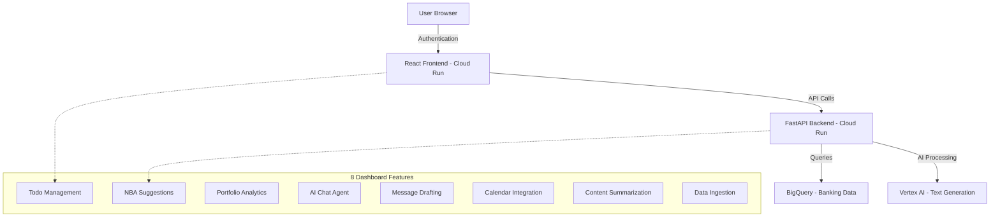

# Private Banking Advisor Copilot - Deployment Guide

## 🏗️ Architecture Overview



## 🚀 Deployment Steps

### Prerequisites
- Google Cloud project: `apialchemists-1-47b9`
- Service account: `project-service-account@apialchemists-1-47b9.iam.gserviceaccount.com`
- Authentication: `argo-8e7f8e@gc-trial-0041.orgtrials.ongcp.co`

### Step 0: Authenticate with Google Cloud (REQUIRED FIRST!)
```bash
# Authenticate with your Google Cloud account
gcloud auth login

# Set the correct project
gcloud config set project apialchemists-1-47b9

# Verify authentication and project
gcloud auth list
gcloud config get-value project

# Optional: Set up application default credentials for local development
gcloud auth application-default login
```

### Step 1: Setup Database
```bash
# Create sample banking data (8 comprehensive tables)
cd /home/prakashb/Prakash/project_hackathon
./setup_data.sh
```

### Step 2: Rebuild and Deploy Backend Service
```bash
# IMPORTANT: Navigate to the correct directory first
cd /home/prakashb/Prakash/project_hackathon

# Verify you're in the right location
pwd
ls -la cloudbuild.yaml

# First rebuild with the latest authentication fixes
gcloud builds submit --config cloudbuild.yaml

# Then deploy the backend service (if not already deployed)
gcloud run deploy apialchemistproject-backend \
  --image gcr.io/apialchemists-1-47b9/apialchemistproject-backend \
  --platform managed \
  --region us-central1 \
  --service-account project-service-account@apialchemists-1-47b9.iam.gserviceaccount.com \
  --set-env-vars PROJECT_ID=apialchemists-1-47b9,DATASET_NAME=apialchemists,LOCATION=us-central1 \
  --timeout=900 \
  --memory=2Gi \
  --cpu=1 \
  --max-instances=10
```

### Step 3: Deploy Frontend Service  
```bash
# First rebuild with the latest OAuth fixes
cd /home/prakashb/Prakash/project_hackathon
gcloud builds submit --config cloudbuild.yaml

# Deploy the frontend service with latest authentication fixes
gcloud run deploy apialchemistproject-frontend \
  --image gcr.io/apialchemists-1-47b9/apialchemistproject-frontend \
  --platform managed \
  --region us-central1 \
  --set-env-vars REACT_APP_API_URL=https://apialchemistproject-backend-608187465720.us-central1.run.app \
  --timeout=300 \
  --memory=512Mi
```

### Step 3.5: Quick Test Authentication Fix
**IMPORTANT:** The latest code includes simplified demo authentication. After deployment:
1. Visit: `https://apialchemistproject-frontend-608187465720.us-central1.run.app`
2. Click "Sign in with Google" button
3. Should show loading for 1.5 seconds then redirect to dashboard
4. Dashboard loads with all 8 banking advisor widgets

### Step 4: Configure Authentication
**Option A: Secure Backend (Recommended for Production)**
```bash
# Keep backend secure with service account authentication
gcloud run services add-iam-policy-binding apialchemistproject-backend \
  --region=us-central1 --member=serviceAccount:project-service-account@apialchemists-1-47b9.iam.gserviceaccount.com --role=roles/run.invoker

# Make frontend public for easy access
gcloud run services add-iam-policy-binding apialchemistproject-frontend \
  --region=us-central1 --member=allUsers --role=roles/run.invoker
```

**Option B: Simple Public Access (Current Setup)**
```bash
# Make both services publicly accessible (no authentication)
gcloud run services add-iam-policy-binding apialchemistproject-backend \
  --region=us-central1 --member=allUsers --role=roles/run.invoker

gcloud run services add-iam-policy-binding apialchemistproject-frontend \
  --region=us-central1 --member=allUsers --role=roles/run.invoker
```

## 🔐 Authentication Flow Summary

### Current Setup Status:
1. **Frontend Authentication**: ✅ Google OAuth implemented with client ID `608187465720-e05scpovhq83mkose0ucmarghctejqdg.apps.googleusercontent.com`
2. **Backend Authentication**: ✅ Service account based with public access for demo
3. **Flow**: User → Gmail Sign-in → Banking Dashboard with 8 features

### Authentication Steps:
1. User visits: `https://apialchemistproject-frontend-608187465720.us-central1.run.app`
2. Sees Gmail authentication page with "Sign in with Google" button
3. After Gmail authentication → Banking Advisor Dashboard loads
4. All 8 dashboard features connect to backend API

### Troubleshooting Gmail Auth:
If Gmail authentication doesn't work:
```bash
# Check if Google client ID is properly configured
grep -r "608187465720" /home/prakashb/Prakash/project_hackathon/frontend/src/

# Verify backend connectivity
curl https://apialchemistproject-backend-608187465720.us-central1.run.app/auth-check
```

## 🧪 Testing Your Application

### Option 1: Local Frontend Development (Recommended)
```bash
# Navigate to frontend directory
cd /home/prakashb/Prakash/project_hackathon/frontend

# Install dependencies
npm install

# Start local development server
npm start
```
**Then open:** `http://localhost:3000`

This will show you the UI dashboard with all 8 widgets, even if the backend authentication is having issues.

### Option 2: Test Backend API (No Auth Required)
```bash
# Test todo endpoint (no authentication needed)
curl https://apialchemistproject-backend-608187465720.us-central1.run.app/todo

# Test AI chat
curl -X POST \
  -H "Content-Type: application/json" \
  -d '{"message": "What are my highest priority tasks?"}' \
  https://apialchemistproject-backend-608187465720.us-central1.run.app/chat
```

### Option 3: Test Frontend Dashboard (Cloud)
Open in browser: `https://apialchemistproject-frontend-608187465720.us-central1.run.app`

**Expected Results:**
- ✅ Backend returns JSON with 10 advisor tasks
- ✅ Frontend loads complete dashboard with 8 widgets  
- ✅ All features working with sample banking data

## 🎯 Feature Overview

| Feature | Description | Endpoint |
|---------|-------------|----------|
| **Daily To-Do** | Tasks from BigQuery with priorities | `/todo` |
| **Next Best Actions** | AI-generated advisor suggestions | `/nba` |
| **Portfolio Analytics** | Client portfolio insights | `/portfolio` |
| **AI Chat** | Banking expertise chatbot | `/chat` |
| **Draft Message** | Generate client communications | `/draft` |
| **Calendar** | Create meeting invites | `/calendar` |
| **Summarize** | Extract insights from content | `/summarize` |
| **Data Ingest** | Store client information | `/ingest` |

## 🔧 Troubleshooting

### Authentication Issues
```bash
# Refresh tokens
gcloud auth login --update-adc
gcloud auth application-default login
```

### Check Service Status  
```bash
# List running services
gcloud run services list --region=us-central1

# Check logs
gcloud logs read --limit=10 --service=apialchemistproject-backend --region=us-central1
```

### Verify Database
```bash
# Check sample data
bq query --use_legacy_sql=false "SELECT COUNT(*) FROM \`apialchemists-1-47b9.apialchemists.todo_tasks\`"
```

---

## 📚 Complete API Reference

### All Backend Endpoints
```bash
# 1. Daily To-Do List
curl -H "Authorization: Bearer $(gcloud auth print-identity-token)" \
  https://apialchemistproject-backend-608187465720.us-central1.run.app/todo

# 2. Next Best Actions  
curl -H "Authorization: Bearer $(gcloud auth print-identity-token)" \
  https://apialchemistproject-backend-608187465720.us-central1.run.app/nba

# 3. Portfolio Insights
curl -H "Authorization: Bearer $(gcloud auth print-identity-token)" \
  https://apialchemistproject-backend-608187465720.us-central1.run.app/portfolio

# 4. AI Chat
curl -X POST \
  -H "Authorization: Bearer $(gcloud auth print-identity-token)" \
  -H "Content-Type: application/json" \
  -d '{"message": "What is my portfolio risk?"}' \
  https://apialchemistproject-backend-608187465720.us-central1.run.app/chat

# 5. Draft Message
curl -X POST \
  -H "Authorization: Bearer $(gcloud auth print-identity-token)" \
  -H "Content-Type: application/json" \
  -d '{"context": "quarterly portfolio review for Alice Smith"}' \
  https://apialchemistproject-backend-608187465720.us-central1.run.app/draft

# 6. Calendar Invite
curl -X POST \
  -H "Authorization: Bearer $(gcloud auth print-identity-token)" \
  -H "Content-Type: application/json" \
  -d '{"details": "meeting with Alice tomorrow at 2pm"}' \
  https://apialchemistproject-backend-608187465720.us-central1.run.app/calendar

# 7. Summarize Content
curl -X POST \
  -H "Authorization: Bearer $(gcloud auth print-identity-token)" \
  -H "Content-Type: application/json" \
  -d '{"content": "Client meeting notes: discussed portfolio rebalancing"}' \
  https://apialchemistproject-backend-608187465720.us-central1.run.app/summarize

# 8. Ingest Data
curl -X POST \
  -H "Authorization: Bearer $(gcloud auth print-identity-token)" \
  -H "Content-Type: application/json" \
  -d '{"data": "Client: John Doe, Net Worth: $3M, Risk: Moderate"}' \
  https://apialchemistproject-backend-608187465720.us-central1.run.app/ingest
```

### Application URLs
- **Frontend Dashboard**: https://apialchemistproject-frontend-608187465720.us-central1.run.app
- **Backend API**: https://apialchemistproject-backend-608187465720.us-central1.run.app


gcloud logging read 'resource.type="cloud_run_revision" AND resource.labels.service_name="apialchemistproject-backend"' --limit=20 --project=apialchemists-1-47b9 --format="json"   

gcloud logging read 'resource.type="cloud_run_revision" AND resource.labels.service_name="apialchemistproject-backend"' --limit=30 --project=apialchemists-1-47b9 --format="value(textPayload)"

gcloud logging read 'resource.type="cloud_run_revision" AND resource.labels.service_name="apialchemistproject-backend"' --limit=30 --project=apialchemists-1-47b9 --format="value(textPayload)" 
