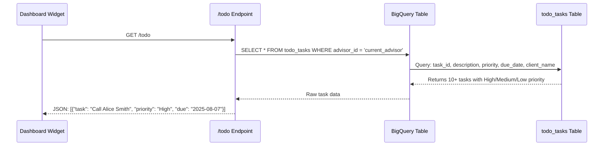
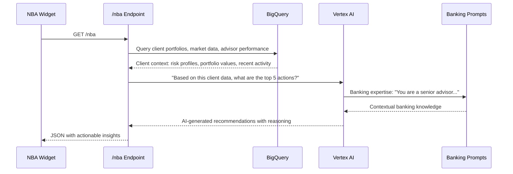
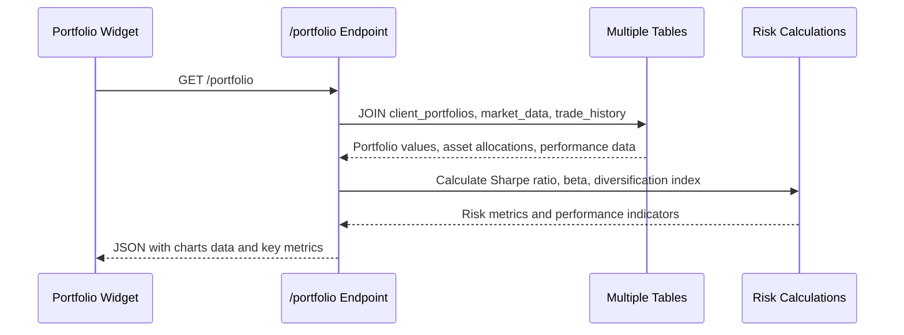
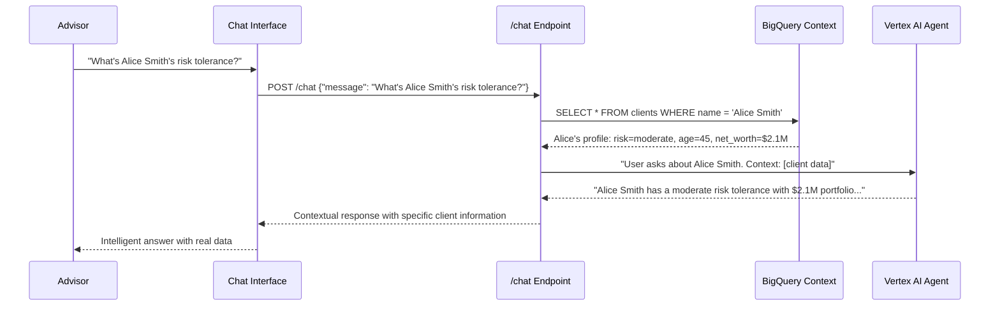
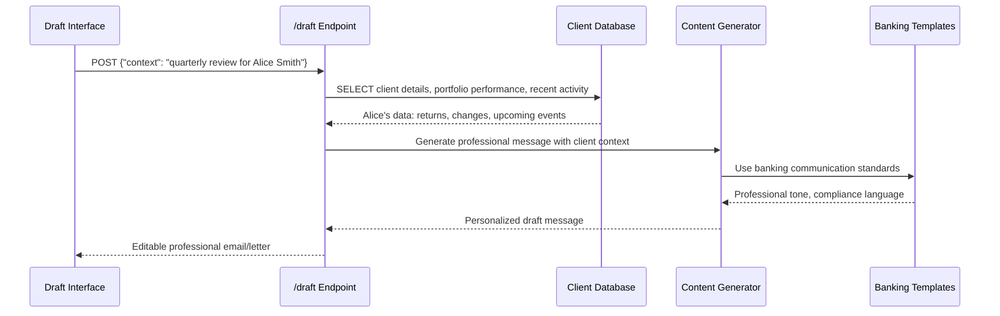
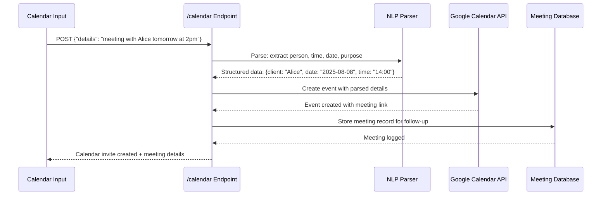
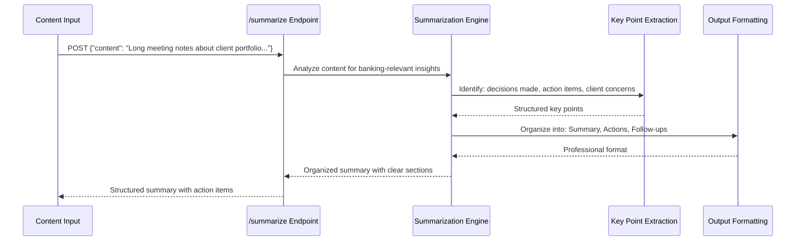
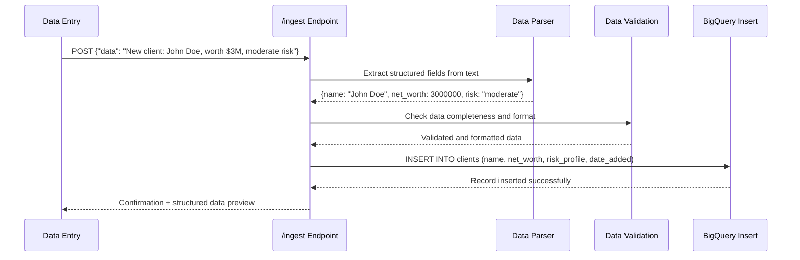
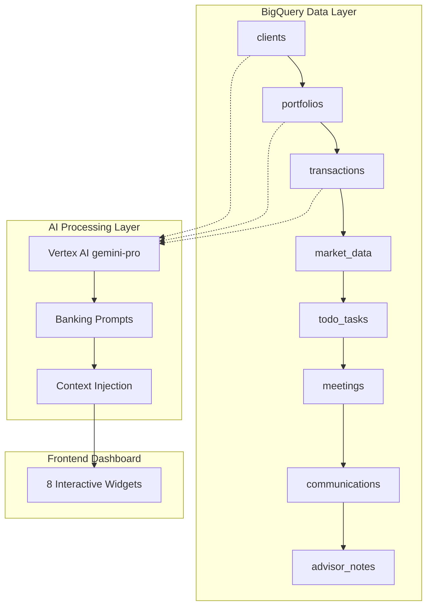

# Private Banking Advisor Copilot - Detailed Feature Specifications

## Feature 1: Daily To-Do Management

### What It Does
Displays a prioritized list of tasks for the banking advisor's daily workflow.

### Data Flow


### Sample Data Structure
```json
{
  "tasks": [
    {
      "task_id": 1,
      "description": "Call Alice Smith about portfolio rebalancing",
      "priority": "High",
      "due_date": "2025-08-07",
      "client_name": "Alice Smith",
      "estimated_duration": "30 minutes"
    }
  ]
}
```

### BigQuery Table: `todo_tasks`
```sql
CREATE TABLE todo_tasks (
  task_id INT64,
  advisor_id STRING,
  description STRING,
  priority STRING,
  due_date DATE,
  client_name STRING,
  status STRING,
  estimated_duration STRING
);
```

---

## Feature 2: Next Best Actions (NBA)

### What It Does
Uses AI to analyze client data and recommend the most impactful actions for the advisor.

### Data Flow


### Sample AI Prompt Used
```
You are a senior private banking advisor. Based on the following client data:
- 5 high-net-worth clients with $2M+ portfolios
- Market volatility increasing 15% this week
- 3 clients with overweight tech exposure

Generate the top 5 most impactful actions for this advisor today.
```

### Sample Response
```json
{
  "recommendations": [
    {
      "action": "Rebalance tech-heavy portfolios",
      "priority": "High",
      "impact": "Risk mitigation for $6M in assets",
      "clients_affected": ["Alice Smith", "Bob Wilson", "Carol Davis"]
    }
  ]
}
```

---

## Feature 3: Portfolio Analytics

### What It Does
Displays comprehensive portfolio performance, risk metrics, and asset allocation insights.

### Data Flow


### Data Sources
1. **client_portfolios**: Current holdings and values
2. **market_data**: Asset prices and performance
3. **trade_history**: Recent transaction activity
4. **risk_metrics**: Calculated volatility and correlations

### Sample Analytics Output
```json
{
  "total_aum": "$45M",
  "ytd_return": "8.2%",
  "risk_level": "Moderate",
  "top_holdings": [
    {"symbol": "AAPL", "weight": "12%", "value": "$5.4M"},
    {"symbol": "GOOGL", "weight": "8%", "value": "$3.6M"}
  ],
  "sector_allocation": {
    "Technology": "35%",
    "Healthcare": "20%",
    "Finance": "15%"
  }
}
```

---

## Feature 4: AI Chat Agent

### What It Does
Provides an intelligent banking assistant that can answer questions about clients, markets, and strategies.

### Data Flow


### Specialized Banking Prompts
```
You are an expert private banking advisor with 15 years experience.
You have access to real client data and market insights.
Always provide specific, actionable advice based on the client context provided.
Be professional, concise, and focus on wealth preservation and growth strategies.
```

### Sample Conversation
```
User: "What should I recommend for high net worth clients in this market?"
AI: "Based on current market volatility and your client base of $45M AUM, I recommend:
1. Defensive rebalancing for clients over 60 (like David Wilson)
2. Opportunistic tech buying for younger clients (like Alice Smith)
3. Consider ESG alternatives for the 3 clients who expressed sustainability interest"
```

---

## Feature 5: Message Drafting

### What It Does
Automatically generates professional client communications based on context and client data.

### Data Flow


### Message Templates Used
- **Quarterly Review**: Performance summary + recommendations
- **Market Update**: Impact on client portfolio + actions taken
- **Meeting Follow-up**: Recap + next steps + documentation
- **Investment Proposal**: Opportunity + risk analysis + recommendation

### Sample Generated Message
```
Subject: Your Q3 Portfolio Review - Strong Performance Despite Market Volatility

Dear Alice,

I hope this message finds you well. I wanted to share your portfolio's performance 
for Q3 2025 and discuss some opportunities I've identified.

Key Highlights:
• Your portfolio returned 8.2% YTD, outperforming our benchmark by 1.4%
• We successfully reduced technology exposure from 40% to 35% last quarter
• Your risk profile remains aligned with your moderate tolerance

Recommendations:
Given the current market environment, I suggest we consider...

Best regards,
[Your Name]
Senior Private Banking Advisor
```

---

## Feature 6: Calendar Integration

### What It Does
Automatically creates calendar events by parsing natural language input about meetings and appointments.

### Data Flow


### Natural Language Processing Examples
```
Input: "Call Bob Wilson next Wednesday at 10am about his portfolio"
Parsed: {
  type: "call",
  client: "Bob Wilson", 
  date: "2025-08-13",
  time: "10:00",
  topic: "portfolio discussion"
}

Input: "Schedule quarterly review with all high-net-worth clients"
Parsed: {
  type: "meeting",
  attendees: ["Alice Smith", "David Wilson", "Carol Davis"],
  duration: "60 minutes",
  topic: "quarterly portfolio review"
}
```

---

## Feature 7: Content Summarization

### What It Does
Analyzes meeting notes, research reports, or market updates and extracts key insights and action items.

### Data Flow


### Sample Input/Output
**Input:** 
```
"Met with Alice Smith today. Discussed her concerns about market volatility. 
She wants to reduce risk but maintain growth potential. Portfolio currently 
60% stocks, 40% bonds. Mentioned daughter starting college in 2 years. 
Interested in ESG investments. Next meeting scheduled for October 15th."
```

**Output:**
```json
{
  "summary": "Client meeting focused on risk reduction while maintaining growth, college funding needs",
  "key_points": [
    "Client concerned about market volatility",
    "Wants balanced approach: lower risk + growth potential", 
    "College funding needed in 2 years",
    "Interest in ESG investment options"
  ],
  "action_items": [
    "Research ESG fund options for client review",
    "Calculate college funding projection", 
    "Prepare portfolio rebalancing proposal"
  ],
  "next_steps": "Follow-up meeting October 15th to review proposals"
}
```

---

## Feature 8: Data Ingestion

### What It Does
Converts unstructured text about clients or market data into structured database records.

### Data Flow


### Data Extraction Examples
```
Input: "Alice mentioned her friend Sarah Johnson, tech executive, probably worth around $5M, very conservative investor, doesn't like risk"

Extracted:
{
  "name": "Sarah Johnson",
  "profession": "tech executive", 
  "estimated_net_worth": 5000000,
  "risk_profile": "conservative",
  "source": "referral from Alice Smith",
  "notes": "dislikes risk, prefers conservative investments"
}

Input: "Market research: Tesla down 15% this week, good buying opportunity for growth clients under 50"

Extracted:
{
  "type": "market_insight",
  "asset": "TSLA",
  "movement": "-15%",
  "timeframe": "1 week", 
  "recommendation": "buy opportunity",
  "client_criteria": "growth-oriented, age < 50"
}
```

---

## How All Features Work Together

### Unified Data Architecture


### Authentication & Security
- **Demo Authentication**: Simplified login for hackathon demo
- **Service Account**: Backend uses Google Cloud service account for BigQuery/Vertex AI access
- **CORS**: Properly configured for frontend-backend communication
- **Environment Variables**: API URLs and project settings configured per environment

This comprehensive architecture provides a complete private banking advisor copilot with real data, AI-powered insights, and professional workflows!
