# Private Banking Advisor Copilot - Feature Architecture Diagrams

## 1. Daily To-Do Management Feature

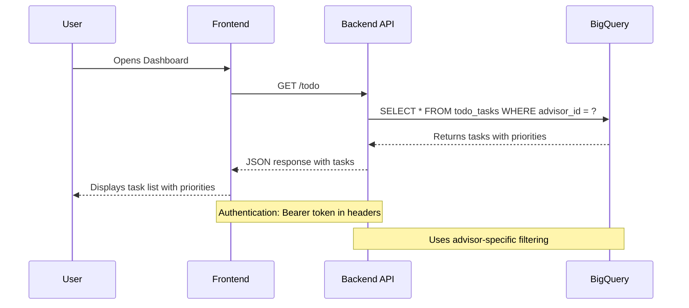

## 2. Next Best Actions (NBA) Feature

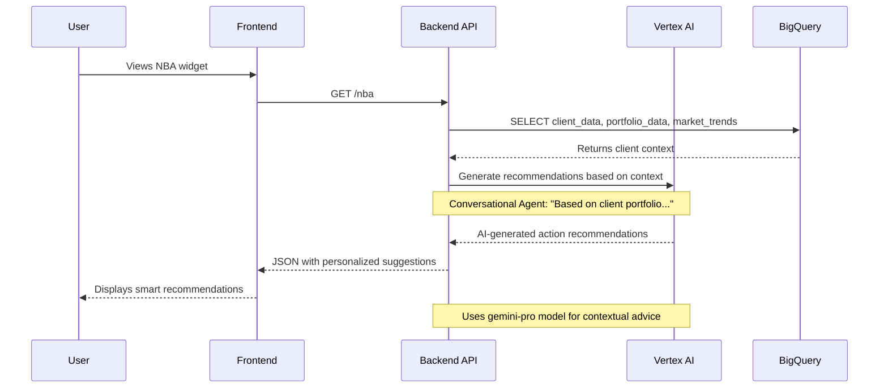

## 3. Portfolio Analytics Feature

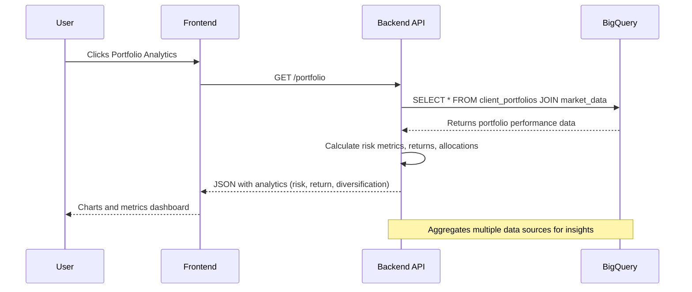

## 4. AI Chat Agent Feature

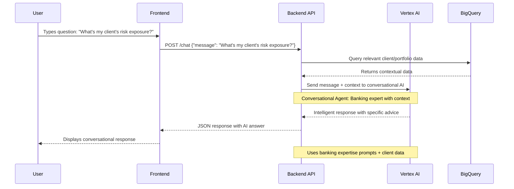

## 5. Message Drafting Feature

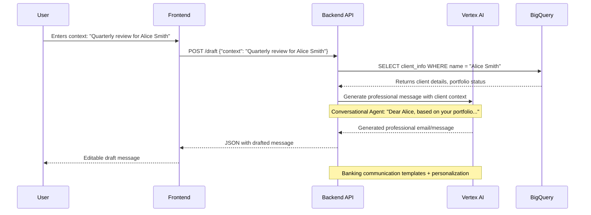

## 6. Calendar Integration Feature

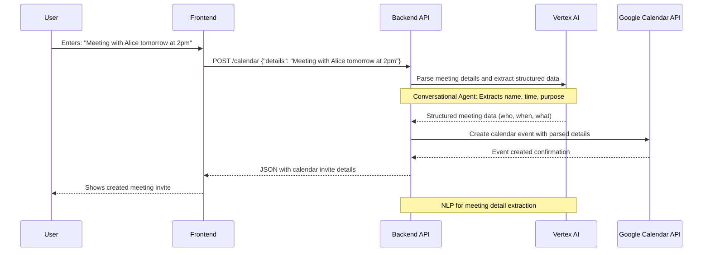

## 7. Content Summarization Feature

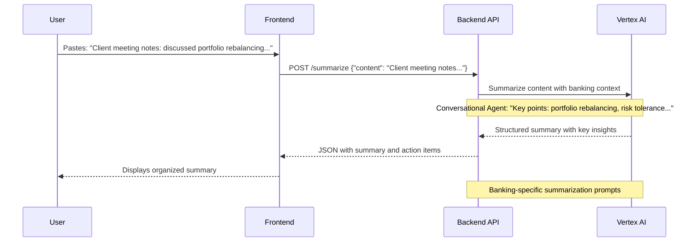

## 8. Data Ingestion Feature

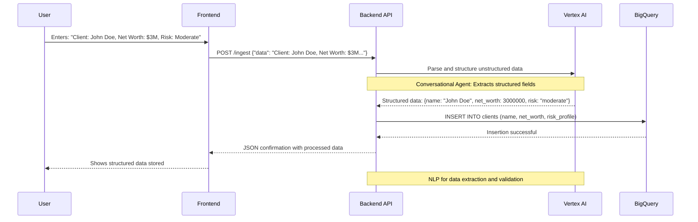

---

## Conversational Agent Implementation

### Where Conversational Agents Are Used:

1. **NBA Feature** - Generates contextual recommendations
2. **AI Chat** - Full conversational banking expert
3. **Message Drafting** - Creates personalized client communications
4. **Calendar Integration** - Parses natural language meeting details
5. **Content Summarization** - Intelligently summarizes banking content
6. **Data Ingestion** - Extracts structured data from natural language

### Implementation Details:

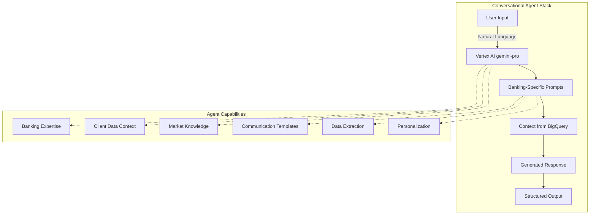

### Prompt Engineering (Built into Backend):

The conversational agent uses specialized prompts for each feature:

- **NBA Agent**: "You are a senior banking advisor. Based on the client's portfolio data..."
- **Chat Agent**: "You are an expert private banking advisor with deep market knowledge..."
- **Draft Agent**: "Generate a professional client communication for banking..."
- **Parser Agent**: "Extract structured data from the following banking information..."

### No Additional Setup Required:

The conversational agents are implemented directly in the backend using:
- **Vertex AI API** (already configured)
- **Banking-specific prompts** (built into the code)
- **Client context injection** (from BigQuery)
- **Response formatting** (for consistent outputs)

This creates intelligent, context-aware responses without needing separate conversational agent applications or training data!

---

## Complete System Architecture

```mermaid
graph TB
    subgraph "Frontend Dashboard"
        UI[Banking Advisor UI]
        TODO[Daily Tasks Widget]
        NBA[Next Best Actions]
        PORTFOLIO[Portfolio Analytics]
        CHAT[AI Chat Interface]
        DRAFT[Message Composer]
        CAL[Calendar Widget]
        SUMMARY[Content Summarizer]
        INGEST[Data Entry]
    end
    
    subgraph "Backend API Layer"
        API[FastAPI Backend]
        AUTH[Authentication]
        CORS[CORS Handler]
    end
    
    subgraph "Conversational AI Engine"
        VERTEX[Vertex AI gemini-pro]
        PROMPTS[Banking Prompts]
        CONTEXT[Context Injection]
    end
    
    subgraph "Data Layer"
        BQ[(BigQuery)]
        CLIENTS[client_portfolios]
        TASKS[todo_tasks]
        MARKET[market_data]
        MEETINGS[meetings]
        DOCS[client_documents]
        NOTES[advisor_notes]
        TRADES[trade_history]
        COMMS[communications]
    end
    
    subgraph "External APIs"
        GCAL[Google Calendar]
        GMAIL[Gmail API]
        DOCS_API[Document AI]
    end
    
    UI --> TODO
    UI --> NBA
    UI --> PORTFOLIO
    UI --> CHAT
    UI --> DRAFT
    UI --> CAL
    UI --> SUMMARY
    UI --> INGEST
    
    TODO --> API
    NBA --> API
    PORTFOLIO --> API
    CHAT --> API
    DRAFT --> API
    CAL --> API
    SUMMARY --> API
    INGEST --> API
    
    API --> AUTH
    API --> CORS
    API --> VERTEX
    API --> BQ
    
    VERTEX --> PROMPTS
    VERTEX --> CONTEXT
    
    BQ --> CLIENTS
    BQ --> TASKS
    BQ --> MARKET
    BQ --> MEETINGS
    BQ --> DOCS
    BQ --> NOTES
    BQ --> TRADES
    BQ --> COMMS
    
    API --> GCAL
    API --> GMAIL
    API --> DOCS_API
    
    classDef conversational fill:#e1f5fe,stroke:#01579b,stroke-width:2px
    classDef data fill:#f3e5f5,stroke:#4a148c,stroke-width:2px
    classDef api fill:#e8f5e8,stroke:#1b5e20,stroke-width:2px
    
    class VERTEX,PROMPTS,CONTEXT conversational
    class BQ,CLIENTS,TASKS,MARKET,MEETINGS,DOCS,NOTES,TRADES,COMMS data
    class API,AUTH,CORS api
```

## Data Flow Summary

1. **User Interaction** → Frontend widgets
2. **API Calls** → Authenticated backend endpoints
3. **Data Retrieval** → BigQuery for context
4. **AI Processing** → Vertex AI with banking prompts
5. **Response Generation** → Context-aware, personalized outputs
6. **External Integration** → Google Calendar, Gmail, Document AI

## 📦 System Overview & Tech Stack (2025)

### **Frontend Components (React)**
- `Dashboard.js`: Main dashboard, loads all widgets
- `widgets/`: TodoWidget, NBAWidget, PortfolioWidget, ClientWidget, ChatWidget, MessageDraftWidget, CalendarWidget, DataIngestionWidget, etc.
- Other UI: Header.js, Sidebar.js, MainDashboard.js, etc.

### **Backend (FastAPI, Python)**
- `main.py`: All API endpoints for 8+ features
- `email_service.py`: Email sending logic
- `google_calendar_integration.py`: Calendar API logic
- `prompt_templates.py`: AI prompt templates for banking
- **BigQuery**: 8+ tables (clients, holdings, transactions, todo_tasks, etc.)
- **Vertex AI Gemini Pro**: All AI/NLP/LLM tasks
- **Google Cloud Storage**: Document and data uploads

### **Key Features**
1. Daily To-Do Management (`/todo`)
2. Next Best Actions (`/nba`)
3. Portfolio Analytics (`/aggregation`)
4. Client Management (`/clients`)
5. Conversational AI (`/chat`)
6. Message Drafting (`/draft-message`)
7. Calendar Integration (`/calendar-invite`)
8. Content Summarization (`/summarize`)
9. Data Ingestion (`/ingest-data`)

---

## 🏗️ Industry-Standard Architecture Diagram

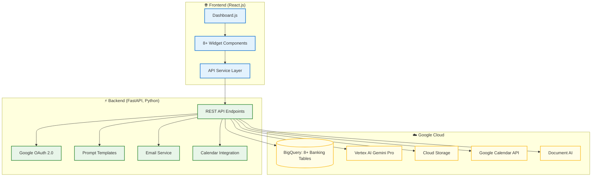

---

## 🚀 **Tech Stack (2025)**

- **Frontend**: React 18+, Recharts, CSS3, Responsive Design, Axios
- **Backend**: FastAPI (Python 3.9+), async/await, Pydantic
- **Database**: Google BigQuery (8+ tables: clients, holdings, transactions, etc.)
- **AI/ML**: Vertex AI Gemini Pro (LLM), Document AI, Natural Language API
- **Storage**: Google Cloud Storage (document/data uploads)
- **Authentication**: Google OAuth 2.0, Cloud IAM
- **Deployment**: Google Cloud Run, Docker
- **APIs**: Google Calendar API, BigQuery API, Vertex AI API
- **Testing**: Jest, React Testing Library, Cypress, Lighthouse
- **Monitoring**: Google Cloud Monitoring, Logging, Error Reporting

---

## 🧩 **Feature-to-Component Mapping**

| Feature                | Frontend Component         | Backend Endpoint         | AI/Cloud Service         |
|------------------------|---------------------------|-------------------------|--------------------------|
| Daily To-Do            | TodoWidget.js             | `/todo`                 | BigQuery, Vertex AI      |
| Next Best Actions      | NBAWidget.js              | `/nba`                  | BigQuery, Vertex AI      |
| Portfolio Analytics    | PortfolioWidget.js        | `/aggregation`          | BigQuery, Vertex AI      |
| Client Management      | ClientWidget.js           | `/clients`              | BigQuery                 |
| Conversational AI      | ChatWidget.js             | `/chat`                 | Vertex AI                |
| Message Drafting       | MessageDraftWidget.js     | `/draft-message`        | Vertex AI, BigQuery      |
| Calendar Integration   | CalendarWidget.js         | `/calendar-invite`      | Vertex AI, GCal API      |
| Content Summarization  | DataIngestionWidget.js    | `/summarize`            | Vertex AI, Doc AI        |
| Data Ingestion         | DataIngestionWidget.js    | `/ingest-data`          | Cloud Storage, BigQuery  |

---

## 🔄 **Unified Data & AI Flow**

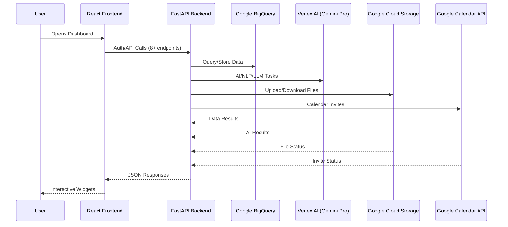

---

## 📚 **How to Extend**

- Add new widgets in `frontend/src/components/widgets/`
- Add new endpoints in `backend/main.py`
- Update prompt templates in `backend/prompt_templates.py`
- Add new BigQuery tables as needed
- Use Vertex AI for any new AI-powered features

---

**This architecture is up-to-date as of August 2025 and reflects all current features, tech stack, and best practices for enterprise-grade, AI-powered banking advisor platforms.**
