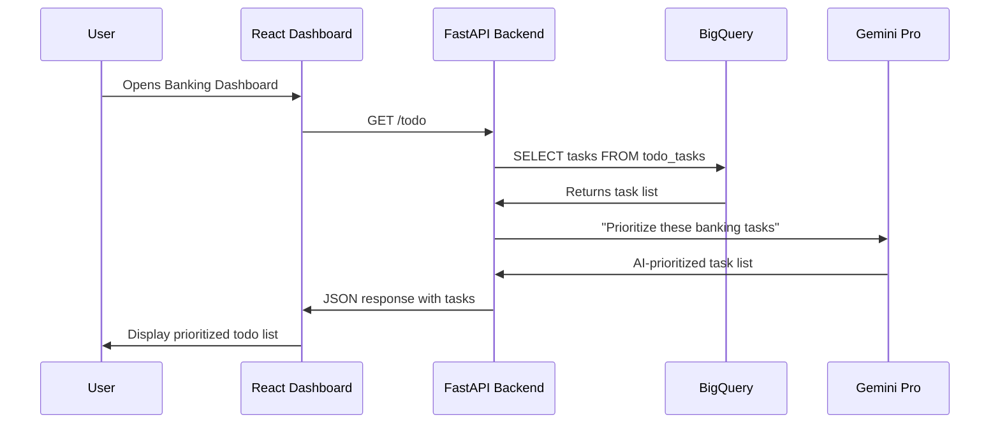

# 🎯 How to View the Sequence Diagrams

## 📊 Visual Viewing Options

### Option 1: VS Code Mermaid Preview (Recommended)
1. **Install Mermaid Extension**:
   - Press `Ctrl+Shift+X` (or `Cmd+Shift+X` on Mac)
   - Search for "Mermaid Preview"
   - Install the extension by Matt Bierner

2. **View Diagrams**:
   - Open any of these files:
     - `SEQUENCE_DIAGRAMS.md`
     - `TECHNICAL_ARCHITECTURE.md` 
     - `API_DATABASE_REFERENCE.md`
   - Right-click in the file
   - Select "Open Preview to the Side"
   - You'll see beautiful rendered diagrams!

### Option 2: Online Mermaid Viewer
1. Go to: https://mermaid.live/
2. Copy any mermaid code block from the documentation
3. Paste it in the editor
4. View the rendered diagram

### Option 3: GitHub/GitLab Rendering
- Push the files to GitHub/GitLab
- They automatically render Mermaid diagrams

---

## 🔍 Quick Start - Copy This Example

Here's a simple sequence to test:



Copy this code and paste it into https://mermaid.live/ to see how it looks!

---

## 📋 All Your Sequence Diagrams Listed

### 1. **Master Architecture Flow** (in SEQUENCE_DIAGRAMS.md)
Shows complete system overview with all components

### 2. **Daily Todo Feature** (in SEQUENCE_DIAGRAMS.md)
- User → TodoWidget → API → BigQuery → AI → User
- Shows task prioritization flow

### 3. **Next Best Actions** (in SEQUENCE_DIAGRAMS.md)
- User → NBAWidget → API → BigQuery (3 tables JOIN) → AI → User
- Shows transaction analysis flow

### 4. **Portfolio Analytics** (in SEQUENCE_DIAGRAMS.md)
- User → PortfolioWidget → API → BigQuery (complex queries) → AI → Recharts → User
- Shows data visualization flow

### 5. **AI Chat** (in SEQUENCE_DIAGRAMS.md)
- User → ChatWidget → API → BigQuery (multiple context queries) → AI → User
- Shows personalized chat flow

### 6. **Message Drafting** (in TECHNICAL_ARCHITECTURE_PART2.md)
- User → MessageWidget → API → BigQuery (client data) → AI → User
- Shows message generation flow

### 7. **Calendar Integration** (in TECHNICAL_ARCHITECTURE_PART2.md)
- User → CalendarWidget → API → AI → Google Calendar → User
- Shows meeting parsing flow

### 8. **Content Summarization** (in TECHNICAL_ARCHITECTURE_PART2.md)
- User → SummaryWidget → API → AI → User
- Shows document analysis flow

### 9. **Data Ingestion** (in SEQUENCE_DIAGRAMS.md)
- User → IngestWidget → API → Google Cloud Storage → User
- Shows file upload flow

### 10. **Authentication Flow** (in SEQUENCE_DIAGRAMS.md)
- User → React → Google OAuth → API → Google Cloud → User
- Shows login sequence

---

## 🚀 What Each Diagram Shows You

### **System Level** (Master Architecture):
- How all 8 features connect
- Data flow between React → FastAPI → BigQuery → AI
- Overall component relationships

### **Feature Level** (Individual Features):
- Step-by-step user interaction
- Exact API calls made
- Database queries executed  
- AI processing steps
- Response formatting

### **Technical Level** (Implementation Details):
- File names and locations
- Code snippets and functions
- Database schemas
- Error handling

---

## 💡 How to Read the Diagrams

### Sequence Diagram Elements:
- **Participants**: User, React, API, BigQuery, AI
- **Arrows**: →→ (messages between components)
- **Notes**: Additional information boxes
- **Loops**: Repeated processes
- **Alt/Opt**: Conditional logic

### Example Reading:
```
User->>React: Clicks Todo widget
```
Means: "User clicks on the Todo widget in React"

```
API->>BigQuery: SELECT tasks FROM todo_tasks
```
Means: "API executes SQL query to get tasks"

---

## 🔧 Troubleshooting Viewing

### If Diagrams Don't Render:
1. **Check Extension**: Make sure Mermaid Preview is installed
2. **File Format**: Ensure files have `.md` extension
3. **Code Blocks**: Diagrams must be in ```mermaid code blocks
4. **Online Backup**: Use mermaid.live as backup viewer

### If Still Having Issues:
- Use the online viewer: https://mermaid.live/
- Copy any diagram code from the documentation files
- Paste and view the rendered result

---

## 📁 File Locations for Diagrams

1. **SEQUENCE_DIAGRAMS.md** - Main sequence flows
2. **TECHNICAL_ARCHITECTURE.md** - Implementation details with flows
3. **TECHNICAL_ARCHITECTURE_PART2.md** - Remaining features with flows
4. **API_DATABASE_REFERENCE.md** - Database relationship diagrams

**Start with SEQUENCE_DIAGRAMS.md** - it has the clearest visual flows!
