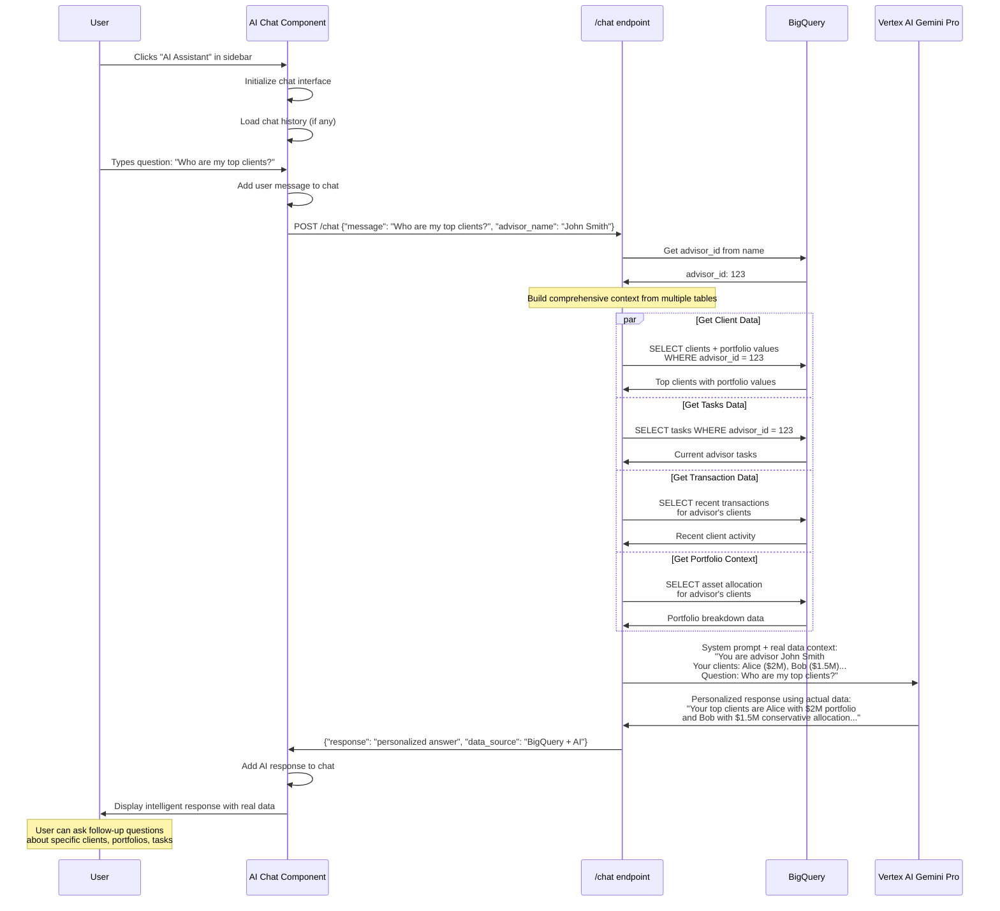

# AI Assistant Page - Technical Flow & Functionality

## 🤖 Page Overview
**Location**: Left sidebar → "AI Assistant"  
**Component**: `ChatWidget.js`  
**Purpose**: Intelligent banking chatbot with real advisor data access  
**AI Model**: Vertex AI Gemini Pro with banking expertise

## 🎯 What This Page Does
- Provides intelligent banking advice and insights
- Accesses real client data for personalized responses  
- Answers questions about portfolios, tasks, and clients
- Learns from advisor patterns and preferences
- Provides 24/7 banking expertise support

## 🔄 Page Flow Sequence



## 📁 File Structure
```
frontend/src/components/widgets/
├── ChatWidget.js           # Main chat interface
├── ChatWidget.css          # Chat styling and animations
├── contexts/
│   └── ChatContext.js      # Chat state management (if needed)
```

## 🔧 Technical Implementation

### Component Architecture:
```javascript
const ChatWidget = () => {
    // State management
    const [messages, setMessages] = useState([]);
    const [inputValue, setInputValue] = useState('');
    const [loading, setLoading] = useState(false);
    const [advisorName, setAdvisorName] = useState('');
    
    // Send message to AI
    const sendMessage = async () => {
        // Add user message
        const userMessage = { 
            type: 'user', 
            text: inputValue, 
            timestamp: new Date() 
        };
        setMessages(prev => [...prev, userMessage]);
        
        // Call AI endpoint
        const response = await fetch('/api/chat', {
            method: 'POST',
            headers: { 'Content-Type': 'application/json' },
            body: JSON.stringify({ 
                message: inputValue, 
                advisor_name: advisorName 
            })
        });
        
        const data = await response.json();
        
        // Add AI response
        const botMessage = { 
            type: 'bot', 
            text: data.response,
            timestamp: new Date() 
        };
        setMessages(prev => [...prev, botMessage]);
    };
};
```

### API Endpoint: POST /chat
**Context Building Queries:**
```sql
-- Get Advisor's Clients with Portfolio Values
SELECT c.name, c.client_id, 
       COALESCE(SUM(h.value), 0) as portfolio_value
FROM clients c
LEFT JOIN holdings h ON c.client_id = h.client_id
WHERE c.advisor_id = @advisor_id
GROUP BY c.client_id, c.name
ORDER BY portfolio_value DESC;

-- Get Advisor's Current Tasks  
SELECT task, priority, due_date
FROM todo_tasks 
WHERE advisor_id = @advisor_id
ORDER BY priority ASC;

-- Get Recent Client Transactions
SELECT t.amount, t.category, t.date, c.name as client_name
FROM transactions t
JOIN accounts a ON t.account_id = a.account_id
JOIN clients c ON a.client_id = c.client_id
WHERE c.advisor_id = @advisor_id
ORDER BY t.date DESC LIMIT 10;

-- Get Portfolio Breakdown
SELECT h.asset_class, COUNT(*) as count, SUM(h.value) as total_value
FROM holdings h
JOIN clients c ON h.client_id = c.client_id
WHERE c.advisor_id = @advisor_id
GROUP BY h.asset_class;
```

### AI System Prompt Template:
```python
BANKING_ADVISOR_SYSTEM_PROMPT = """
You are an expert private banking advisor AI assistant with access to real client data.

Key Guidelines:
- Provide professional, accurate responses using actual data provided
- Always reference specific client names, amounts, and portfolio details
- Maintain banking professionalism and confidentiality
- Focus on actionable insights and recommendations
- Use proper financial terminology
- Be concise but comprehensive

You have access to:
- Client portfolio values and allocations
- Recent transaction activity  
- Current advisor tasks and priorities
- Asset class distributions
- Risk profiles and investment objectives
"""
```

## 🎨 Chat Interface Layout
```
┌─────────────────────────────────────────────────────────────┐
│                    AI Banking Assistant                     │
│                     🤖 Gemini Pro                          │
├─────────────────────────────────────────────────────────────┤
│                                                             │
│  👤 You: Who are my highest value clients?                │
│  ┌─────────────────────────────────────────────────────┐   │
│  │ 🤖 Based on your current portfolio data:           │   │
│  │                                                     │   │
│  │ Your top 3 clients are:                            │   │
│  │ • Alice Johnson: $2.1M (diversified portfolio)     │   │
│  │ • Robert Chen: $1.8M (growth-focused)              │   │
│  │ • Maria Rodriguez: $1.5M (conservative)            │   │
│  │                                                     │   │
│  │ Would you like me to analyze their recent activity │   │
│  │ or suggest engagement strategies?                   │   │
│  └─────────────────────────────────────────────────────┘   │
│                                                             │
│  👤 You: What tasks should I prioritize today?            │
│  ┌─────────────────────────────────────────────────────┐   │
│  │ 🤖 Based on your current task list:                │   │
│  │                                                     │   │
│  │ High Priority (Due Today):                          │   │
│  │ 1. Review Alice's quarterly portfolio               │   │
│  │ 2. Prepare investment report for Robert             │   │
│  │ 3. Schedule rebalancing meeting with Maria          │   │
│  │                                                     │   │
│  │ These align with your top clients' needs.          │   │
│  └─────────────────────────────────────────────────────┘   │
│                                                             │
├─────────────────────────────────────────────────────────────┤
│  💬 Ask about clients, portfolios, tasks, market trends... │
│  [                                              ] [Send]    │
└─────────────────────────────────────────────────────────────┘
```

## 🤖 AI Capabilities

### Questions the AI Can Answer:
- **Client Information**: "Who are my top clients?" "What's Alice's risk profile?"
- **Portfolio Analysis**: "Show me asset allocation" "Which clients need rebalancing?"
- **Task Management**: "What are my priorities today?" "Which tasks are overdue?"
- **Market Insights**: "How will rate changes affect my clients?" 
- **Performance Metrics**: "How are my clients performing?" "Which advisors are top performers?"
- **Risk Assessment**: "Which clients have high risk exposure?"

### AI Response Types:
- **Data-driven answers** using real client information
- **Actionable recommendations** based on portfolio analysis
- **Risk alerts** and compliance reminders
- **Market impact analysis** for client portfolios
- **Task prioritization** with reasoning

## 📊 Data Sources

### Real-time Database Access:
- **Clients Table**: Names, contact info, risk profiles, portfolio values
- **Holdings Table**: Asset allocations, security positions, valuations
- **Transactions Table**: Recent activity, cash flows, trading patterns  
- **Tasks Table**: Current priorities, deadlines, assignments
- **Advisors Table**: Performance metrics, specializations

### AI Processing:
- **Context Building**: Combines data from multiple tables
- **Personalization**: Tailors responses to specific advisor
- **Banking Expertise**: Uses specialized financial knowledge
- **Real-time Analysis**: Processes current market conditions

## 🔗 Integration Points

### With Other Pages:
- **Tasks Page**: "Show me my tasks" → Links to full task management
- **Client Portfolios**: "Tell me about Alice" → Links to client detail
- **Analytics**: "How are we performing?" → Links to reports
- **Messages**: "Draft email to Bob" → Links to message center

### External Systems:
- **Market Data**: Real-time pricing and market conditions
- **News Integration**: Recent financial news impact analysis
- **Compliance Systems**: Regulatory requirement reminders

## 🎯 Business Value
- **24/7 Banking Expertise**: Always-available intelligent assistant
- **Personalized Insights**: Uses actual advisor and client data
- **Time Savings**: Instant answers without manual data lookup
- **Decision Support**: AI-powered recommendations and analysis
- **Knowledge Continuity**: Maintains context across conversations
