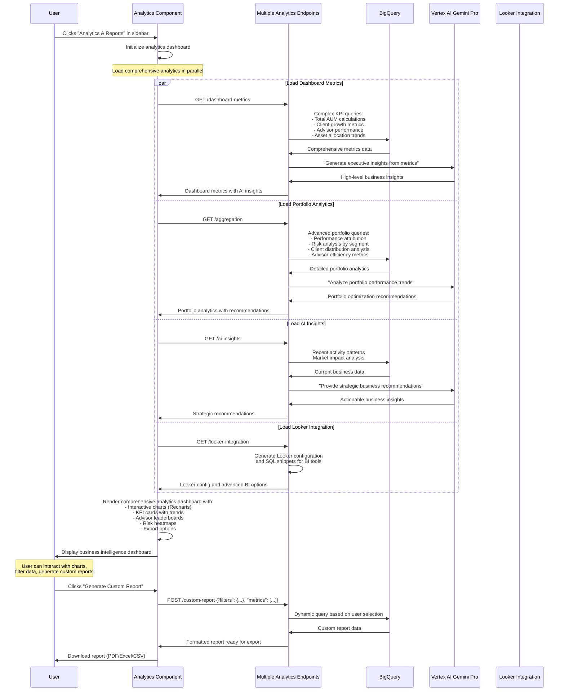

# Analytics & Reports Page - Technical Flow & Functionality

## 📊 Page Overview
**Location**: Left sidebar → "Analytics & Reports"  
**Component**: `Dashboard.js` (Analytics Mode) / Custom Analytics Component  
**Purpose**: Comprehensive business intelligence and reporting dashboard  
**Database**: All tables with complex analytical queries

## 🎯 What This Page Does
- Displays comprehensive business analytics and KPIs
- Generates advisor performance reports and rankings
- Shows portfolio analytics with interactive visualizations
- Provides market insights and trend analysis
- Enables custom report generation and export

## 🔄 Page Flow Sequence



## 📁 File Structure
```
frontend/src/components/
├── Dashboard.js            # Main analytics dashboard (reused)
├── Dashboard.css          # Analytics styling and responsive design
├── AnalyticsPage.js       # Dedicated analytics page (if separate)
├── AnalyticsPage.css      # Analytics-specific styling
├── charts/
│   ├── KPICards.js        # KPI visualization components
│   ├── PortfolioCharts.js # Portfolio analysis charts
│   ├── AdvisorRankings.js # Advisor performance charts
│   └── RiskHeatmap.js     # Risk analysis visualization
```

## 🔧 Technical Implementation

### Component Architecture:
```javascript
const AnalyticsPage = () => {
    // State management
    const [analyticsData, setAnalyticsData] = useState(null);
    const [selectedTimeframe, setSelectedTimeframe] = useState('30d');
    const [selectedMetrics, setSelectedMetrics] = useState(['aum', 'clients', 'performance']);
    const [chartType, setChartType] = useState('overview'); // overview, advisors, portfolios, risk
    const [loading, setLoading] = useState(true);
    const [exportFormat, setExportFormat] = useState('pdf');
    
    useEffect(() => {
        loadAnalyticsData();
    }, [selectedTimeframe, selectedMetrics]);
    
    const loadAnalyticsData = async () => {
        try {
            const [
                dashboardMetrics,
                portfolioAnalytics, 
                aiInsights,
                lookerConfig
            ] = await Promise.all([
                fetch('/api/dashboard-metrics').then(r => r.json()),
                fetch('/api/aggregation').then(r => r.json()),
                fetch('/api/ai-insights').then(r => r.json()),
                fetch('/api/looker-integration').then(r => r.json())
            ]);
            
            setAnalyticsData({
                kpis: dashboardMetrics.dashboard.kpis,
                charts: dashboardMetrics.dashboard.charts,
                portfolioInsights: portfolioAnalytics.aggregation,
                aiRecommendations: aiInsights.ai_insights,
                lookerIntegration: lookerConfig.looker_config
            });
        } catch (error) {
            console.error('Analytics loading failed:', error);
        } finally {
            setLoading(false);
        }
    };
    
    const generateCustomReport = async (reportConfig) => {
        const response = await fetch('/api/custom-report', {
            method: 'POST',
            headers: { 'Content-Type': 'application/json' },
            body: JSON.stringify(reportConfig)
        });
        return response.blob(); // For file download
    };
    
    const exportReport = async (format) => {
        const reportBlob = await generateCustomReport({
            timeframe: selectedTimeframe,
            metrics: selectedMetrics,
            format: format
        });
        
        // Trigger download
        const url = window.URL.createObjectURL(reportBlob);
        const a = document.createElement('a');
        a.href = url;
        a.download = `analytics-report-${Date.now()}.${format}`;
        a.click();
    };
};
```

### Advanced Database Analytics Queries:

#### Business Intelligence KPIs:
```sql
-- Comprehensive business metrics
WITH monthly_metrics AS (
    SELECT 
        DATE_TRUNC(DATE(t.date), MONTH) as month,
        COUNT(DISTINCT c.client_id) as active_clients,
        COUNT(DISTINCT a.advisor_id) as active_advisors,
        SUM(CASE WHEN t.amount > 0 THEN t.amount ELSE 0 END) as inflows,
        SUM(CASE WHEN t.amount < 0 THEN ABS(t.amount) ELSE 0 END) as outflows,
        COUNT(t.transaction_id) as transaction_count
    FROM `apialchemists-1-47b9.apialchemists.transactions` t
    JOIN `apialchemists-1-47b9.apialchemists.accounts` acc ON t.account_id = acc.account_id
    JOIN `apialchemists-1-47b9.apialchemists.clients` c ON acc.client_id = c.client_id
    JOIN `apialchemists-1-47b9.apialchemists.advisors` a ON c.advisor_id = a.advisor_id
    WHERE t.date >= DATE_SUB(CURRENT_DATE(), INTERVAL 12 MONTH)
    GROUP BY month
),
current_portfolio AS (
    SELECT 
        SUM(h.value) as total_aum,
        COUNT(DISTINCT c.client_id) as total_clients,
        COUNT(DISTINCT h.symbol) as unique_securities,
        COUNT(DISTINCT h.asset_class) as asset_classes
    FROM `apialchemists-1-47b9.apialchemists.holdings` h
    JOIN `apialchemists-1-47b9.apialchemists.clients` c ON h.client_id = c.client_id
)
SELECT 
    mm.*,
    cp.total_aum,
    cp.total_clients,
    cp.unique_securities,
    cp.asset_classes
FROM monthly_metrics mm
CROSS JOIN current_portfolio cp
ORDER BY mm.month DESC;
```

#### Advisor Performance Rankings:
```sql
-- Comprehensive advisor performance analysis
SELECT 
    a.advisor_id,
    a.name as advisor_name,
    a.specialization,
    COUNT(DISTINCT c.client_id) as client_count,
    SUM(h.value) as total_aum,
    AVG(h.value) as avg_client_portfolio,
    
    -- Performance metrics
    SUM(CASE WHEN h.value >= 1000000 THEN 1 ELSE 0 END) as high_value_clients,
    COUNT(DISTINCT h.asset_class) as asset_diversity_score,
    COUNT(DISTINCT h.sector) as sector_diversity_score,
    
    -- Client satisfaction (based on activity)
    AVG(DATE_DIFF(CURRENT_DATE(), c.date_joined, DAY)) as avg_client_tenure_days,
    COUNT(t.transaction_id) / COUNT(DISTINCT c.client_id) as transactions_per_client,
    
    -- Growth metrics
    SUM(CASE 
        WHEN t.date >= DATE_SUB(CURRENT_DATE(), INTERVAL 90 DAY) AND t.amount > 0 
        THEN t.amount ELSE 0 
    END) as recent_inflows,
    
    -- Risk management
    STDDEV(h.value) as portfolio_volatility,
    
    -- Efficiency metrics
    RANK() OVER (ORDER BY SUM(h.value) DESC) as aum_rank,
    RANK() OVER (ORDER BY COUNT(DISTINCT c.client_id) DESC) as client_count_rank,
    RANK() OVER (ORDER BY AVG(h.value) DESC) as avg_portfolio_rank
    
FROM `apialchemists-1-47b9.apialchemists.advisors` a
LEFT JOIN `apialchemists-1-47b9.apialchemists.clients` c ON a.advisor_id = c.advisor_id
LEFT JOIN `apialchemists-1-47b9.apialchemists.holdings` h ON c.client_id = h.client_id
LEFT JOIN `apialchemists-1-47b9.apialchemists.accounts` acc ON c.client_id = acc.client_id
LEFT JOIN `apialchemists-1-47b9.apialchemists.transactions` t ON acc.account_id = t.account_id
GROUP BY a.advisor_id, a.name, a.specialization
HAVING SUM(h.value) > 0
ORDER BY total_aum DESC;
```

#### Risk Analysis Heatmap:
```sql
-- Risk analysis by asset class and sector
SELECT 
    h.asset_class,
    h.sector,
    SUM(h.value) as total_exposure,
    COUNT(DISTINCT c.client_id) as clients_exposed,
    COUNT(*) as total_positions,
    
    -- Risk metrics
    STDDEV(h.current_price) as price_volatility,
    AVG((h.current_price - h.purchase_price) / h.purchase_price) as avg_return,
    STDDEV((h.current_price - h.purchase_price) / h.purchase_price) as return_volatility,
    
    -- Concentration risk
    MAX(h.value) as largest_position,
    SUM(h.value) / SUM(SUM(h.value)) OVER() as portfolio_percentage,
    
    -- Performance metrics
    SUM(CASE WHEN h.current_price > h.purchase_price THEN 1 ELSE 0 END) / COUNT(*) as win_rate,
    
    -- Risk classification
    CASE 
        WHEN STDDEV(h.current_price) > 50 AND SUM(h.value) > 1000000 THEN 'High Risk'
        WHEN STDDEV(h.current_price) > 25 OR SUM(h.value) > 500000 THEN 'Medium Risk'
        ELSE 'Low Risk'
    END as risk_level
    
FROM `apialchemists-1-47b9.apialchemists.holdings` h
JOIN `apialchemists-1-47b9.apialchemists.clients` c ON h.client_id = c.client_id
WHERE h.sector IS NOT NULL 
  AND h.asset_class IS NOT NULL
GROUP BY h.asset_class, h.sector
HAVING SUM(h.value) > 50000  -- Filter small positions
ORDER BY total_exposure DESC;
```

## 🎨 Analytics Dashboard Layout
```
┌─────────────────────────────────────────────────────────────────────────┐
│                    📊 Analytics & Reports Dashboard                     │
│                                                                         │
│  [Overview] [Advisors] [Portfolios] [Risk] [Looker]    📅 Last 30 Days │
├─────────────────────────────────────────────────────────────────────────┤
│                                                                         │
│  ┌─────────────┐ ┌─────────────┐ ┌─────────────┐ ┌─────────────┐        │
│  │  Total AUM  │ │   Clients   │ │  Advisors   │ │ Net Inflow  │        │
│  │   $25.2M    │ │     156     │ │      8      │ │   +$2.1M    │        │
│  │  ↗️ +12.5%   │ │   ↗️ +3.2%   │ │   Stable    │ │  ↗️ +15.3%   │        │
│  └─────────────┘ └─────────────┘ └─────────────┘ └─────────────┘        │
│                                                                         │
│  ┌───────────────────────────────┐  ┌─────────────────────────────────┐  │
│  │     Asset Allocation          │  │    Advisor Performance          │  │
│  │                              │  │                                 │  │
│  │      [Donut Chart]           │  │  1. Alice Johnson    $8.5M AUM  │  │
│  │   Stocks: 45% ($11.3M)       │  │  2. Bob Smith        $6.2M AUM  │  │
│  │   Bonds: 30% ($7.6M)         │  │  3. Carol Davis      $4.8M AUM  │  │
│  │   Real Estate: 15%           │  │  4. David Wilson     $3.1M AUM  │  │
│  │   Cash: 10%                  │  │  5. Eva Martinez     $2.8M AUM  │  │
│  └───────────────────────────────┘  └─────────────────────────────────┘  │
│                                                                         │
│  ┌─────────────────────────────────────────────────────────────────────┐ │
│  │                      Risk Heatmap                                   │ │
│  │                                                                     │ │
│  │  Asset Class    │  Sector      │  Exposure  │  Risk Level  │ Trend  │ │
│  │  Stocks         │  Technology  │  $5.2M     │  🔴 High     │  ↗️     │ │
│  │  Stocks         │  Healthcare  │  $3.8M     │  🟡 Medium   │  ↗️     │ │
│  │  Bonds          │  Corporate   │  $4.1M     │  🟢 Low      │  →     │ │
│  │  Real Estate    │  Commercial  │  $2.9M     │  🟡 Medium   │  ↘️     │ │
│  │                                                                     │ │
│  └─────────────────────────────────────────────────────────────────────┘ │
│                                                                         │
│  ┌─────────────────────────────────────────────────────────────────────┐ │
│  │                    🤖 AI Strategic Insights                         │ │
│  │                                                                     │ │
│  │  📈 "Technology sector outperforming - consider rebalancing"        │ │
│  │  ⚠️  "3 clients exceed single-security concentration limits"         │ │
│  │  💡 "Q1 market volatility presents defensive positioning opportunity"│ │
│  │  🎯 "Top-performing advisors show 15% higher client retention"      │ │
│  │                                                                     │ │
│  └─────────────────────────────────────────────────────────────────────┘ │
│                                                                         │
│  [📊 Export Report] [📋 Custom Report] [🔍 Drill Down] [📤 Share]      │
└─────────────────────────────────────────────────────────────────────────┘
```

## 📈 Interactive Visualizations

### Chart Components using Recharts:
```javascript
const AssetAllocationChart = ({ data }) => (
    <ResponsiveContainer width="100%" height={300}>
        <PieChart>
            <Pie 
                data={data}
                dataKey="value"
                nameKey="asset_class"
                cx="50%" 
                cy="50%" 
                outerRadius={80}
                fill="#8884d8"
                label={({name, percentage}) => `${name} ${percentage}%`}
            >
                {data.map((entry, index) => (
                    <Cell key={index} fill={entry.color} />
                ))}
            </Pie>
            <Tooltip formatter={(value) => `$${value.toLocaleString()}`} />
            <Legend />
        </PieChart>
    </ResponsiveContainer>
);

const AdvisorPerformanceChart = ({ data }) => (
    <ResponsiveContainer width="100%" height={400}>
        <BarChart data={data}>
            <CartesianGrid strokeDasharray="3 3" />
            <XAxis dataKey="advisor_name" />
            <YAxis tickFormatter={(value) => `$${(value/1000000).toFixed(1)}M`} />
            <Tooltip formatter={(value) => `$${value.toLocaleString()}`} />
            <Bar dataKey="total_aum" fill="#3B82F6" />
            <Bar dataKey="client_count" fill="#10B981" />
        </BarChart>
    </ResponsiveContainer>
);

const RiskHeatmapComponent = ({ data }) => {
    const getRiskColor = (riskLevel) => {
        const colors = {
            'Low': '#10B981',
            'Medium': '#F59E0B', 
            'High': '#EF4444'
        };
        return colors[riskLevel] || '#6B7280';
    };
    
    return (
        <div className="risk-heatmap">
            {data.map((item, index) => (
                <div 
                    key={index}
                    className="risk-cell"
                    style={{ backgroundColor: getRiskColor(item.risk_level) }}
                >
                    <span className="asset-class">{item.asset_class}</span>
                    <span className="exposure">${(item.exposure/1000000).toFixed(1)}M</span>
                </div>
            ))}
        </div>
    );
};
```

## 🔗 Looker Integration

### Looker Studio Configuration:
```javascript
const configureLookerIntegration = async () => {
    const response = await fetch('/api/looker-integration');
    const config = await response.json();
    
    // Generate Looker connection file
    const lookerConfig = {
        connection: config.looker_config.connection,
        views: config.looker_config.views,
        dashboards: config.looker_config.dashboards
    };
    
    // Download configuration
    downloadLookerConfig(lookerConfig);
};

const downloadLookerConfig = (config) => {
    const blob = new Blob([JSON.stringify(config, null, 2)], {
        type: 'application/json'
    });
    const url = URL.createObjectURL(blob);
    const a = document.createElement('a');
    a.href = url;
    a.download = 'banking-analytics-looker-config.json';
    a.click();
};
```

## 📊 Export and Reporting

### Custom Report Generation:
```javascript
const generateReport = async (reportConfig) => {
    const reportData = {
        title: 'Private Banking Analytics Report',
        dateRange: reportConfig.timeframe,
        metrics: {
            totalAUM: analyticsData.kpis.total_aum.value,
            clientGrowth: analyticsData.kpis.total_clients.trend,
            topPerformers: analyticsData.portfolioInsights.client_distribution.advisor_rankings.slice(0, 5)
        },
        insights: analyticsData.aiRecommendations,
        charts: generateChartImages()
    };
    
    return await fetch('/api/generate-report', {
        method: 'POST',
        headers: { 'Content-Type': 'application/json' },
        body: JSON.stringify(reportData)
    }).then(r => r.blob());
};
```

## 🎯 Business Intelligence Value
- **Executive Dashboards**: High-level business overview for leadership
- **Performance Monitoring**: Track advisor and portfolio performance
- **Risk Management**: Identify and monitor portfolio risks
- **Regulatory Reporting**: Generate compliance and regulatory reports
- **Strategic Planning**: Data-driven insights for business growth
- **Client Insights**: Understanding client behavior and preferences
