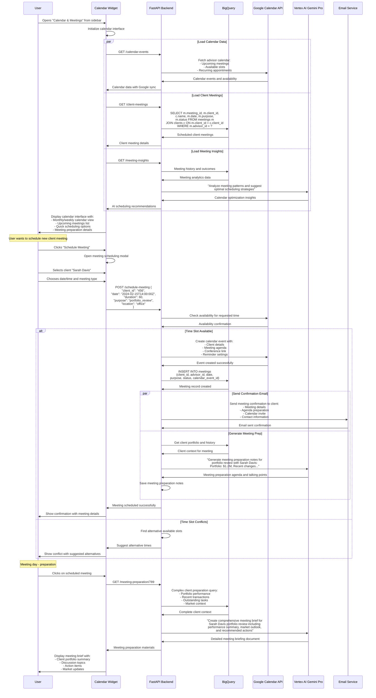

# Calendar & Meetings Page - Technical Flow & Functionality

## 📅 Page Overview
**Location**: Left sidebar → "Calendar & Meetings"  
**Component**: `CalendarWidget.js`  
**Purpose**: Meeting management and calendar integration for client appointments  
**Database**: Client and advisor scheduling with Google Calendar API integration

## 🎯 What This Page Does
- Displays advisor's calendar with client meetings and events
- Schedules new client meetings with automated conflict detection
- Integrates with Google Calendar for real-time synchronization
- Sends meeting reminders and follow-up tasks
- Tracks meeting outcomes and client interactions

## 🔄 Page Flow Sequence



## 📁 File Structure
```
frontend/src/components/
├── CalendarWidget.js          # Main calendar interface
├── CalendarWidget.css         # Calendar styling
├── calendar/
│   ├── CalendarView.js        # Calendar display component
│   ├── MeetingScheduler.js    # Meeting scheduling modal
│   ├── MeetingPrep.js         # Meeting preparation component
│   ├── AvailabilityPicker.js  # Time slot selection
│   ├── ClientSelector.js     # Client selection for meetings
│   └── MeetingHistory.js     # Historical meeting records
```

## 🔧 Technical Implementation

### Component Architecture:
```javascript
const CalendarWidget = () => {
    // State management
    const [currentDate, setCurrentDate] = useState(new Date());
    const [calendarView, setCalendarView] = useState('month'); // month, week, day
    const [meetings, setMeetings] = useState([]);
    const [availability, setAvailability] = useState([]);
    const [selectedMeeting, setSelectedMeeting] = useState(null);
    const [isScheduling, setIsScheduling] = useState(false);
    const [meetingPrep, setMeetingPrep] = useState(null);
    const [calendarSync, setCalendarSync] = useState(true);
    
    useEffect(() => {
        loadCalendarData();
        // Setup real-time sync with Google Calendar
        setupGoogleCalendarSync();
    }, [currentDate]);
    
    const loadCalendarData = async () => {
        try {
            const [eventsRes, meetingsRes, insightsRes] = await Promise.all([
                fetch('/api/calendar-events'),
                fetch('/api/client-meetings'),
                fetch('/api/meeting-insights')
            ]);
            
            const calendarEvents = await eventsRes.json();
            const clientMeetings = await meetingsRes.json();
            const insights = await insightsRes.json();
            
            // Merge calendar events with client meetings
            const combinedEvents = mergeMeetingData(calendarEvents, clientMeetings);
            setMeetings(combinedEvents);
            
            setAvailability(insights.optimal_scheduling_slots);
        } catch (error) {
            console.error('Calendar loading failed:', error);
        }
    };
    
    const scheduleNewMeeting = async (meetingData) => {
        try {
            const response = await fetch('/api/schedule-meeting', {
                method: 'POST',
                headers: { 'Content-Type': 'application/json' },
                body: JSON.stringify(meetingData)
            });
            
            if (response.ok) {
                const result = await response.json();
                // Refresh calendar data
                loadCalendarData();
                setIsScheduling(false);
                showSuccessNotification('Meeting scheduled successfully!');
                
                // Send calendar invite
                await sendCalendarInvite(result.meeting_id);
            }
        } catch (error) {
            console.error('Meeting scheduling failed:', error);
        }
    };
    
    const prepareMeeting = async (meetingId) => {
        try {
            const response = await fetch(`/api/meeting-preparation/${meetingId}`);
            const prep = await response.json();
            setMeetingPrep(prep);
        } catch (error) {
            console.error('Meeting preparation failed:', error);
        }
    };
    
    const setupGoogleCalendarSync = () => {
        // WebSocket connection for real-time calendar updates
        const ws = new WebSocket('ws://localhost:8000/ws/calendar-sync');
        ws.onmessage = (event) => {
            const update = JSON.parse(event.data);
            if (update.type === 'calendar_change') {
                loadCalendarData(); // Refresh on external changes
            }
        };
    };
};
```

### Google Calendar Integration:
```javascript
const GoogleCalendarService = {
    async createEvent(eventData) {
        const calendarEvent = {
            summary: `Meeting with ${eventData.client_name}`,
            description: `Portfolio Review\nAdvisor: ${eventData.advisor_name}\nPurpose: ${eventData.purpose}`,
            start: {
                dateTime: eventData.start_time,
                timeZone: 'America/New_York'
            },
            end: {
                dateTime: eventData.end_time,
                timeZone: 'America/New_York'
            },
            attendees: [
                { email: eventData.client_email },
                { email: eventData.advisor_email }
            ],
            reminders: {
                useDefault: false,
                overrides: [
                    { method: 'email', minutes: 24 * 60 },  // 1 day
                    { method: 'popup', minutes: 30 }        // 30 minutes
                ]
            },
            conferenceData: {
                createRequest: {
                    requestId: generateRequestId(),
                    conferenceSolutionKey: { type: 'hangoutsMeet' }
                }
            }
        };
        
        return await googleCalendar.events.insert({
            calendarId: 'primary',
            resource: calendarEvent,
            conferenceDataVersion: 1
        });
    },
    
    async checkAvailability(timeSlot) {
        const freebusy = await googleCalendar.freebusy.query({
            resource: {
                timeMin: timeSlot.start,
                timeMax: timeSlot.end,
                items: [{ id: 'primary' }]
            }
        });
        
        return freebusy.data.calendars.primary.busy.length === 0;
    }
};
```

### Meeting Preparation Database Query:
```sql
-- Comprehensive meeting preparation data
WITH client_summary AS (
    SELECT 
        c.client_id,
        c.name,
        c.email,
        c.phone,
        c.date_joined,
        a.name as advisor_name,
        
        -- Portfolio overview
        SUM(h.value) as total_portfolio_value,
        COUNT(DISTINCT h.symbol) as num_holdings,
        
        -- Recent performance
        SUM(CASE WHEN h.current_price > h.purchase_price 
             THEN (h.current_price - h.purchase_price) * h.quantity 
             ELSE 0 END) as unrealized_gains,
        
        -- Top holdings
        ARRAY_AGG(
            STRUCT(h.symbol, h.asset_class, h.value)
            ORDER BY h.value DESC LIMIT 5
        ) as top_holdings,
        
        -- Risk metrics
        r.risk_tolerance,
        r.risk_capacity,
        
        -- Recent activity
        COUNT(t.transaction_id) as recent_transactions,
        MAX(t.date) as last_transaction_date
        
    FROM `apialchemists-1-47b9.apialchemists.clients` c
    JOIN `apialchemists-1-47b9.apialchemists.advisors` a ON c.advisor_id = a.advisor_id
    LEFT JOIN `apialchemists-1-47b9.apialchemists.holdings` h ON c.client_id = h.client_id
    LEFT JOIN `apialchemists-1-47b9.apialchemists.risk_metrics` r ON c.client_id = r.client_id
    LEFT JOIN `apialchemists-1-47b9.apialchemists.accounts` acc ON c.client_id = acc.client_id
    LEFT JOIN `apialchemists-1-47b9.apialchemists.transactions` t ON acc.account_id = t.account_id 
        AND t.date >= DATE_SUB(CURRENT_DATE(), INTERVAL 30 DAY)
    WHERE c.client_id = ?
    GROUP BY c.client_id, c.name, c.email, c.phone, c.date_joined, 
             a.name, r.risk_tolerance, r.risk_capacity
),
meeting_history AS (
    SELECT 
        m.client_id,
        COUNT(*) as total_meetings,
        MAX(m.date) as last_meeting_date,
        ARRAY_AGG(
            STRUCT(m.date, m.purpose, m.outcome)
            ORDER BY m.date DESC LIMIT 3
        ) as recent_meetings,
        AVG(m.rating) as avg_meeting_satisfaction
    FROM meetings m
    WHERE m.client_id = ?
      AND m.status = 'completed'
    GROUP BY m.client_id
),
market_context AS (
    SELECT 
        h.asset_class,
        AVG((h.current_price - h.purchase_price) / h.purchase_price * 100) as sector_performance
    FROM `apialchemists-1-47b9.apialchemists.holdings` h
    WHERE h.client_id = ?
    GROUP BY h.asset_class
),
outstanding_tasks AS (
    SELECT 
        COUNT(*) as pending_tasks,
        ARRAY_AGG(
            STRUCT(task, priority, due_date)
            ORDER BY due_date ASC
        ) as task_list
    FROM `apialchemists-1-47b9.apialchemists.todo_tasks`
    WHERE client_id = ?
      AND status = 'pending'
)
SELECT 
    cs.*,
    mh.total_meetings,
    mh.last_meeting_date,
    mh.recent_meetings,
    mh.avg_meeting_satisfaction,
    mc.sector_performance,
    ot.pending_tasks,
    ot.task_list,
    
    -- Meeting readiness score
    CASE 
        WHEN cs.recent_transactions > 5 AND ot.pending_tasks = 0 THEN 'High'
        WHEN cs.recent_transactions > 0 OR ot.pending_tasks > 0 THEN 'Medium'
        ELSE 'Low'
    END as meeting_readiness,
    
    -- Suggested discussion topics
    ARRAY[
        CASE WHEN cs.unrealized_gains > 0 THEN 'Performance Review - Positive Gains' END,
        CASE WHEN ot.pending_tasks > 0 THEN 'Outstanding Action Items' END,
        CASE WHEN cs.recent_transactions = 0 THEN 'Portfolio Activity Discussion' END,
        CASE WHEN DATE_DIFF(CURRENT_DATE(), cs.date_joined, DAY) > 365 THEN 'Annual Portfolio Review' END
    ] as suggested_topics
    
FROM client_summary cs
LEFT JOIN meeting_history mh ON cs.client_id = mh.client_id
CROSS JOIN market_context mc
CROSS JOIN outstanding_tasks ot;
```

## 🎨 Calendar Interface Layout
```
┌─────────────────────────────────────────────────────────────────────────┐
│                     📅 Calendar & Meetings                             │
│                                                                         │
│  [Month] [Week] [Day] [Schedule Meeting]            🔄 Sync: ✅ Google  │
├─────────────────────────────────────────────────────────────────────────┤
│                                                                         │
│  ┌─────────────────────────────────┐  ┌─────────────────────────────────┐ │
│  │          February 2024          │  │       📋 Today's Meetings       │ │
│  │                                 │  │                                 │ │
│  │  Mon  Tue  Wed  Thu  Fri  Sat  │  │  🕘 9:00 AM - John Smith        │ │
│  │   5    6    7    8    9   10   │  │     Portfolio Review             │ │
│  │  12   13   14  [15]  16   17   │  │     📍 Conference Room A         │ │
│  │  19   20   21   22   23   24   │  │     [📝 Prepare] [📞 Join]      │ │
│  │  26   27   28   29              │  │                                 │ │
│  │                                 │  │  🕐 1:00 PM - Sarah Davis       │ │
│  │  Selected: Feb 15 (Today)      │  │     Quarterly Check-in          │ │
│  │  • 9:00 AM - John Smith        │  │     📍 Video Call              │ │
│  │  • 1:00 PM - Sarah Davis       │  │     [📝 Prepare] [📞 Join]      │ │
│  │  • 3:30 PM - Market Research   │  │                                 │ │
│  │                                 │  │  🕞 3:30 PM - Team Meeting      │ │
│  └─────────────────────────────────┘  │     Market Strategy             │ │
│                                       │     📍 Main Conference Room     │ │
│                                       │     [📝 Notes] [📊 Present]     │ │
│                                       └─────────────────────────────────┘ │
│                                                                         │
│  ┌─────────────────────────────────────────────────────────────────────┐ │
│  │                     📋 Meeting Preparation                          │ │
│  │                                                                     │ │
│  │  Client: John Smith                    📊 Portfolio: $2.1M          │ │
│  │  Meeting: Portfolio Review             📈 YTD Return: +5.2%         │ │
│  │  Duration: 60 minutes                  ⚡ Activity: High            │ │
│  │                                                                     │ │
│  │  📑 Agenda:                           🎯 Discussion Points:         │ │
│  │  • Performance review                 • Technology sector gains     │ │
│  │  • Q1 market outlook                 • Diversification opportunity  │ │
│  │  • Rebalancing options               • Tax optimization strategies  │ │
│  │  • Risk assessment update            • Estate planning review       │ │
│  │                                                                     │ │
│  │  📊 Key Metrics:                     ⚠️ Action Items:               │ │
│  │  • Total Holdings: 28 securities     • Review bond allocation       │ │
│  │  • Asset Classes: 4                  • Update risk profile          │ │
│  │  • Top Performer: AAPL (+12.3%)      • Schedule tax planning call   │ │
│  │  • Largest Position: 8.5% MSFT       • Send market outlook report   │ │
│  │                                                                     │ │
│  │  [💾 Save Notes] [📧 Send Summary] [📋 Create Follow-up Tasks]      │ │
│  └─────────────────────────────────────────────────────────────────────┘ │
├─────────────────────────────────────────────────────────────────────────┤
│                      📊 Meeting Analytics                               │
│                                                                         │
│  This Month: 18 meetings  |  Avg Duration: 52 min  |  Satisfaction: ⭐ 4.6/5  │
│  Next Week: 7 scheduled   |  Prep Time: 15 min avg |  No-shows: 2% rate    │
│                                                                         │
│  [📊 View Full Analytics] [📅 Availability Settings] [⚙️ Calendar Sync] │
└─────────────────────────────────────────────────────────────────────────┘
```

## 📅 Advanced Calendar Features

### Meeting Scheduler Component:
```javascript
const MeetingScheduler = ({ onSchedule, onCancel }) => {
    const [selectedClient, setSelectedClient] = useState(null);
    const [selectedDateTime, setSelectedDateTime] = useState(null);
    const [meetingType, setMeetingType] = useState('portfolio_review');
    const [duration, setDuration] = useState(60);
    const [location, setLocation] = useState('video_call');
    const [availableSlots, setAvailableSlots] = useState([]);
    
    const meetingTypes = {
        portfolio_review: 'Portfolio Review',
        initial_consultation: 'Initial Consultation', 
        quarterly_checkin: 'Quarterly Check-in',
        risk_assessment: 'Risk Assessment',
        tax_planning: 'Tax Planning',
        estate_planning: 'Estate Planning'
    };
    
    const checkAvailability = async (date) => {
        const response = await fetch(`/api/availability?date=${date}`);
        const slots = await response.json();
        setAvailableSlots(slots.available_slots);
    };
    
    return (
        <div className="meeting-scheduler-modal">
            <div className="scheduler-header">
                <h3>📅 Schedule Client Meeting</h3>
                <button onClick={onCancel} className="close-btn">✕</button>
            </div>
            
            <div className="scheduler-form">
                <div className="form-section">
                    <label>Client</label>
                    <ClientSelector 
                        onSelect={setSelectedClient}
                        selected={selectedClient}
                    />
                </div>
                
                <div className="form-section">
                    <label>Meeting Type</label>
                    <select 
                        value={meetingType}
                        onChange={(e) => setMeetingType(e.target.value)}
                    >
                        {Object.entries(meetingTypes).map(([key, label]) => (
                            <option key={key} value={key}>{label}</option>
                        ))}
                    </select>
                </div>
                
                <div className="form-section">
                    <label>Date & Time</label>
                    <AvailabilityPicker
                        onSelect={setSelectedDateTime}
                        availableSlots={availableSlots}
                        duration={duration}
                    />
                </div>
                
                <div className="form-section">
                    <label>Duration</label>
                    <select value={duration} onChange={(e) => setDuration(parseInt(e.target.value))}>
                        <option value={30}>30 minutes</option>
                        <option value={60}>1 hour</option>
                        <option value={90}>1.5 hours</option>
                        <option value={120}>2 hours</option>
                    </select>
                </div>
                
                <div className="form-section">
                    <label>Location</label>
                    <select value={location} onChange={(e) => setLocation(e.target.value)}>
                        <option value="video_call">Video Call</option>
                        <option value="office">Office - Conference Room A</option>
                        <option value="client_location">Client Location</option>
                        <option value="phone_call">Phone Call</option>
                    </select>
                </div>
                
                <div className="scheduler-actions">
                    <button 
                        onClick={() => onSchedule({
                            client_id: selectedClient?.client_id,
                            datetime: selectedDateTime,
                            type: meetingType,
                            duration,
                            location
                        })}
                        disabled={!selectedClient || !selectedDateTime}
                        className="schedule-btn"
                    >
                        📅 Schedule Meeting
                    </button>
                    <button onClick={onCancel} className="cancel-btn">
                        Cancel
                    </button>
                </div>
            </div>
        </div>
    );
};
```

### Meeting Preparation AI Assistant:
```javascript
const generateMeetingPreparation = async (clientId, meetingType) => {
    const prompt = `Generate a comprehensive meeting preparation brief for a ${meetingType} meeting. 
    Include:
    1. Key discussion topics based on client portfolio and recent activity
    2. Specific talking points and questions to ask
    3. Action items and follow-up tasks
    4. Market insights relevant to client's holdings
    5. Regulatory or compliance items to address
    
    Make it professional, actionable, and client-focused.`;
    
    const response = await fetch('/api/ai-meeting-prep', {
        method: 'POST',
        headers: { 'Content-Type': 'application/json' },
        body: JSON.stringify({
            client_id: clientId,
            meeting_type: meetingType,
            prompt: prompt
        })
    });
    
    return await response.json();
};
```

## 📊 Meeting Analytics & Insights

### Calendar Analytics Component:
```javascript
const CalendarAnalytics = ({ meetings }) => {
    const calculateAnalytics = () => {
        const thisMonth = meetings.filter(m => 
            new Date(m.date).getMonth() === new Date().getMonth()
        );
        
        const avgDuration = thisMonth.reduce((sum, m) => sum + m.duration, 0) / thisMonth.length;
        const avgSatisfaction = thisMonth.reduce((sum, m) => sum + (m.rating || 5), 0) / thisMonth.length;
        const noShowRate = thisMonth.filter(m => m.status === 'no_show').length / thisMonth.length * 100;
        
        return {
            totalMeetings: thisMonth.length,
            avgDuration: Math.round(avgDuration),
            avgSatisfaction,
            noShowRate
        };
    };
    
    const analytics = calculateAnalytics();
    
    return (
        <div className="calendar-analytics">
            <div className="analytics-grid">
                <div className="metric">
                    <span className="value">{analytics.totalMeetings}</span>
                    <span className="label">Meetings This Month</span>
                </div>
                <div className="metric">
                    <span className="value">{analytics.avgDuration}m</span>
                    <span className="label">Avg Duration</span>
                </div>
                <div className="metric">
                    <span className="value">⭐ {analytics.avgSatisfaction.toFixed(1)}</span>
                    <span className="label">Client Satisfaction</span>
                </div>
                <div className="metric">
                    <span className="value">{analytics.noShowRate.toFixed(1)}%</span>
                    <span className="label">No-Show Rate</span>
                </div>
            </div>
        </div>
    );
};
```

## 🔔 Automated Reminders & Follow-ups

### Meeting Reminder System:
```javascript
const setupMeetingReminders = (meeting) => {
    const reminderTimes = [
        { time: 24 * 60 * 60 * 1000, message: '24 hours before' },  // 1 day
        { time: 2 * 60 * 60 * 1000, message: '2 hours before' },    // 2 hours
        { time: 30 * 60 * 1000, message: '30 minutes before' }      // 30 minutes
    ];
    
    reminderTimes.forEach(reminder => {
        const reminderTime = new Date(meeting.date).getTime() - reminder.time;
        
        if (reminderTime > Date.now()) {
            setTimeout(async () => {
                await sendMeetingReminder(meeting, reminder.message);
            }, reminderTime - Date.now());
        }
    });
};

const sendMeetingReminder = async (meeting, timeframe) => {
    const reminderData = {
        client_email: meeting.client_email,
        meeting_details: meeting,
        timeframe: timeframe,
        preparation_notes: meeting.preparation_notes
    };
    
    await fetch('/api/send-meeting-reminder', {
        method: 'POST',
        headers: { 'Content-Type': 'application/json' },
        body: JSON.stringify(reminderData)
    });
};
```

## 🔗 Integration Benefits

### Google Calendar Sync:
- **Real-time Updates**: Bi-directional sync with Google Calendar
- **Conflict Detection**: Automatic scheduling conflict prevention
- **Mobile Access**: Calendar access via Google Calendar mobile app
- **Meeting Links**: Automated Google Meet integration
- **Reminder System**: Leverages Google's notification system

### Business Value:
- **Client Experience**: Professional scheduling and preparation
- **Advisor Efficiency**: Streamlined meeting management workflow
- **Revenue Optimization**: Better meeting utilization and client engagement
- **Compliance**: Documented meeting history and outcomes
- **Relationship Building**: Consistent client touchpoints and follow-up
