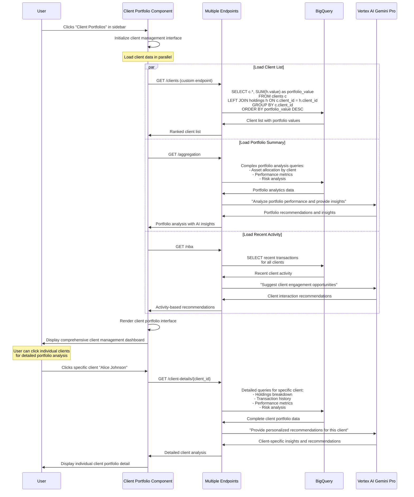

# Client Portfolios Page - Technical Flow & Functionality

## 👥 Page Overview
**Location**: Left sidebar → "Client Portfolios"  
**Component**: `ClientWidget.js` / `PortfolioWidget.js`  
**Purpose**: Comprehensive client portfolio management and analysis  
**Database**: `clients`, `holdings`, `transactions`, `accounts` tables

## 🎯 What This Page Does
- Displays detailed client portfolio information
- Shows asset allocation and performance metrics
- Provides client contact information and history
- Enables portfolio rebalancing recommendations
- Tracks client investment objectives and risk profiles

## 🔄 Page Flow Sequence



## 📁 File Structure
```
frontend/src/components/widgets/
├── ClientWidget.js         # Main client management interface
├── ClientWidget.css        # Client portfolio styling
├── PortfolioWidget.js      # Portfolio analysis components
├── PortfolioWidget.css     # Portfolio visualization styles
```

## 🔧 Technical Implementation

### Component Architecture:
```javascript
const ClientWidget = () => {
    // State management
    const [clients, setClients] = useState([]);
    const [selectedClient, setSelectedClient] = useState(null);
    const [portfolioData, setPortfolioData] = useState(null);
    const [loading, setLoading] = useState(true);
    const [filter, setFilter] = useState('all'); // all, high-value, new, at-risk
    
    useEffect(() => {
        loadClientData();
    }, []);
    
    const loadClientData = async () => {
        try {
            // Load client list with portfolio values
            const clientResponse = await fetch('/api/aggregation');
            const portfolioResponse = await fetch('/api/nba');
            
            const clientData = await clientResponse.json();
            const activityData = await portfolioResponse.json();
            
            // Combine and process data
            processClientPortfolios(clientData, activityData);
        } catch (error) {
            console.error('Failed to load client data:', error);
        }
    };
    
    const selectClient = async (clientId) => {
        // Load detailed client information
        const response = await fetch(`/api/client-details/${clientId}`);
        const clientDetails = await response.json();
        setSelectedClient(clientDetails);
    };
    
    const renderPortfolioBreakdown = (client) => {
        return (
            <div className="portfolio-breakdown">
                <PieChart data={client.assetAllocation} />
                <PerformanceChart data={client.performance} />
                <RiskMetrics risk={client.riskProfile} />
            </div>
        );
    };
};
```

### Database Queries for Client Portfolios:

#### Client List Query:
```sql
-- Get all clients with portfolio summary
SELECT 
    c.client_id,
    c.name,
    c.email,
    c.phone,
    c.risk_profile,
    c.tier,
    c.net_worth,
    c.date_joined,
    a.name as advisor_name,
    COALESCE(SUM(h.value), 0) as current_portfolio_value,
    COUNT(h.holding_id) as total_holdings,
    COUNT(DISTINCT h.asset_class) as asset_classes,
    MAX(t.date) as last_transaction_date
FROM `apialchemists-1-47b9.apialchemists.clients` c
LEFT JOIN `apialchemists-1-47b9.apialchemists.advisors` a ON c.advisor_id = a.advisor_id
LEFT JOIN `apialchemists-1-47b9.apialchemists.holdings` h ON c.client_id = h.client_id
LEFT JOIN `apialchemists-1-47b9.apialchemists.accounts` acc ON c.client_id = acc.client_id
LEFT JOIN `apialchemists-1-47b9.apialchemists.transactions` t ON acc.account_id = t.account_id
GROUP BY c.client_id, c.name, c.email, c.phone, c.risk_profile, c.tier, c.net_worth, c.date_joined, a.name
ORDER BY current_portfolio_value DESC;
```

#### Individual Client Detail Query:
```sql
-- Detailed portfolio breakdown for specific client
WITH client_holdings AS (
    SELECT 
        h.asset_class,
        h.sector,
        SUM(h.value) as class_value,
        COUNT(*) as positions,
        AVG(h.current_price / h.purchase_price - 1) * 100 as avg_performance_pct
    FROM `apialchemists-1-47b9.apialchemists.holdings` h
    WHERE h.client_id = @client_id
    GROUP BY h.asset_class, h.sector
),
recent_transactions AS (
    SELECT 
        t.transaction_id,
        t.amount,
        t.transaction_type,
        t.category,
        t.date,
        t.description
    FROM `apialchemists-1-47b9.apialchemists.transactions` t
    JOIN `apialchemists-1-47b9.apialchemists.accounts` a ON t.account_id = a.account_id
    WHERE a.client_id = @client_id
    ORDER BY t.date DESC
    LIMIT 10
)
SELECT 
    ch.*,
    rt.transaction_id,
    rt.amount,
    rt.transaction_type,
    rt.date as transaction_date
FROM client_holdings ch
CROSS JOIN recent_transactions rt;
```

## 🎨 Client Portfolio Interface Layout
```
┌─────────────────────────────────────────────────────────────────────────┐
│                      👥 Client Portfolios                              │
│                                                                         │
│  [All Clients] [High Value] [New] [At Risk]     🔍 Search: [        ]  │
├─────────────────────────────────────────────────────────────────────────┤
│                                                                         │
│  ┌─────────────────┐  ┌─────────────────┐  ┌─────────────────┐         │
│  │ Alice Johnson   │  │ Robert Chen     │  │ Maria Rodriguez │         │
│  │ 💰 $2.1M        │  │ 💰 $1.8M        │  │ 💰 $1.5M        │         │
│  │ 📊 Conservative │  │ 📊 Growth       │  │ 📊 Balanced     │         │
│  │ ✅ Up 12.5%     │  │ ⚠️ Down 2.1%    │  │ ✅ Up 8.3%      │         │
│  │ 📞 555-0123     │  │ 📞 555-0124     │  │ 📞 555-0125     │         │
│  │ [View Details]  │  │ [View Details]  │  │ [View Details]  │         │
│  └─────────────────┘  └─────────────────┘  └─────────────────┘         │
│                                                                         │
│  ┌─────────────────────────────────────────────────────────────────────┐ │
│  │               📊 Selected Client: Alice Johnson                     │ │
│  ├─────────────────────────────────────────────────────────────────────┤ │
│  │                                                                     │ │
│  │  📈 Portfolio: $2.1M    📅 Last Review: 2025-01-15                │ │
│  │  🎯 Risk: Conservative  📞 Contact: alice@email.com               │ │
│  │                                                                     │ │
│  │  Asset Allocation:          Performance (YTD):                      │ │
│  │  ┌─────────────────┐      ┌─────────────────────┐                  │ │
│  │  │     [Pie Chart] │      │   [Line Chart]      │                  │ │
│  │  │ Stocks:  45%    │      │   +12.5% Return     │                  │ │
│  │  │ Bonds:   35%    │      │   Outperforming     │                  │ │
│  │  │ Cash:    20%    │      │   Benchmark by 3.2% │                  │ │
│  │  └─────────────────┘      └─────────────────────┘                  │ │
│  │                                                                     │ │
│  │  🤖 AI Recommendations:                                            │ │
│  │  • Consider rebalancing to reduce cash allocation                   │ │
│  │  • Growth opportunities in technology sector                       │ │
│  │  • Schedule quarterly review meeting                               │ │
│  │                                                                     │ │
│  │  Recent Activity:                                                   │ │
│  │  • Jan 20: Dividend reinvestment +$1,250                          │ │
│  │  • Jan 15: Bond purchase +$50,000                                 │ │
│  │  • Jan 10: Stock sale -$25,000                                    │ │
│  │                                                                     │ │
│  └─────────────────────────────────────────────────────────────────────┘ │
└─────────────────────────────────────────────────────────────────────────┘
```

## 📊 Portfolio Analytics & Metrics

### Key Performance Indicators:
```javascript
const calculatePortfolioMetrics = (holdings) => {
    return {
        totalValue: holdings.reduce((sum, h) => sum + h.value, 0),
        ytdReturn: calculateYTDReturn(holdings),
        sharpeRatio: calculateSharpeRatio(holdings),
        beta: calculateBeta(holdings),
        diversificationScore: calculateDiversification(holdings),
        riskScore: calculateRiskScore(holdings)
    };
};
```

### Asset Allocation Analysis:
```sql
-- Asset allocation for client portfolio
SELECT 
    h.asset_class,
    SUM(h.value) as allocation_value,
    ROUND(100.0 * SUM(h.value) / SUM(SUM(h.value)) OVER(), 2) as allocation_percentage,
    COUNT(*) as num_positions,
    AVG((h.current_price - h.purchase_price) / h.purchase_price * 100) as avg_performance
FROM holdings h
WHERE h.client_id = @client_id
GROUP BY h.asset_class
ORDER BY allocation_value DESC;
```

### Performance Attribution:
```sql
-- Performance analysis by asset class
SELECT 
    h.asset_class,
    h.sector,
    SUM(h.value * (h.current_price - h.purchase_price) / h.purchase_price) as contribution_to_return,
    SUM(h.value) as position_value,
    COUNT(*) as positions
FROM holdings h 
WHERE h.client_id = @client_id
GROUP BY h.asset_class, h.sector
ORDER BY contribution_to_return DESC;
```

## 🤖 AI-Powered Client Insights

### Portfolio Optimization Recommendations:
```python
def generate_client_recommendations(client_data):
    prompt = f"""
    Analyze this client portfolio and provide specific recommendations:
    
    Client: {client_data['name']}
    Risk Profile: {client_data['risk_profile']}
    Portfolio Value: ${client_data['portfolio_value']:,}
    Current Allocation: {client_data['asset_allocation']}
    Recent Performance: {client_data['ytd_return']}%
    
    Provide 3-4 specific, actionable recommendations focusing on:
    1. Asset allocation optimization
    2. Risk management
    3. Growth opportunities
    4. Next advisor actions
    
    Consider current market conditions and client's risk tolerance.
    """
```

### Risk Assessment:
```python
def assess_portfolio_risk(client_holdings):
    prompt = f"""
    Assess portfolio risk for this client:
    
    Holdings: {client_holdings}
    
    Analyze:
    1. Concentration risk (single positions > 10%)
    2. Sector exposure risks
    3. Geographic diversification
    4. Liquidity concerns
    5. Interest rate sensitivity
    
    Provide risk level (Low/Medium/High) with specific concerns.
    """
```

## 🔗 Integration Points

### Message Center Integration:
```javascript
const draftClientMessage = async (clientId, context) => {
    const response = await fetch('/api/draft-message', {
        method: 'POST',
        headers: { 'Content-Type': 'application/json' },
        body: JSON.stringify({
            client_id: clientId,
            text: context
        })
    });
    return response.json();
};
```

### Calendar Integration:
- **Schedule Reviews**: Book quarterly portfolio reviews
- **Rebalancing Meetings**: Schedule rebalancing discussions
- **Performance Reviews**: Annual performance meetings

### Task Management Integration:
- **Auto-generate Tasks**: Create tasks from AI recommendations
- **Client Follow-ups**: Schedule follow-up actions
- **Compliance Tasks**: Generate required compliance actions

## 📈 Advanced Analytics

### Portfolio Comparison:
```sql
-- Compare client performance to peer group
WITH peer_performance AS (
    SELECT 
        c.risk_profile,
        AVG((h.current_price - h.purchase_price) / h.purchase_price * 100) as avg_peer_return
    FROM clients c
    JOIN holdings h ON c.client_id = h.client_id
    WHERE c.risk_profile = @client_risk_profile
    GROUP BY c.risk_profile
),
client_performance AS (
    SELECT 
        AVG((h.current_price - h.purchase_price) / h.purchase_price * 100) as client_return
    FROM holdings h
    WHERE h.client_id = @client_id
)
SELECT 
    cp.client_return,
    pp.avg_peer_return,
    cp.client_return - pp.avg_peer_return as relative_performance
FROM client_performance cp, peer_performance pp;
```

### Trend Analysis:
```javascript
const analyzeTrends = async (clientId) => {
    // Get 12 months of portfolio values
    const monthlyValues = await getMonthlyPortfolioValues(clientId);
    
    // Calculate trends
    return {
        trend: calculateTrend(monthlyValues),
        volatility: calculateVolatility(monthlyValues), 
        sharpeRatio: calculateSharpeRatio(monthlyValues),
        maxDrawdown: calculateMaxDrawdown(monthlyValues)
    };
};
```

## 🎯 Business Value
- **Comprehensive Client View**: Complete portfolio and relationship overview
- **Performance Monitoring**: Track client success and advisor effectiveness
- **Risk Management**: Identify and address portfolio risks proactively
- **Personalized Service**: AI-driven insights for each client relationship
- **Regulatory Compliance**: Ensure proper documentation and oversight
