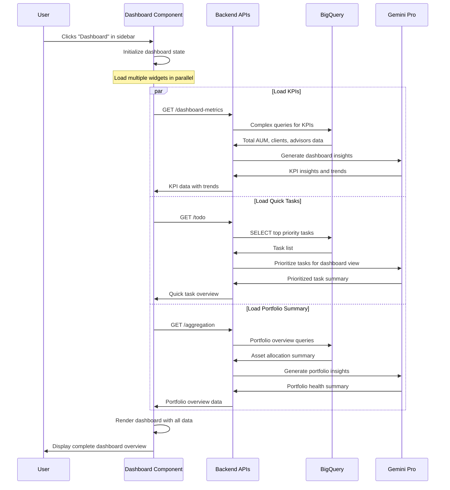

# Dashboard Page - Technical Flow & Functionality

## 📊 Page Overview
**Location**: Main landing page after login  
**Component**: `MainDashboard.js`  
**Navigation**: Left sidebar → "Dashboard"  
**Purpose**: Central overview of all banking advisor activities

## 🎯 What This Page Does
- Shows key performance indicators (KPIs) 
- Displays widget overview of all features
- Provides quick access to daily tasks
- Shows portfolio summary and alerts
- Real-time updates from all system components

## 🔄 Page Flow Sequence



## 📁 File Structure
```
frontend/src/components/
├── MainDashboard.js        # Main dashboard component
├── MainDashboard.css       # Dashboard styling
├── widgets/
│   ├── TodoWidget.js       # Quick tasks widget
│   ├── PortfolioWidget.js  # Portfolio summary
│   ├── NBAWidget.js        # Quick actions
│   └── ChatWidget.js       # AI assistant preview
```

## 🔧 Technical Implementation

### Component Architecture:
```javascript
const MainDashboard = () => {
    // State management
    const [dashboardData, setDashboardData] = useState(null);
    const [loading, setLoading] = useState(true);
    const [kpis, setKpis] = useState({});
    
    // Load dashboard data on mount
    useEffect(() => {
        loadDashboardData();
    }, []);
    
    // API calls
    const loadDashboardData = async () => {
        Promise.all([
            fetchKPIData(),      // /dashboard-metrics
            fetchTaskSummary(),  // /todo
            fetchPortfolioOverview(), // /aggregation
            fetchRecentAlerts()  // /ai-insights
        ]).then(renderDashboard);
    };
}
```

### Key API Endpoints Used:
- **GET /dashboard-metrics** - KPI cards and trends
- **GET /todo** - Quick task overview
- **GET /aggregation** - Portfolio summary  
- **GET /ai-insights** - Real-time alerts and insights

### Database Tables Accessed:
```sql
-- KPI Calculations
SELECT 
    COUNT(DISTINCT c.client_id) as total_clients,
    SUM(h.value) as total_aum,
    COUNT(DISTINCT a.advisor_id) as active_advisors
FROM holdings h
JOIN clients c ON h.client_id = c.client_id
JOIN advisors a ON c.advisor_id = a.advisor_id;

-- Recent Activity Summary
SELECT COUNT(*) as daily_transactions,
       SUM(amount) as daily_volume
FROM transactions 
WHERE DATE(date) = CURRENT_DATE();
```

## 🎨 Visual Layout
```
┌─────────────────────────────────────────────────────────────────┐
│                    Dashboard Header                              │
│  📊 Private Banking Dashboard    🔔 Alerts    👤 Profile        │
├─────────────────────────────────────────────────────────────────┤
│                                                                 │
│  ┌─────────────┐  ┌─────────────┐  ┌─────────────┐ ┌──────────┐ │
│  │   Total AUM │  │   Clients   │  │  Advisors   │ │ Today's  │ │
│  │   $25.2M    │  │     156     │  │      8      │ │Tasks: 12 │ │
│  │   ↗️ +12.5%  │  │   ↗️ +3.2%   │  │   Stable    │ │ ⚠️ 3 High │ │
│  └─────────────┘  └─────────────┘  └─────────────┘ └──────────┘ │
│                                                                 │
│  ┌───────────────────────────┐  ┌─────────────────────────────┐ │
│  │    Portfolio Overview     │  │      Quick Actions          │ │
│  │                          │  │                             │ │
│  │    📈 Asset Allocation   │  │  • Review client portfolios  │ │
│  │    Stocks: 45%           │  │  • Prepare quarterly reports │ │
│  │    Bonds: 30%            │  │  • Schedule client meetings  │ │
│  │    Real Estate: 25%      │  │                             │ │
│  └───────────────────────────┘  └─────────────────────────────┘ │
│                                                                 │
│  ┌─────────────────────────────────────────────────────────────┐ │
│  │                    AI Insights & Alerts                     │ │
│  │                                                             │ │
│  │  🤖 "High-value clients showing increased activity"         │ │
│  │  ⚠️  "Portfolio rebalancing opportunities identified"       │ │
│  │  📊 "Market volatility requires advisor attention"          │ │
│  └─────────────────────────────────────────────────────────────┘ │
│                                                                 │
└─────────────────────────────────────────────────────────────────┘
```

## 📊 Data Sources

### Real-time Data:
- **BigQuery Tables**: advisors, clients, holdings, transactions, todo_tasks
- **AI Processing**: Vertex AI Gemini Pro for insights generation
- **Cloud Storage**: Document count and recent uploads

### Update Frequency:
- **KPIs**: Real-time (on page load)
- **Tasks**: Real-time (on page load) 
- **Portfolio Data**: Real-time (on page load)
- **AI Insights**: Generated fresh each visit

## 🔗 Navigation Options
From dashboard, users can:
- **Click widgets** → Navigate to detailed pages
- **View alerts** → See specific issues
- **Quick actions** → Jump to priority tasks
- **Sidebar navigation** → Access other features

## 🎯 Business Value
- **At-a-glance overview** of entire advisory business
- **Immediate identification** of priority items
- **Real-time insights** powered by AI
- **Quick access** to all platform features
- **Performance tracking** with trend indicators
