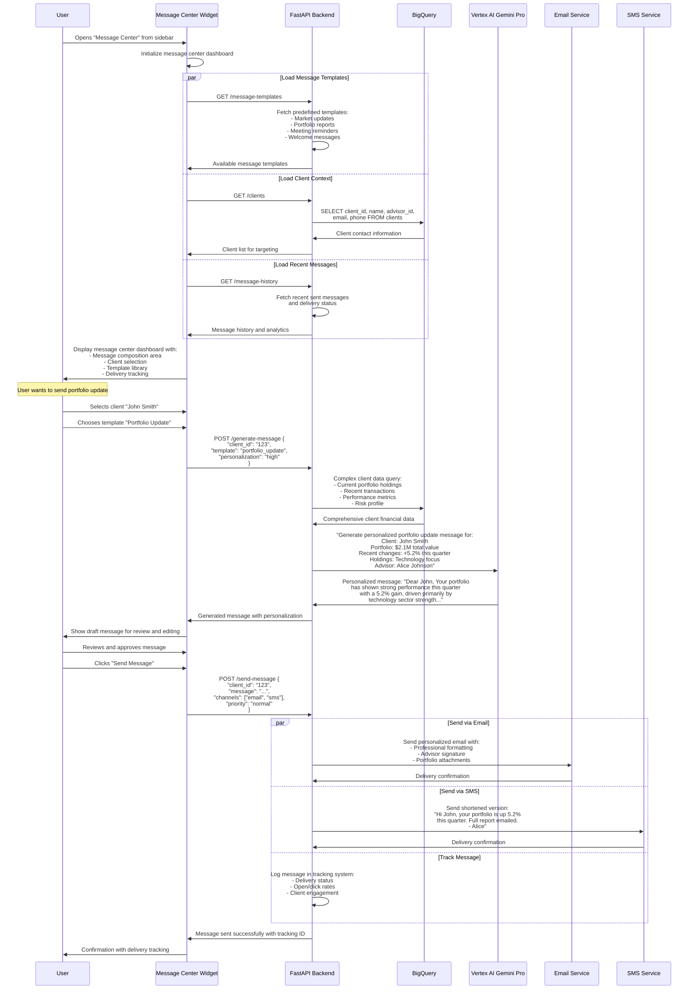

# Message Center Page - Technical Flow & Functionality

## 📧 Page Overview
**Location**: Left sidebar → "Message Center"  
**Component**: `MessageDraftWidget.js`  
**Purpose**: AI-powered communication and message drafting  
**Database**: Uses all client and advisor data for contextual messaging

## 🎯 What This Page Does
- Drafts personalized messages for clients using AI
- Manages communication templates and workflows
- Sends portfolio updates and market insights
- Schedules and tracks message delivery
- Integrates with email systems and SMS

## 🔄 Page Flow Sequence



## 📁 File Structure
```
frontend/src/components/
├── MessageDraftWidget.js      # Main message center component
├── MessageDraftWidget.css     # Message center styling
├── message/
│   ├── MessageComposer.js     # Message composition interface
│   ├── TemplateLibrary.js     # Message template management
│   ├── ClientSelector.js     # Client targeting component
│   ├── DeliveryTracker.js    # Message delivery tracking
│   └── MessageHistory.js     # Sent message history
```

## 🔧 Technical Implementation

### Component Architecture:
```javascript
const MessageDraftWidget = () => {
    // State management
    const [selectedClient, setSelectedClient] = useState(null);
    const [selectedTemplate, setSelectedTemplate] = useState(null);
    const [messageContent, setMessageContent] = useState('');
    const [messageType, setMessageType] = useState('email'); // email, sms, both
    const [deliverySchedule, setDeliverySchedule] = useState('immediate');
    const [isGenerating, setIsGenerating] = useState(false);
    const [messageHistory, setMessageHistory] = useState([]);
    const [templates, setTemplates] = useState([]);
    const [clients, setClients] = useState([]);
    
    useEffect(() => {
        loadInitialData();
    }, []);
    
    const loadInitialData = async () => {
        try {
            const [templatesRes, clientsRes, historyRes] = await Promise.all([
                fetch('/api/message-templates'),
                fetch('/api/clients'),
                fetch('/api/message-history')
            ]);
            
            setTemplates(await templatesRes.json());
            setClients(await clientsRes.json());
            setMessageHistory(await historyRes.json());
        } catch (error) {
            console.error('Failed to load message center data:', error);
        }
    };
    
    const generatePersonalizedMessage = async () => {
        if (!selectedClient || !selectedTemplate) return;
        
        setIsGenerating(true);
        try {
            const response = await fetch('/api/generate-message', {
                method: 'POST',
                headers: { 'Content-Type': 'application/json' },
                body: JSON.stringify({
                    client_id: selectedClient.client_id,
                    template: selectedTemplate.template_id,
                    personalization: 'high',
                    include_portfolio_data: true,
                    include_market_insights: true
                })
            });
            
            const result = await response.json();
            setMessageContent(result.generated_message);
        } catch (error) {
            console.error('Message generation failed:', error);
        } finally {
            setIsGenerating(false);
        }
    };
    
    const sendMessage = async () => {
        try {
            const response = await fetch('/api/send-message', {
                method: 'POST',
                headers: { 'Content-Type': 'application/json' },
                body: JSON.stringify({
                    client_id: selectedClient.client_id,
                    message: messageContent,
                    channels: messageType === 'both' ? ['email', 'sms'] : [messageType],
                    priority: 'normal',
                    schedule: deliverySchedule
                })
            });
            
            if (response.ok) {
                const result = await response.json();
                // Update message history
                loadInitialData();
                // Reset form
                setMessageContent('');
                setSelectedClient(null);
                setSelectedTemplate(null);
                
                // Show success notification
                showSuccessNotification('Message sent successfully!');
            }
        } catch (error) {
            console.error('Failed to send message:', error);
        }
    };
};
```

### Message Generation Integration:
```javascript
const MessageComposer = ({ onGenerate, isGenerating }) => {
    const [templateSettings, setTemplateSettings] = useState({
        tone: 'professional', // casual, professional, friendly
        length: 'medium',     // short, medium, long
        includeData: true,    // Include portfolio data
        includeInsights: true // Include AI insights
    });
    
    return (
        <div className="message-composer">
            <div className="composer-header">
                <h3>📝 Compose Message</h3>
                <div className="composer-settings">
                    <select 
                        value={templateSettings.tone}
                        onChange={(e) => setTemplateSettings(prev => ({
                            ...prev, tone: e.target.value
                        }))}
                    >
                        <option value="professional">Professional</option>
                        <option value="friendly">Friendly</option>
                        <option value="casual">Casual</option>
                    </select>
                </div>
            </div>
            
            <div className="message-input-area">
                <textarea
                    placeholder="Message will be generated based on client data and selected template..."
                    value={messageContent}
                    onChange={(e) => setMessageContent(e.target.value)}
                    rows={8}
                    className="message-textarea"
                />
                
                <div className="composer-actions">
                    <button 
                        onClick={onGenerate}
                        disabled={isGenerating}
                        className="generate-btn"
                    >
                        {isGenerating ? '🤖 Generating...' : '✨ Generate with AI'}
                    </button>
                    <button className="preview-btn">👁️ Preview</button>
                    <button className="send-btn">📤 Send Message</button>
                </div>
            </div>
        </div>
    );
};
```

### Advanced Message Generation Query:
```sql
-- Comprehensive client data for message personalization
WITH client_portfolio AS (
    SELECT 
        c.client_id,
        c.name,
        c.email,
        c.phone,
        c.date_joined,
        a.name as advisor_name,
        a.specialization,
        
        -- Portfolio summary
        SUM(h.value) as total_portfolio_value,
        COUNT(DISTINCT h.symbol) as num_holdings,
        COUNT(DISTINCT h.asset_class) as asset_classes,
        
        -- Recent performance
        SUM(CASE WHEN h.current_price > h.purchase_price 
             THEN (h.current_price - h.purchase_price) * h.quantity 
             ELSE 0 END) as unrealized_gains,
        SUM(CASE WHEN h.current_price < h.purchase_price 
             THEN (h.purchase_price - h.current_price) * h.quantity 
             ELSE 0 END) as unrealized_losses,
             
        -- Risk assessment
        r.risk_tolerance,
        r.risk_capacity,
        r.investment_horizon,
        
        -- Recent activity
        COUNT(t.transaction_id) as recent_transactions,
        MAX(t.date) as last_transaction_date,
        SUM(CASE WHEN t.date >= DATE_SUB(CURRENT_DATE(), INTERVAL 30 DAY) 
            THEN t.amount ELSE 0 END) as monthly_activity
        
    FROM `apialchemists-1-47b9.apialchemists.clients` c
    JOIN `apialchemists-1-47b9.apialchemists.advisors` a ON c.advisor_id = a.advisor_id
    LEFT JOIN `apialchemists-1-47b9.apialchemists.holdings` h ON c.client_id = h.client_id
    LEFT JOIN `apialchemists-1-47b9.apialchemists.risk_metrics` r ON c.client_id = r.client_id
    LEFT JOIN `apialchemists-1-47b9.apialchemists.accounts` acc ON c.client_id = acc.client_id
    LEFT JOIN `apialchemists-1-47b9.apialchemists.transactions` t ON acc.account_id = t.account_id
    WHERE c.client_id = ?
    GROUP BY c.client_id, c.name, c.email, c.phone, c.date_joined, 
             a.name, a.specialization, r.risk_tolerance, r.risk_capacity, r.investment_horizon
),
market_context AS (
    SELECT 
        h.asset_class,
        AVG((h.current_price - h.purchase_price) / h.purchase_price) as sector_performance,
        COUNT(*) as sector_positions
    FROM `apialchemists-1-47b9.apialchemists.holdings` h
    WHERE h.asset_class IN (
        SELECT DISTINCT asset_class 
        FROM `apialchemists-1-47b9.apialchemists.holdings` 
        WHERE client_id = ?
    )
    GROUP BY h.asset_class
)
SELECT 
    cp.*,
    mc.sector_performance,
    mc.sector_positions,
    
    -- Personalization insights
    CASE 
        WHEN cp.unrealized_gains > cp.unrealized_losses THEN 'positive_performance'
        WHEN cp.unrealized_losses > cp.unrealized_gains THEN 'needs_attention'
        ELSE 'stable_performance'
    END as portfolio_status,
    
    CASE 
        WHEN cp.recent_transactions = 0 THEN 'inactive_client'
        WHEN cp.recent_transactions > 5 THEN 'active_client'
        ELSE 'moderate_activity'
    END as activity_level,
    
    CASE
        WHEN DATE_DIFF(CURRENT_DATE(), cp.date_joined, DAY) < 90 THEN 'new_client'
        WHEN DATE_DIFF(CURRENT_DATE(), cp.date_joined, DAY) > 1825 THEN 'loyal_client'  -- 5 years
        ELSE 'established_client'
    END as client_tenure_category
    
FROM client_portfolio cp
CROSS JOIN market_context mc;
```

## 🎨 Message Center Layout
```
┌─────────────────────────────────────────────────────────────────────────┐
│                       📧 Message Center                                 │
│                                                                         │
│  [Templates] [Compose] [History] [Analytics]           📊 Success: 94%  │
├─────────────────────────────────────────────────────────────────────────┤
│                                                                         │
│  ┌─────────────────┐  ┌─────────────────────────────────────────────┐   │
│  │   📋 Templates   │  │           ✍️  Message Composer              │   │
│  │                 │  │                                             │   │
│  │ 📈 Portfolio     │  │  To: [Select Client ▼]                     │   │
│  │    Update       │  │      John Smith (john@email.com)           │   │
│  │                 │  │                                             │   │
│  │ 📊 Market        │  │  Template: [Portfolio Update ▼]            │   │
│  │    Insights     │  │                                             │   │
│  │                 │  │  ┌─────────────────────────────────────────┐ │   │
│  │ 📅 Meeting       │  │  │ Dear John,                              │ │   │
│  │    Reminder     │  │  │                                         │ │   │
│  │                 │  │  │ Your portfolio has performed well this  │ │   │
│  │ 🎉 Welcome       │  │  │ quarter with a 5.2% gain. Your         │ │   │
│  │    Message      │  │  │ technology holdings contributed         │ │   │
│  │                 │  │  │ significantly to this growth.           │ │   │
│  │ 🚨 Risk Alert    │  │  │                                         │ │   │
│  │                 │  │  │ Key highlights:                         │ │   │
│  │ 💼 Rebalancing   │  │  │ • Total value: $2.1M (+$104K)          │ │   │
│  │    Advice       │  │  │ • Best performer: AAPL (+12.3%)        │ │   │
│  │                 │  │  │ • Diversification score: Excellent      │ │   │
│  └─────────────────┘  │  │                                         │ │   │
│                       │  │ Let's schedule a call to discuss your   │ │   │
│                       │  │ options for the next quarter.           │ │   │
│                       │  │                                         │ │   │
│                       │  │ Best regards,                           │ │   │
│                       │  │ Alice Johnson, Financial Advisor        │ │   │
│                       │  └─────────────────────────────────────────┘ │   │
│                       │                                             │   │
│                       │  Tone: [Professional ▼]  Length: [Medium ▼] │   │
│                       │                                             │   │
│                       │  [✨ Generate with AI] [👁️ Preview]          │   │
│                       │  [📧 Email] [📱 SMS] [📧📱 Both]             │   │
│                       │  [📤 Send Now] [⏰ Schedule]                 │   │
│                       └─────────────────────────────────────────────┘   │
├─────────────────────────────────────────────────────────────────────────┤
│                        📊 Recent Messages                               │
│                                                                         │
│  📧 Portfolio Update → John Smith        ✅ Delivered  📖 Opened  📧 2h │
│  📱 Meeting Reminder → Sarah Davis       ✅ Delivered  📖 Read     📱 4h │
│  📧 Market Insights → All Clients (24)   ✅ Delivered  📖 18/24   📧 1d │
│  📧 Risk Alert → Michael Johnson         ❌ Failed     🔄 Retry    📧 2d │
│                                                                         │
│  [📊 View Analytics] [📋 Export History] [⚙️ Settings]                  │
└─────────────────────────────────────────────────────────────────────────┘
```

## 📧 Message Templates

### Template Categories:
```javascript
const messageTemplates = {
    portfolio_updates: {
        title: "Portfolio Performance Update",
        variables: ["client_name", "portfolio_value", "performance", "top_holdings"],
        aiPrompt: "Generate a professional portfolio update highlighting recent performance and key changes"
    },
    
    market_insights: {
        title: "Market Commentary",
        variables: ["client_name", "relevant_sectors", "market_trends"],
        aiPrompt: "Create market insights relevant to client's portfolio composition"
    },
    
    meeting_reminders: {
        title: "Meeting Reminder",
        variables: ["client_name", "meeting_date", "agenda", "advisor_name"],
        aiPrompt: "Draft a professional meeting reminder with agenda"
    },
    
    risk_alerts: {
        title: "Risk Management Alert",
        variables: ["client_name", "risk_factors", "recommendations"],
        aiPrompt: "Generate risk alert with specific recommendations"
    },
    
    rebalancing_advice: {
        title: "Rebalancing Recommendation",
        variables: ["client_name", "current_allocation", "target_allocation"],
        aiPrompt: "Create rebalancing advice with clear rationale"
    }
};
```

### AI Message Generation Prompts:
```javascript
const generateAIPrompt = (template, clientData) => {
    const basePrompt = `You are a professional financial advisor writing to a client. 
    Generate a ${template.title.toLowerCase()} message that is:
    - Professional but personable
    - Data-driven and specific
    - Actionable with clear next steps
    - Appropriate length for the channel
    
    Client Information:
    - Name: ${clientData.name}
    - Portfolio Value: $${clientData.total_portfolio_value?.toLocaleString()}
    - Holdings: ${clientData.num_holdings} securities
    - Risk Profile: ${clientData.risk_tolerance}
    - Recent Performance: ${clientData.performance_summary}
    - Advisor: ${clientData.advisor_name}
    
    ${template.aiPrompt}`;
    
    return basePrompt;
};
```

## 📈 Message Analytics & Tracking

### Delivery Tracking Component:
```javascript
const MessageTracker = ({ messageHistory }) => {
    const calculateMetrics = () => {
        const total = messageHistory.length;
        const delivered = messageHistory.filter(m => m.status === 'delivered').length;
        const opened = messageHistory.filter(m => m.opened).length;
        const clicked = messageHistory.filter(m => m.clicked).length;
        
        return {
            deliveryRate: (delivered / total * 100).toFixed(1),
            openRate: (opened / delivered * 100).toFixed(1),
            clickRate: (clicked / opened * 100).toFixed(1)
        };
    };
    
    const metrics = calculateMetrics();
    
    return (
        <div className="message-analytics">
            <h3>📊 Message Performance</h3>
            <div className="metrics-grid">
                <div className="metric-card">
                    <span className="metric-value">{metrics.deliveryRate}%</span>
                    <span className="metric-label">Delivery Rate</span>
                </div>
                <div className="metric-card">
                    <span className="metric-value">{metrics.openRate}%</span>
                    <span className="metric-label">Open Rate</span>
                </div>
                <div className="metric-card">
                    <span className="metric-value">{metrics.clickRate}%</span>
                    <span className="metric-label">Click Rate</span>
                </div>
            </div>
        </div>
    );
};
```

## 🔗 Integration Points

### Email Service Integration:
```javascript
const sendEmailMessage = async (messageData) => {
    const emailPayload = {
        to: messageData.client_email,
        from: messageData.advisor_email,
        subject: generateSubjectLine(messageData.template, messageData.client_name),
        html: formatEmailHTML(messageData.message),
        attachments: await generateAttachments(messageData.client_id),
        tracking: {
            opens: true,
            clicks: true,
            unsubscribes: true
        }
    };
    
    return await emailService.send(emailPayload);
};
```

### SMS Service Integration:
```javascript
const sendSMSMessage = async (messageData) => {
    const smsPayload = {
        to: messageData.client_phone,
        from: messageData.advisor_phone,
        body: truncateForSMS(messageData.message),
        statusCallback: '/api/sms-status'
    };
    
    return await smsService.send(smsPayload);
};
```

## 🎯 Business Communication Value
- **Client Engagement**: Personalized, data-driven communication
- **Efficiency**: AI-generated content reduces manual effort
- **Consistency**: Template-based messaging ensures professional quality
- **Tracking**: Comprehensive analytics for communication effectiveness
- **Compliance**: Audit trail for regulatory requirements
- **Relationship Building**: Regular, relevant client touchpoints
