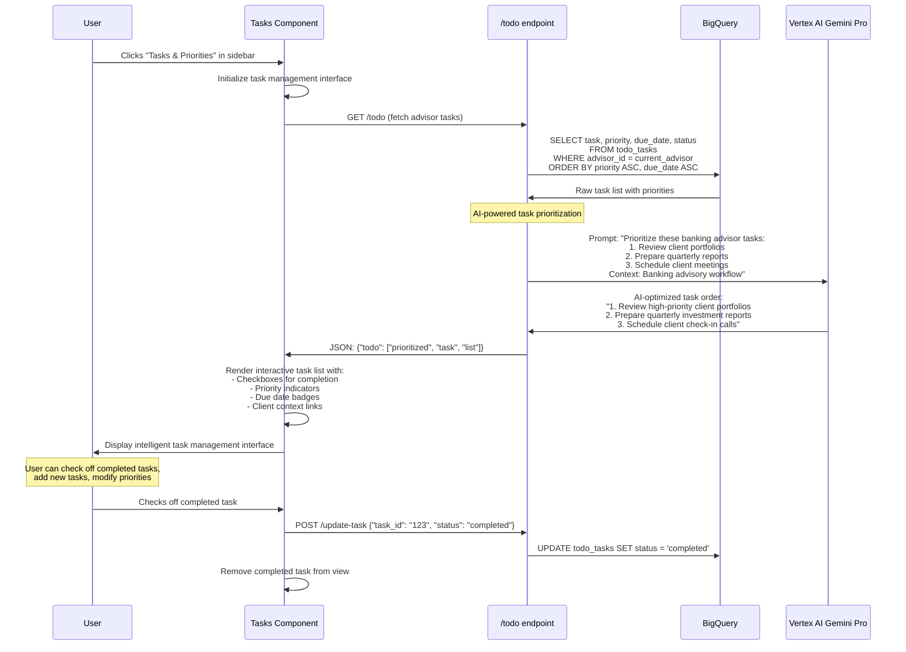

# Tasks & Priorities Page - Technical Flow & Functionality

## ✅ Page Overview
**Location**: Left sidebar → "Tasks & Priorities"  
**Component**: `TodoWidget.js`  
**Purpose**: Manage daily banking advisor tasks with AI-powered prioritization  
**Database**: `todo_tasks` table in BigQuery

## 🎯 What This Page Does
- Displays daily tasks for banking advisors
- Uses AI to intelligently prioritize tasks
- Allows task completion tracking
- Shows deadlines and priority levels
- Integrates with client data for context

## 🔄 Page Flow Sequence



## 📁 File Structure
```
frontend/src/components/widgets/
├── TodoWidget.js           # Main task management interface
├── TodoWidget.css          # Task styling and interactions
├── BaseWidget.css          # Shared widget styling
```

## 🔧 Technical Implementation

### Component Architecture:
```javascript
const TodoWidget = () => {
    // State management
    const [tasks, setTasks] = useState([]);
    const [loading, setLoading] = useState(true);
    const [filter, setFilter] = useState('all'); // all, pending, completed
    const [newTask, setNewTask] = useState('');
    
    // Load tasks on component mount
    useEffect(() => {
        fetchTasks();
    }, []);
    
    const fetchTasks = async () => {
        try {
            const response = await fetch('/api/todo');
            const data = await response.json();
            setTasks(data.todo.map((task, index) => ({
                id: index,
                text: task,
                completed: false,
                priority: getPriorityFromText(task),
                dueDate: getDueDateFromText(task)
            })));
        } catch (error) {
            console.error('Failed to fetch tasks:', error);
        } finally {
            setLoading(false);
        }
    };
    
    const toggleTask = (taskId) => {
        setTasks(tasks.map(task => 
            task.id === taskId 
                ? { ...task, completed: !task.completed }
                : task
        ));
    };
    
    const addTask = () => {
        if (newTask.trim()) {
            const task = {
                id: Date.now(),
                text: newTask,
                completed: false,
                priority: 'medium',
                dueDate: new Date()
            };
            setTasks([...tasks, task]);
            setNewTask('');
        }
    };
};
```

### API Endpoint: GET /todo
**Database Query:**
```sql
SELECT 
    task_id,
    task,
    priority,
    due_date,
    status,
    created_at,
    category
FROM `apialchemists-1-47b9.apialchemists.todo_tasks` 
WHERE advisor_id = @current_advisor_id
  AND status != 'completed'
ORDER BY 
    priority ASC,
    due_date ASC,
    created_at ASC
LIMIT 20;
```

**AI Prioritization Logic:**
```python
# AI prompt for task prioritization
prompt = f"""
Prioritize these tasks for a bank advisor based on:
1. Client impact (high-value clients first)
2. Regulatory deadlines
3. Revenue opportunities
4. Risk mitigation

Tasks: {', '.join(tasks)}

Return a numbered list with brief reasoning for top priorities.
Focus on banking advisory workflow efficiency.
"""

model = GenerativeModel("gemini-pro")
response = model.generate_content(prompt)
```

## 🎨 Task Interface Layout
```
┌─────────────────────────────────────────────────────────────┐
│              📋 Tasks & Priorities                          │
│                                                             │
│  [All] [Pending] [Completed]    🎯 AI Prioritized         │
├─────────────────────────────────────────────────────────────┤
│                                                             │
│  ☐ 🔴 Review high-priority client portfolios               │
│      📅 Due: Today    👤 3 clients    💰 $5.2M AUM         │
│                                                             │
│  ☐ 🟡 Prepare quarterly investment reports                  │
│      📅 Due: Tomorrow  📊 Q4 2025    ⏰ 2 hours est.       │
│                                                             │
│  ☑️ ✅ Schedule client check-in calls                       │
│      📞 Completed     👥 8 calls scheduled                 │
│                                                             │
│  ☐ 🟡 Analyze market trends for recommendations            │
│      📈 Market Analysis  🎯 Investment opportunities        │
│                                                             │
│  ☐ 🟢 Update compliance documentation                      │
│      📋 Regulatory     📅 Due: Next week                   │
│                                                             │
├─────────────────────────────────────────────────────────────┤
│  ➕ Add new task:                                          │
│  [                                            ] [Add]       │
│                                                             │
│  🤖 AI Suggestions:                                        │
│  • "Consider scheduling portfolio reviews for Q1"          │
│  • "Market volatility requires client communication"       │
└─────────────────────────────────────────────────────────────┘
```

## 📊 Task Categories & Priorities

### Priority Levels:
- **🔴 High (Red)**: Urgent client issues, regulatory deadlines
- **🟡 Medium (Yellow)**: Important but not time-critical  
- **🟢 Low (Green)**: Administrative tasks, future planning

### Task Categories:
```sql
-- Task categories in database
CREATE TABLE todo_tasks (
    task_id STRING,
    advisor_id STRING,
    task STRING,
    category STRING,  -- 'client_service', 'compliance', 'business_development', 'administrative'
    priority INT64,   -- 1 (highest) to 5 (lowest)
    due_date DATE,
    status STRING,    -- 'pending', 'in_progress', 'completed', 'overdue'
    client_id STRING, -- Optional link to specific client
    estimated_hours FLOAT64,
    created_at TIMESTAMP
);
```

### Common Banking Tasks:
- **Client Service**: Portfolio reviews, client meetings, investment recommendations
- **Compliance**: Regulatory reporting, documentation updates, risk assessments
- **Business Development**: Prospecting, referral follow-ups, market research
- **Administrative**: Report preparation, system updates, team meetings

## 🤖 AI-Powered Features

### Smart Prioritization:
- **Client Impact Analysis**: Tasks affecting high-value clients ranked higher
- **Deadline Intelligence**: Regulatory and contractual deadlines prioritized
- **Revenue Optimization**: Revenue-generating activities boosted in priority
- **Risk Mitigation**: Risk-related tasks elevated when needed

### AI Suggestions:
```python
# AI generates contextual task suggestions
ai_prompt = f"""
Based on current advisor workload and client portfolio:
- Advisor: {advisor_name}
- Top clients: {top_clients}  
- Recent market conditions: {market_summary}
- Current tasks: {current_tasks}

Suggest 2-3 additional high-value tasks this advisor should consider.
Focus on client service and business growth opportunities.
"""
```

### Intelligent Reminders:
- **Deadline Alerts**: Automatic notifications before due dates
- **Client Context**: Links tasks to relevant client information
- **Market-Based Tasks**: Suggests tasks based on market conditions
- **Performance Insights**: Recommends tasks to improve metrics

## 🔗 Integration Points

### Client Portfolio Integration:
```javascript
// Link tasks to client data
const getTaskContext = async (task) => {
    if (task.client_id) {
        const clientData = await fetchClientData(task.client_id);
        return {
            clientName: clientData.name,
            portfolioValue: clientData.portfolio_value,
            riskProfile: clientData.risk_profile
        };
    }
};
```

### Calendar Integration:
- **Task Scheduling**: Convert tasks to calendar appointments
- **Deadline Sync**: Sync due dates with calendar system
- **Meeting Integration**: Link client meeting tasks to calendar

### Analytics Integration:
- **Task Completion Metrics**: Track advisor productivity
- **Priority Accuracy**: Measure AI prioritization effectiveness
- **Time Tracking**: Estimate and track actual time spent

## 📈 Performance Metrics

### Task Analytics:
- **Completion Rate**: Percentage of tasks completed on time
- **Priority Accuracy**: How well AI prioritization matches outcomes
- **Client Impact**: Tasks completed affecting high-value clients
- **Time Estimation**: Accuracy of time estimates vs. actual

### Advisor Productivity:
```sql
-- Task completion metrics query
SELECT 
    advisor_id,
    COUNT(*) as total_tasks,
    SUM(CASE WHEN status = 'completed' THEN 1 ELSE 0 END) as completed_tasks,
    AVG(CASE WHEN status = 'completed' 
        THEN DATE_DIFF(completed_date, created_at, DAY) 
        ELSE NULL END) as avg_completion_days
FROM todo_tasks 
WHERE created_at >= DATE_SUB(CURRENT_DATE(), INTERVAL 30 DAY)
GROUP BY advisor_id;
```

## 🎯 Business Value
- **Increased Productivity**: AI prioritization optimizes advisor time
- **Better Client Service**: High-value client tasks prioritized appropriately
- **Compliance Assurance**: Regulatory tasks never missed
- **Performance Tracking**: Measurable productivity improvements
- **Stress Reduction**: Clear priorities reduce advisor overwhelm
