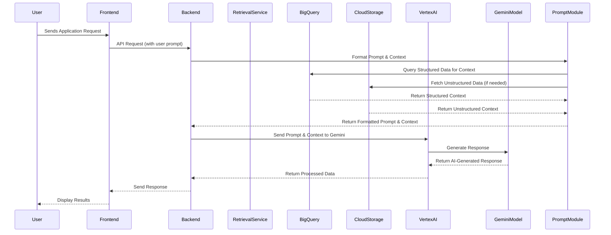

# Private Banking Advisor Copilot 🏦

## 🎯 Overview
A comprehensive AI-powered full-stack solution designed for private banking advisors to enhance client service delivery and operational efficiency. The platform integrates 8 core features with modern web technologies and Google Cloud AI services.

## ✨ Key Features
- **📋 Daily To-Do Management**: AI-prioritized task list with BigQuery integration
- **🎯 Next Best Actions**: Intelligent client opportunity recommendations
- **✉️ Message Drafting**: AI-powered personalized client communications
- **📅 Calendar Integration**: Automated meeting scheduling with Google Calendar
- **📄 Content Summarization**: Document and email analysis with AI insights
- **🤖 Conversational AI**: Natural language banking assistant
- **💼 Portfolio Analytics**: Real-time client portfolio insights and analytics

## 🏗️ Complete System Architecture

## 🛠️ Tech Stack
- **Frontend**: React 18+ with modern hooks, CSS3, responsive design, Google Looker
- **Backend**: Python FastAPI with async/await, Pydantic models
- **Database**: Google BigQuery with optimized banking schema
- **AI/ML**: Google Vertex AI (Gemini Pro), Document AI, Natural Language API  
- **Storage**: Google Cloud Storage for document management
- **Authentication**: Google OAuth 2.0 with Cloud IAM
- **Deployment**: Google Cloud Run with Docker containerization
- **APIs**: Google Calendar API, BigQuery API, Vertex AI AP