# Private Banking Advisor Copilot 🏦

## 🎯 Overview
A comprehensive AI-powered full-stack solution designed for private banking advisors to enhance client service delivery and operational efficiency. The platform integrates 8 core features with modern web technologies and Google Cloud AI services.

## ✨ Key Features
- **📋 Daily To-Do Management**: AI-prioritized task list with BigQuery integration
- **🎯 Next Best Actions**: Intelligent client opportunity recommendations
- **✉️ Message Drafting**: AI-powered personalized client communications
- **📅 Calendar Integration**: Automated meeting scheduling with Google Calendar
- **📄 Content Summarization**: Document and email analysis with AI insights
- **📊 Data Ingestion**: Multi-source data aggregation and processing
- **🤖 Conversational AI**: Natural language banking assistant
- **💼 Portfolio Analytics**: Real-time client portfolio insights and analytics

## 🏗️ Complete System Architecture

```mermaid
graph TB
    %% User Layer
    User[👤 Private Banking Advisor]
    
    %% Frontend Layer
    subgraph "🌐 Frontend - React Dashboard"
        Auth[🔐 Token Authentication]
        Dashboard[📊 Main Dashboard]
        Widgets[8 Feature Widgets]
        UI[💻 Responsive UI]
    end
    
    %% Backend Layer  
    subgraph "⚡ Backend - FastAPI"
        API[🔌 REST API Endpoints]
        Auth_Backend[🔑 Authentication Service]
        Features[🎯 8 Core Features]
        Middleware[⚙️ Request Processing]
    end
    
    %% Google Cloud Services
    subgraph "☁️ Google Cloud Platform"
        CloudRun[🏃 Cloud Run Deployment]
        BigQuery[(📊 BigQuery - Banking Data)]
        VertexAI[🤖 Vertex AI - Text Generation]
        DocumentAI[📝 Document AI - OCR/Analysis]
        CloudStorage[📁 Cloud Storage - Files]
        Calendar[📅 Google Calendar API]
        IAM[🛡️ Identity & Access Management]
    end
    
    %% Data Flow
    User --> Auth
    Auth --> Dashboard
    Dashboard --> Widgets
    Widgets --> UI
    
    UI --> API
    API --> Auth_Backend
    Auth_Backend --> Features
    Features --> Middleware
    
    CloudRun --> API
    Middleware --> BigQuery
    Middleware --> VertexAI
    Middleware --> DocumentAI
    Middleware --> CloudStorage
    Middleware --> Calendar
    IAM --> Auth_Backend
    
    %% Feature Details
    subgraph "🎯 8 Core Banking Features"
        F1[📋 Todo Management]
        F2[🎯 NBA Suggestions]
        F3[💼 Portfolio Insights]
        F4[👥 Client Management]
        F5[💬 AI Chat Assistant]
        F6[✉️ Message Drafting]
        F7[📅 Calendar Integration]
        F8[📊 Data Ingestion]
    end
    
    Features --> F1
    Features --> F2
    Features --> F3
    Features --> F4
    Features --> F5
    Features --> F6
    Features --> F7
    Features --> F8
    
    %% Styling
    classDef userStyle fill:#e1f5fe,stroke:#01579b,stroke-width:2px
    classDef frontendStyle fill:#f3e5f5,stroke:#4a148c,stroke-width:2px
    classDef backendStyle fill:#e8f5e8,stroke:#1b5e20,stroke-width:2px
    classDef cloudStyle fill:#fff3e0,stroke:#e65100,stroke-width:2px
    classDef featureStyle fill:#fce4ec,stroke:#880e4f,stroke-width:2px
    
    class User userStyle
    class Auth,Dashboard,Widgets,UI frontendStyle
    class API,Auth_Backend,Features,Middleware backendStyle
    class CloudRun,BigQuery,VertexAI,DocumentAI,CloudStorage,Calendar,IAM cloudStyle
    class F1,F2,F3,F4,F5,F6,F7,F8 featureStyle
```



## 🛠️ Tech Stack
- **Frontend**: React 18+ with modern hooks, CSS3, responsive design
- **Backend**: Python FastAPI with async/await, Pydantic models
- **Database**: Google BigQuery with optimized banking schema
- **AI/ML**: Google Vertex AI (Gemini Pro), Document AI, Natural Language API  
- **Storage**: Google Cloud Storage for document management
- **Authentication**: Google OAuth 2.0 with Cloud IAM
- **Deployment**: Google Cloud Run with Docker containerization
- **APIs**: Google Calendar API, BigQuery API, Vertex AI API

## 🚀 Quick Start Guide

### 📋 Prerequisites
- Google Cloud Account with billing enabled
- Project ID: `apialchemists-1-47b9`
- Node.js 18+ and Python 3.9+
- Google Cloud SDK installed

### 🔧 Local Development Setup

#### 1. Frontend Development
```bash
cd frontend
npm install
npm start
# Access at: http://localhost:3000
```

#### 2. Backend Development
```bash
cd backend
python3 -m venv venv
source venv/bin/activate  # On Windows: venv\Scripts\activate
pip install -r requirements.txt
uvicorn main:app --reload
# API available at: http://localhost:8000
```

#### 3. Environment Configuration
```bash
# Set Google Cloud credentials
export GOOGLE_APPLICATION_CREDENTIALS="path/to/your/service-account-key.json"
export PROJECT_ID="apialchemists-1-47b9"
export DATASET_NAME="apialchemists"
```

### ☁️ Cloud Deployment
```bash
# Build and deploy both services
gcloud builds submit --config cloudbuild.yaml

# Deploy backend
gcloud run deploy apialchemistproject-backend \
  --image gcr.io/apialchemists-1-47b9/apialchemistproject-backend \
  --platform managed \
  --region us-central1 \
  --service-account project-service-account@apialchemists-1-47b9.iam.gserviceaccount.com

# Deploy frontend  
gcloud run deploy apialchemistproject-frontend \
  --image gcr.io/apialchemists-1-47b9/apialchemistproject-frontend \
  --platform managed \
  --region us-central1
```

## 📊 Database Schema

### BigQuery Tables Structure


## 🎯 Feature Deep Dive

### 1. 📋 Daily To-Do Management
- **Purpose**: AI-prioritized task management for advisors
- **Data Source**: BigQuery `todo_tasks` table
- **AI Integration**: Vertex AI for priority scoring and categorization
- **UI**: Interactive task list with completion tracking

### 2. 🎯 Next Best Actions (NBA)
- **Purpose**: AI-driven client opportunity recommendations
- **Algorithm**: Analyzes client portfolios, market data, and behavior patterns
- **AI Model**: Gemini Pro for opportunity scoring and recommendation text
- **Output**: Prioritized action items with confidence scores

### 3. 💼 Portfolio Insights
- **Purpose**: Real-time portfolio analytics and performance metrics
- **Data Source**: BigQuery `holdings`, `accounts`, `transactions` tables
- **Analytics**: Asset allocation, performance trends, risk analysis
- **Visualization**: Interactive charts and KPI dashboards

### 4. 👥 Client Management
- **Purpose**: Comprehensive client relationship management
- **Features**: Client profiles, contact history, relationship mapping
- **Data Integration**: CRM data synchronization with BigQuery
- **AI Enhancement**: Client sentiment analysis and engagement scoring

### 5. 💬 Conversational AI Assistant
- **Purpose**: Natural language banking assistant for advisors
- **AI Model**: Vertex AI with banking domain fine-tuning
- **Capabilities**: Portfolio queries, market insights, client recommendations
- **Context**: Maintains conversation history and client context

### 6. ✉️ Message Drafting
- **Purpose**: AI-powered personalized client communications
- **Input**: Context, client preferences, communication type
- **AI Processing**: Gemini Pro for content generation and personalization
- **Output**: Professional, compliant banking communications

### 7. 📅 Calendar Integration
- **Purpose**: Automated meeting scheduling and calendar management
- **API**: Google Calendar API integration
- **Features**: Smart scheduling, conflict detection, client availability
- **AI Enhancement**: Meeting purpose extraction and optimal timing suggestions

### 8. 📊 Data Ingestion & Aggregation
- **Purpose**: Multi-source data integration and processing
- **Sources**: CSV files, APIs, document uploads, market data feeds
- **Processing**: Document AI for OCR, data validation, schema mapping
- **Storage**: Cloud Storage for raw files, BigQuery for structured data

## 🔒 Security & Authentication

### Token-Based Authentication Flow


### Security Features
- **🔐 OAuth 2.0**: Google Identity Platform integration
- **🛡️ IAM Controls**: Role-based access with Google Cloud IAM
- **🔒 Token Validation**: Server-side token verification for all API calls
- **📋 Audit Logging**: Comprehensive access and activity logging
- **🏢 Enterprise Compliance**: Organization policy adherence

## 🧪 Testing & Quality Assurance

### API Testing
```bash
# Test authentication
curl -H "Authorization: Bearer $(gcloud auth print-identity-token)" \
  https://your-backend-url.run.app/todo

# Test all 8 features
curl -H "Authorization: Bearer $(gcloud auth print-identity-token)" \
  https://your-backend-url.run.app/nba

curl -X POST \
  -H "Authorization: Bearer $(gcloud auth print-identity-token)" \
  -H "Content-Type: application/json" \
  -d '{"message": "What is my portfolio risk?"}' \
  https://your-backend-url.run.app/chat
```

### Frontend Testing
- **Unit Tests**: Jest and React Testing Library
- **Integration Tests**: Cypress for end-to-end workflows
- **Performance**: Lighthouse audits for web vitals
- **Accessibility**: WCAG 2.1 AA compliance testing

## 📈 Performance & Scaling

### Architecture Benefits
- **⚡ Serverless**: Auto-scaling with Google Cloud Run
- **💾 Caching**: BigQuery caching for frequently accessed data
- **🔄 Async Processing**: FastAPI async endpoints for concurrent requests
- **📱 Responsive**: Mobile-first design with progressive web app features

### Monitoring & Observability
- **📊 Cloud Monitoring**: Real-time metrics and alerting
- **📝 Cloud Logging**: Centralized log aggregation and analysis
- **🔍 Error Reporting**: Automatic error detection and notification
- **📈 Performance Tracking**: Request latency and throughput metrics

## 🎯 Roadmap & Future Enhancements

### Phase 1 (Current) ✅
- Core 8 features implementation
- Basic authentication and security
- BigQuery data integration
- Vertex AI integration

### Phase 2 🚧
- Advanced analytics and reporting
- Mobile application development
- Enhanced AI model fine-tuning
- Multi-language support

### Phase 3 🔮
- Machine learning model training on client data
- Advanced predictive analytics
- Integration with external banking APIs
- Workflow automation and process optimization

## 📚 Documentation & Support

### Key Documentation Files
- **[DEPLOYMENT.md](DEPLOYMENT.md)**: Complete deployment instructions
- **[DEPLOYMENT_LOCAL.md](DEPLOYMENT_LOCAL.md)**: Local development setup
- **[FEATURES.md](FEATURES.md)**: Detailed feature specifications
- **API Documentation**: Available at `/docs` endpoint when running locally

### Support & Contribution
- **🐛 Issue Reporting**: Use GitHub Issues for bug reports
- **💡 Feature Requests**: Submit enhancement proposals via GitHub
- **📖 Wiki**: Comprehensive documentation in project wiki
- **💬 Community**: Join our developer community discussions

---

## 🏆 Getting Started - Next Steps

1. **📖 Read [DEPLOYMENT.md](DEPLOYMENT.md)** for complete setup instructions
2. **🔧 Set up local development** using the quick start guide above
3. **☁️ Deploy to Google Cloud** following the deployment guide
4. **🧪 Test all 8 features** using the provided API examples
5. **📊 Load sample data** to explore the full functionality

**Ready to revolutionize private banking advisory services with AI! 🚀**
  --region <REGION> \
  --allow-unauthenticated
```

Repeat for frontend. Update environment variables and IAM roles as needed.

## Integration Notes
- Configure service accounts for BigQuery, Vertex AI, and Cloud Storage access.
- Set up OAuth for Google Calendar API.
- Use Agentspace for conversational agent endpoints in backend.

## Feature Implementation
See code comments and documentation for details on each feature.

## TODO: Architecture Documentation
- [ ] Create mermaid diagrams explaining the overall system architecture
- [ ] Add sequence diagrams showing the flow for key features:
  - [ ] User query → Chat → Vertex AI → Response flow
  - [ ] Portfolio data retrieval → BigQuery → Frontend display
  - [ ] Document ingestion → Cloud Storage → AI processing
  - [ ] Calendar invite creation → Google Calendar API integration
- [ ] Add component interaction diagrams for frontend-backend communication
- [ ] Document data flow between services (BigQuery, Vertex AI, Cloud Storage)

---

For more details, see `.github/copilot-instructions.md`.
