# Private Banking Advisor Copilot - Sequence Diagrams

## 📋 Master Architecture Flow

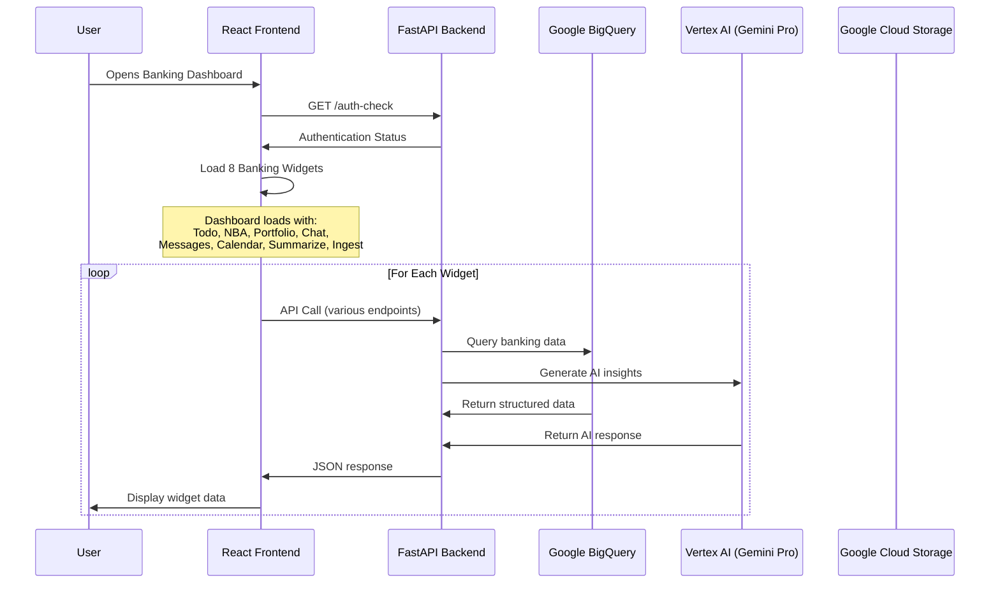

---

## 🏠 Main Dashboard Page

### Tech Stack Overview:
- **Frontend**: React.js with Recharts for visualizations
- **Backend**: FastAPI with async endpoints  
- **Database**: Google BigQuery with 8 banking tables
- **AI**: Vertex AI Gemini Pro model
- **Storage**: Google Cloud Storage
- **Authentication**: Google OAuth + Service Account

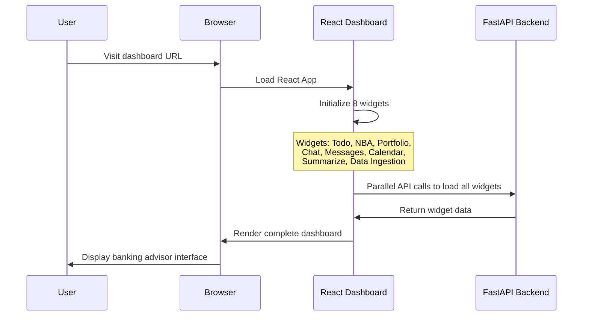

---

## 📝 1. Daily To-Do Feature

### What it does (Layman):
Gets daily tasks for bank advisors from the database, prioritizes them using AI, and shows the most important ones first.

### Tech Details:
- **API Endpoint**: `GET /todo`
- **Database**: `todo_tasks` table in BigQuery
- **AI Model**: Gemini Pro for task prioritization
- **Data Fetched**: Task descriptions, priorities, due dates

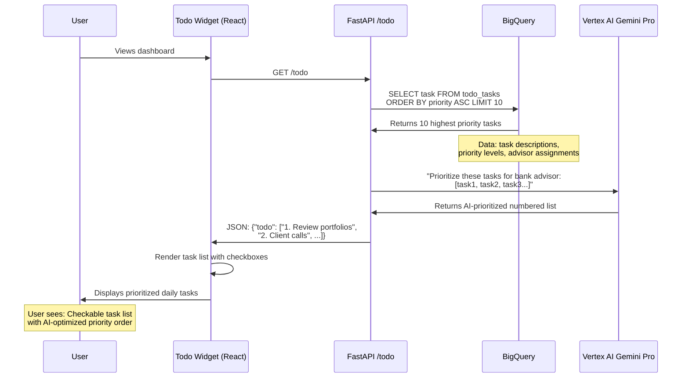

---

## 🎯 2. Next Best Actions (NBA) Feature  

### What it does (Layman):
Analyzes recent client transactions and suggests the best actions an advisor should take next.

### Tech Details:
- **API Endpoint**: `GET /nba`
- **Database**: `transactions`, `accounts`, `clients` tables
- **AI Model**: Gemini Pro for action recommendations
- **Data Fetched**: Recent transactions, amounts, categories, client IDs

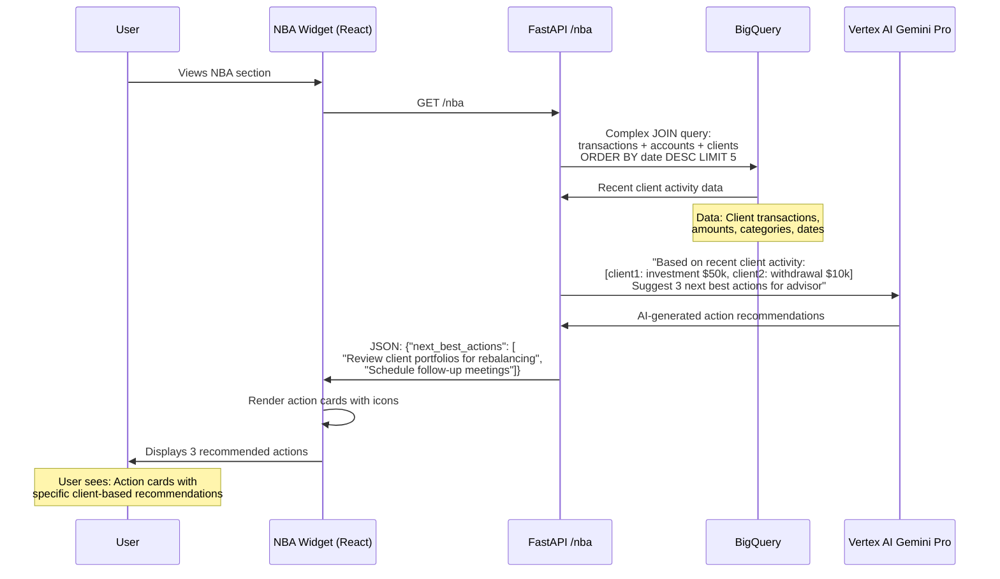

---

## 💼 3. Portfolio Analytics Feature

### What it does (Layman):
Shows comprehensive analysis of all client portfolios, advisor performance, and investment insights.

### Tech Details:
- **API Endpoint**: `GET /aggregation`
- **Database**: `holdings`, `clients`, `advisors`, `transactions` tables
- **AI Model**: Gemini Pro for portfolio insights
- **Data Fetched**: Asset allocations, advisor performance, risk analysis

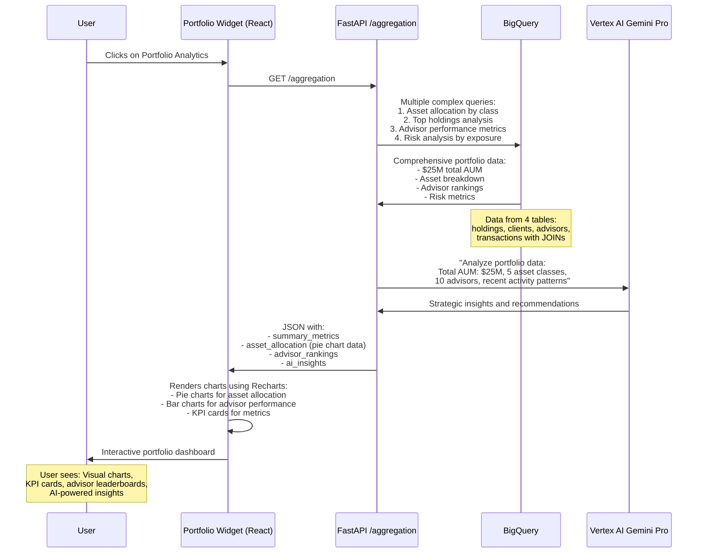

---

## 💬 4. AI Chat Feature

### What it does (Layman):
Intelligent chatbot that answers questions about clients, tasks, and portfolios using real banking data.

### Tech Details:
- **API Endpoint**: `POST /chat`
- **Database**: All tables (advisors, clients, holdings, tasks, transactions)
- **AI Model**: Gemini Pro with banking system prompts
- **Data Fetched**: Advisor-specific client data, portfolio info, tasks

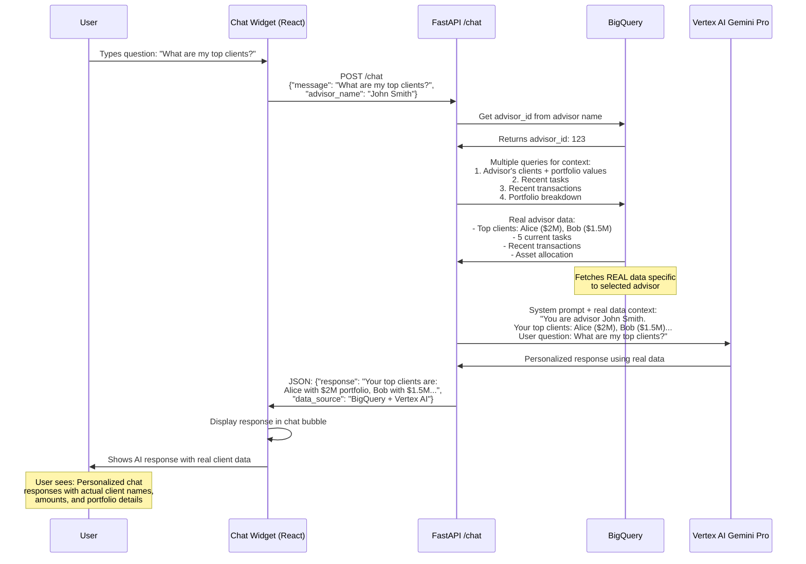

---

## ✉️ 5. Message Drafting Feature

### What it does (Layman):
Creates professional emails and messages for clients using AI, personalized with their information.

### Tech Details:
- **API Endpoint**: `POST /draft-message`
- **Database**: `clients` table for personalization
- **AI Model**: Gemini Pro with professional banking prompts
- **Data Fetched**: Client contact info, context for personalization

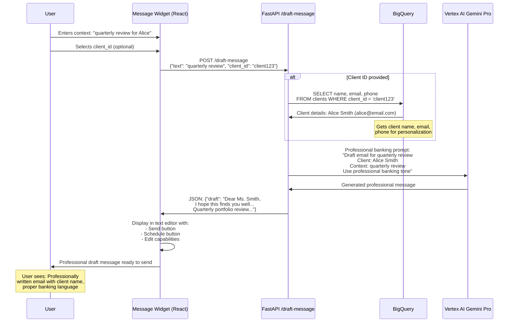

---

## 📅 6. Calendar Integration Feature

### What it does (Layman):
Creates calendar invites for client meetings using AI to parse meeting details.

### Tech Details:
- **API Endpoint**: `POST /calendar-invite`
- **AI Model**: Gemini Pro for parsing meeting details
- **Data Processing**: Structured meeting information
- **Integration**: Prepared for Google Calendar API

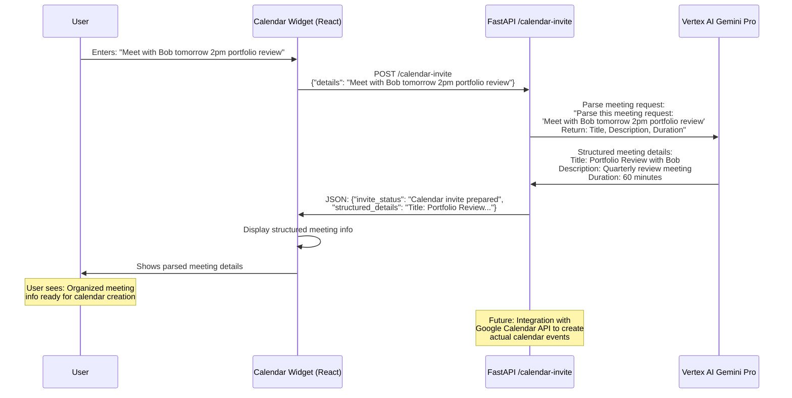

---

## 📄 7. Content Summarization Feature

### What it does (Layman):
Takes any text (reports, emails, documents) and creates executive summaries for banking context.

### Tech Details:
- **API Endpoint**: `POST /summarize`
- **AI Model**: Gemini Pro with banking-focused summarization prompts
- **Processing**: Text analysis for key points, action items, relevance

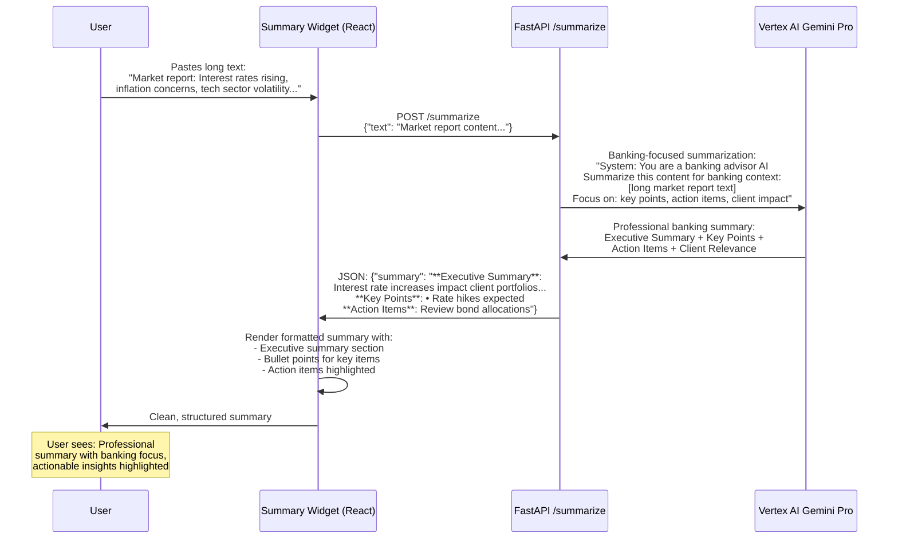

---

## 📤 8. Data Ingestion Feature

### What it does (Layman):
Uploads client documents and data to cloud storage for future analysis and record keeping.

### Tech Details:
- **API Endpoint**: `POST /ingest-data`
- **Storage**: Google Cloud Storage bucket "apialchemists"
- **File Processing**: Text/document upload with metadata
- **Integration**: Ready for BigQuery data loading

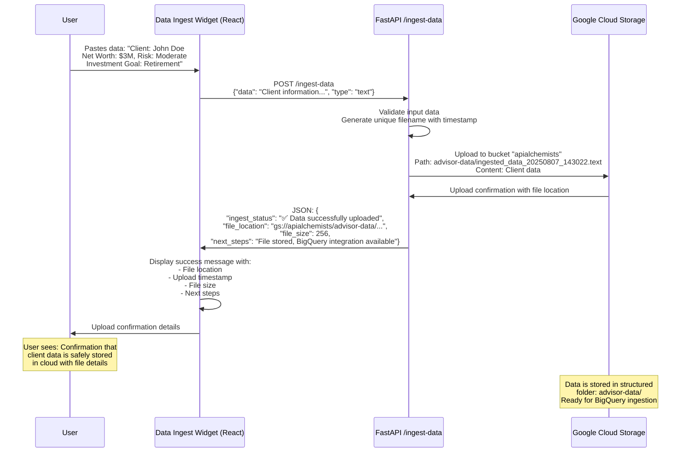

---

## 🔄 Authentication Flow

### What it does (Layman):
Securely logs users in with Google accounts and manages access to banking data.

### Tech Details:
- **Frontend**: Google OAuth with client ID
- **Backend**: Service account authentication
- **Flow**: Google Sign-in → Dashboard access

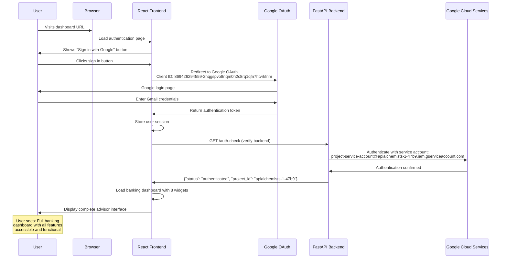

---

## 📊 Database Schema Overview

### BigQuery Tables Used:

1. **`advisors`** - Advisor information
2. **`clients`** - Client profiles and contact info  
3. **`holdings`** - Investment positions and values
4. **`transactions`** - Financial transactions
5. **`accounts`** - Account details linking clients
6. **`todo_tasks`** - Daily tasks for advisors
7. **`portfolio_summary`** - Aggregated portfolio data
8. **`risk_metrics`** - Risk analysis data

### Data Relationships:
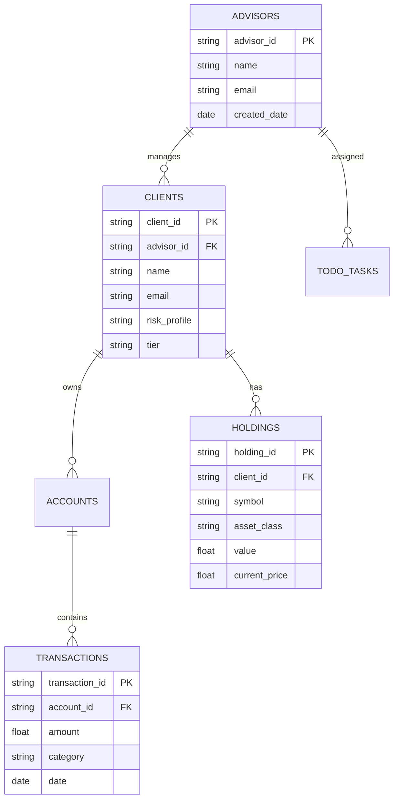

This documentation serves as your technical guide to understand how each feature works, what data it uses, and how the AI integrations function. Each sequence diagram shows the complete flow from user interaction to data display.
