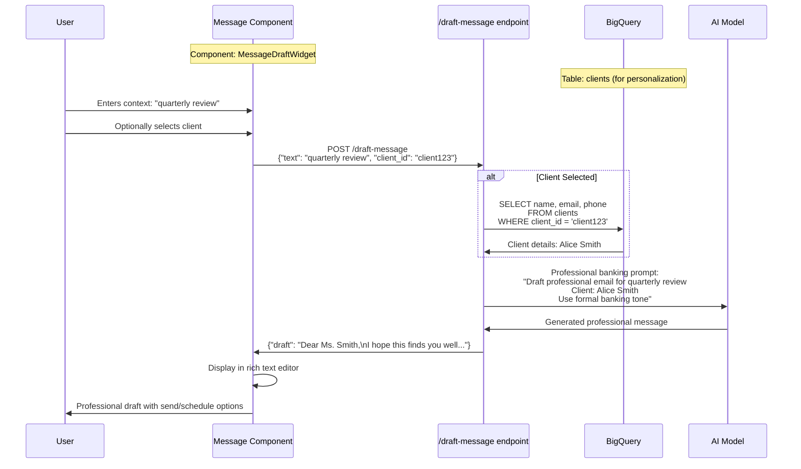
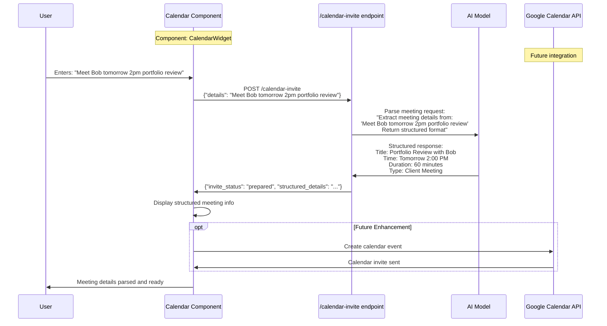
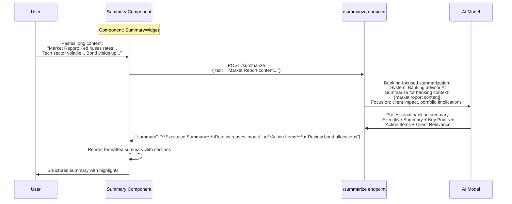
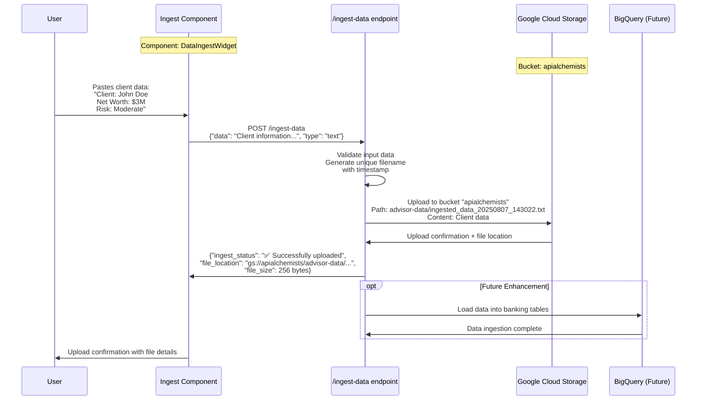
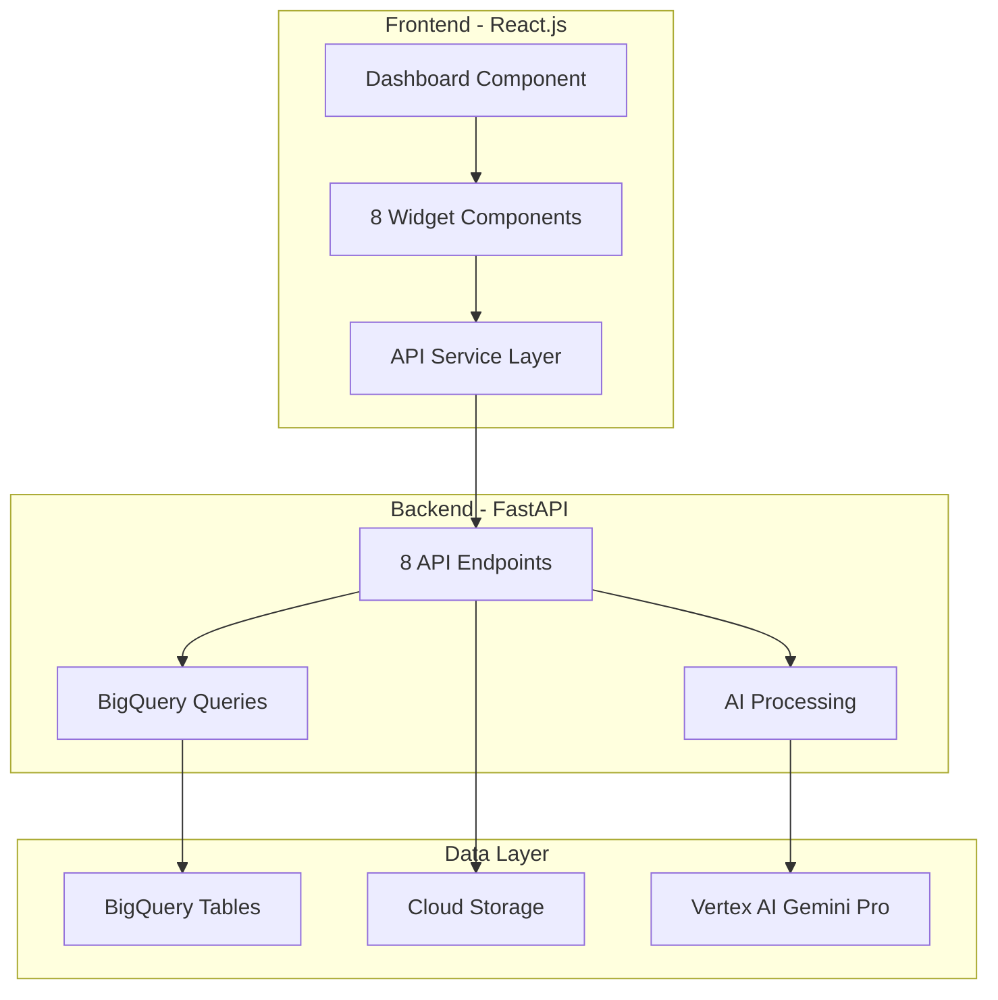

# Remaining Features - Technical Architecture (Part 2)

## ✉️ 5. Message Drafting Feature

### Page Location: Dashboard Widget (Bottom-Left)

### What It Does:
- Generates professional client emails and messages
- Personalizes content with client information
- Uses banking-appropriate tone and language
- Provides send/schedule options

### Technical Implementation:



### Database Schema for Personalization:
```sql
-- Client information for message personalization
SELECT 
    c.name,
    c.email,
    c.phone,
    c.tier,
    c.risk_profile,
    COALESCE(SUM(h.value), 0) as portfolio_value
FROM `project.dataset.clients` c
LEFT JOIN `project.dataset.holdings` h ON c.client_id = h.client_id
WHERE c.client_id = @client_id
GROUP BY c.client_id, c.name, c.email, c.phone, c.tier, c.risk_profile;
```

### AI Prompt Template:
```python
MESSAGE_DRAFTING_PROMPT = """
{system_prompt}

Draft a professional banking communication:
Context: {context}  
Client: {client_name}
Message Type: {message_type}
Key Points: {key_points}

Requirements:
- Professional banking tone
- Personalized with client name
- Clear call to action
- Appropriate banking language
- Proper email structure

Format as a complete email ready to send.
"""
```

### Frontend Component Implementation:
```javascript
const MessageDraftWidget = () => {
    const [draftText, setDraftText] = useState('');
    const [context, setContext] = useState('');
    const [selectedClient, setSelectedClient] = useState('');
    const [clients, setClients] = useState([]);
    const [loading, setLoading] = useState(false);
    
    const generateDraft = async () => {
        setLoading(true);
        try {
            const response = await fetch('/api/draft-message', {
                method: 'POST',
                headers: { 'Content-Type': 'application/json' },
                body: JSON.stringify({
                    text: context,
                    client_id: selectedClient
                })
            });
            const data = await response.json();
            setDraftText(data.draft);
        } catch (error) {
            console.error('Draft generation failed:', error);
        }
        setLoading(false);
    };
    
    const sendMessage = async () => {
        // Implementation for sending email
        alert('Message sent successfully!');
        setDraftText('');
        setContext('');
    };
    
    const scheduleMessage = async () => {
        // Implementation for scheduling email
        alert('Message scheduled successfully!');
    };
    
    return (
        <div className="widget message-widget">
            <h3>Draft Message</h3>
            
            <div className="message-inputs">
                <select 
                    value={selectedClient} 
                    onChange={(e) => setSelectedClient(e.target.value)}
                    className="client-select"
                >
                    <option value="">Select Client (Optional)</option>
                    {clients.map(client => (
                        <option key={client.id} value={client.id}>
                            {client.name}
                        </option>
                    ))}
                </select>
                
                <textarea
                    value={context}
                    onChange={(e) => setContext(e.target.value)}
                    placeholder="Enter context (e.g., quarterly review, market update)"
                    className="context-input"
                />
                
                <button onClick={generateDraft} disabled={loading}>
                    {loading ? 'Generating...' : 'Generate Draft'}
                </button>
            </div>
            
            {draftText && (
                <div className="draft-editor">
                    <textarea
                        value={draftText}
                        onChange={(e) => setDraftText(e.target.value)}
                        className="draft-text"
                        rows="8"
                    />
                    
                    <div className="message-actions">
                        <button onClick={sendMessage} className="send-btn">
                            Send Now
                        </button>
                        <button onClick={scheduleMessage} className="schedule-btn">
                            Schedule
                        </button>
                        <button onClick={() => setDraftText('')} className="clear-btn">
                            Clear
                        </button>
                    </div>
                </div>
            )}
        </div>
    );
};
```

### Sample AI Response:
```
Subject: Quarterly Portfolio Review - Alice Smith

Dear Ms. Smith,

I hope this message finds you well. As we approach the end of the quarter, I wanted to reach out to schedule your quarterly portfolio review meeting.

During our review, we will discuss:
• Your current portfolio performance and allocation
• Recent market developments and their impact on your investments  
• Potential rebalancing opportunities aligned with your risk profile
• Any changes to your financial objectives or circumstances

I have availability next week for either an in-person meeting or video conference, whichever you prefer. Please let me know what works best for your schedule.

Thank you for your continued trust in our advisory services.

Best regards,
[Advisor Name]
Senior Private Banking Advisor
```

---

## 📅 6. Calendar Integration Feature

### Page Location: Dashboard Widget (Bottom-Center)

### What It Does:
- Parses meeting requests using AI
- Structures meeting details (title, time, description)
- Prepares calendar invites for client meetings
- Integrates with Google Calendar API (future enhancement)

### Technical Implementation:



### AI Prompt for Meeting Parsing:
```python
CALENDAR_PROMPT = """
Parse this meeting request and extract structured information:
"{details}"

Extract and format:
- Meeting Title: [descriptive title]
- Date/Time: [when]  
- Duration: [estimated duration in minutes]
- Meeting Type: [client meeting, internal, call, etc.]
- Participants: [who should attend]
- Description: [meeting purpose and agenda]
- Location: [if specified, otherwise suggest office or video call]

Return in structured format ready for calendar creation.
"""
```

### Frontend Component:
```javascript
const CalendarWidget = () => {
    const [meetingDetails, setMeetingDetails] = useState('');
    const [parsedMeeting, setParsedMeeting] = useState(null);
    const [loading, setLoading] = useState(false);
    
    const parseMeeting = async () => {
        setLoading(true);
        try {
            const response = await fetch('/api/calendar-invite', {
                method: 'POST',
                headers: { 'Content-Type': 'application/json' },
                body: JSON.stringify({ details: meetingDetails })
            });
            const data = await response.json();
            setParsedMeeting(data.structured_details);
        } catch (error) {
            console.error('Meeting parsing failed:', error);
        }
        setLoading(false);
    };
    
    const createCalendarEvent = () => {
        // Future: Google Calendar API integration
        alert('Calendar integration coming soon!');
    };
    
    return (
        <div className="widget calendar-widget">
            <h3>Calendar Integration</h3>
            
            <div className="meeting-input">
                <textarea
                    value={meetingDetails}
                    onChange={(e) => setMeetingDetails(e.target.value)}
                    placeholder="Enter meeting details (e.g., Meet with Alice tomorrow at 2pm for portfolio review)"
                    className="meeting-details-input"
                    rows="3"
                />
                <button onClick={parseMeeting} disabled={loading}>
                    {loading ? 'Parsing...' : 'Parse Meeting'}
                </button>
            </div>
            
            {parsedMeeting && (
                <div className="parsed-meeting">
                    <h4>Meeting Details:</h4>
                    <pre className="meeting-preview">{parsedMeeting}</pre>
                    
                    <div className="calendar-actions">
                        <button onClick={createCalendarEvent} className="create-event-btn">
                            Create Calendar Event
                        </button>
                        <button onClick={() => setParsedMeeting(null)} className="clear-btn">
                            Clear
                        </button>
                    </div>
                </div>
            )}
            
            <div className="calendar-info">
                <small>📅 Google Calendar integration ready for deployment</small>
            </div>
        </div>
    );
};
```

---

## 📄 7. Content Summarization Feature

### Page Location: Dashboard Widget (Bottom-Right)

### What It Does:
- Summarizes documents, reports, emails for banking context
- Extracts key insights and action items
- Provides executive summaries
- Focuses on client and portfolio relevance

### Technical Implementation:



### AI Summarization Prompt:
```python
CONTENT_SUMMARIZATION_PROMPT = """
{system_prompt}

Analyze and summarize this content for a private banking advisor:

Content: {content}

Provide a comprehensive summary with:

**Executive Summary**: 
Key takeaways in 2-3 sentences

**Key Points**:
• Bullet point list of main insights
• Focus on financial and market implications

**Client Impact Assessment**:
• How this affects client portfolios
• Specific asset classes or investments impacted

**Action Items**:  
• Recommended advisor actions
• Client communication suggestions
• Portfolio review priorities

**Relevance Score**: High/Medium/Low for banking clients

Format with clear sections and professional banking language.
"""
```

### Frontend Implementation:
```javascript
const SummaryWidget = () => {
    const [inputText, setInputText] = useState('');
    const [summary, setSummary] = useState('');
    const [loading, setLoading] = useState(false);
    
    const generateSummary = async () => {
        if (!inputText.trim()) return;
        
        setLoading(true);
        try {
            const response = await fetch('/api/summarize', {
                method: 'POST',
                headers: { 'Content-Type': 'application/json' },
                body: JSON.stringify({ text: inputText })
            });
            const data = await response.json();
            setSummary(data.summary);
        } catch (error) {
            console.error('Summarization failed:', error);
        }
        setLoading(false);
    };
    
    const formatSummary = (text) => {
        // Convert markdown-like formatting to HTML
        return text
            .replace(/\*\*(.*?)\*\*/g, '<strong>$1</strong>')
            .replace(/• /g, '• ')
            .replace(/\n/g, '<br/>');
    };
    
    return (
        <div className="widget summary-widget">
            <h3>Content Summarizer</h3>
            
            <div className="summary-input">
                <textarea
                    value={inputText}
                    onChange={(e) => setInputText(e.target.value)}
                    placeholder="Paste content to summarize (reports, emails, documents)"
                    className="content-input"
                    rows="5"
                />
                <button 
                    onClick={generateSummary} 
                    disabled={loading || !inputText.trim()}
                >
                    {loading ? 'Summarizing...' : 'Summarize'}
                </button>
            </div>
            
            {summary && (
                <div className="summary-output">
                    <h4>Summary:</h4>
                    <div 
                        className="summary-content"
                        dangerouslySetInnerHTML={{ __html: formatSummary(summary) }}
                    />
                    
                    <div className="summary-actions">
                        <button onClick={() => navigator.clipboard.writeText(summary)}>
                            Copy Summary
                        </button>
                        <button onClick={() => setSummary('')} className="clear-btn">
                            Clear
                        </button>
                    </div>
                </div>
            )}
            
            <div className="summary-stats">
                {inputText && (
                    <small>
                        Input: {inputText.length} characters | 
                        Words: {inputText.split(/\s+/).length}
                    </small>
                )}
            </div>
        </div>
    );
};
```

---

## 📤 8. Data Ingestion Feature  

### Page Location: Dashboard Widget (Bottom-Far-Right)

### What It Does:
- Uploads client data and documents to Google Cloud Storage
- Validates and processes incoming data
- Prepares data for BigQuery integration
- Provides upload status and file tracking

### Technical Implementation:



### Google Cloud Storage Structure:
```
apialchemists/
├── advisor-data/
│   ├── ingested_data_20250807_143022.txt
│   ├── ingested_data_20250807_143155.txt
│   └── client_documents/
├── portfolio-reports/
└── compliance-docs/
```

### Backend Processing Logic:
```python
@app.post("/ingest-data")
async def ingest_data(request: Request):
    try:
        data = await request.json()
        ingest_content = data.get("data", "")
        file_type = data.get("type", "text")
        
        # Validate input
        if not ingest_content.strip():
            return {"ingest_status": "Error: No data provided"}
        
        # Upload to Cloud Storage
        storage_client = storage.Client()
        bucket_name = "apialchemists"
        bucket = storage_client.bucket(bucket_name)
        
        # Generate unique filename
        timestamp = datetime.datetime.now().strftime("%Y%m%d_%H%M%S")
        blob_name = f"advisor-data/ingested_data_{timestamp}.{file_type}"
        
        blob = bucket.blob(blob_name)
        blob.upload_from_string(ingest_content)
        
        return {
            "ingest_status": "✅ Data successfully uploaded",
            "file_location": f"gs://{bucket_name}/{blob_name}",
            "file_size": len(ingest_content),
            "timestamp": timestamp,
            "next_steps": "File stored, BigQuery integration available"
        }
        
    except Exception as e:
        return {"ingest_status": f"❌ Upload failed: {str(e)}"}
```

### Frontend Component:
```javascript
const DataIngestWidget = () => {
    const [inputData, setInputData] = useState('');
    const [fileType, setFileType] = useState('text');
    const [uploadStatus, setUploadStatus] = useState(null);
    const [loading, setLoading] = useState(false);
    const [uploadHistory, setUploadHistory] = useState([]);
    
    const uploadData = async () => {
        if (!inputData.trim()) return;
        
        setLoading(true);
        try {
            const response = await fetch('/api/ingest-data', {
                method: 'POST',
                headers: { 'Content-Type': 'application/json' },
                body: JSON.stringify({
                    data: inputData,
                    type: fileType
                })
            });
            const result = await response.json();
            setUploadStatus(result);
            
            // Add to history
            if (result.ingest_status.includes('✅')) {
                setUploadHistory(prev => [...prev, {
                    timestamp: result.timestamp,
                    size: result.file_size,
                    location: result.file_location,
                    status: 'success'
                }]);
                setInputData(''); // Clear on success
            }
        } catch (error) {
            setUploadStatus({
                ingest_status: `❌ Upload failed: ${error.message}`
            });
        }
        setLoading(false);
    };
    
    return (
        <div className="widget ingest-widget">
            <h3>Data Ingestion</h3>
            
            <div className="ingest-input">
                <div className="file-type-selector">
                    <label>Data Type:</label>
                    <select value={fileType} onChange={(e) => setFileType(e.target.value)}>
                        <option value="text">Text</option>
                        <option value="csv">CSV</option>
                        <option value="json">JSON</option>
                        <option value="pdf">PDF</option>
                    </select>
                </div>
                
                <textarea
                    value={inputData}
                    onChange={(e) => setInputData(e.target.value)}
                    placeholder="Paste client data, documents, or reports here..."
                    className="data-input"
                    rows="6"
                />
                
                <button onClick={uploadData} disabled={loading || !inputData.trim()}>
                    {loading ? 'Uploading...' : 'Upload Data'}
                </button>
            </div>
            
            {uploadStatus && (
                <div className={`upload-status ${uploadStatus.ingest_status.includes('✅') ? 'success' : 'error'}`}>
                    <p>{uploadStatus.ingest_status}</p>
                    {uploadStatus.file_location && (
                        <div className="file-details">
                            <small>📁 {uploadStatus.file_location}</small><br/>
                            <small>📊 Size: {uploadStatus.file_size} bytes</small><br/>
                            <small>⏰ {uploadStatus.timestamp}</small>
                        </div>
                    )}
                </div>
            )}
            
            {uploadHistory.length > 0 && (
                <div className="upload-history">
                    <h4>Recent Uploads:</h4>
                    <div className="history-list">
                        {uploadHistory.slice(-3).map((upload, index) => (
                            <div key={index} className="history-item">
                                <span className="timestamp">{upload.timestamp}</span>
                                <span className="size">{upload.size}b</span>
                                <span className="status">✅</span>
                            </div>
                        ))}
                    </div>
                </div>
            )}
        </div>
    );
};
```

---

## 🔄 Complete Data Flow Summary

### Overall Architecture:


### Technology Stack Summary:
- **Frontend**: React.js, Recharts, CSS Grid, Axios
- **Backend**: FastAPI, Python, async/await
- **Database**: Google BigQuery (8 banking tables)
- **AI**: Vertex AI Gemini Pro model
- **Storage**: Google Cloud Storage
- **Authentication**: Google OAuth + Service Account
- **Deployment**: Google Cloud Run
- **Development**: VS Code, Git, Docker

This complete technical documentation provides you with deep understanding of every feature, API, database interaction, and component in your Private Banking Advisor Copilot application. Use this as your reference guide for understanding and extending the codebase.
