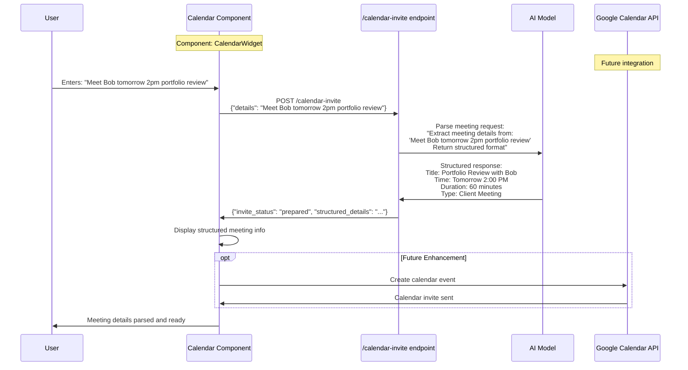
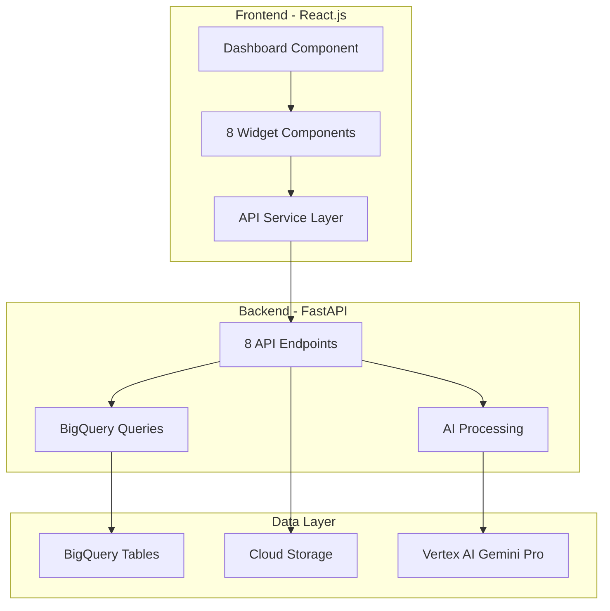

# Remaining Features - Technical Architecture (Part 2)

## ✉️ 5. Message Drafting Feature

### Page Location: Dashboard Widget (Bottom-Left)

### What It Does:
- Generates professional client emails and messages
- Personalizes content with client information
- Uses banking-appropriate tone and language
- Provides send/schedule options

### Technical Implementation:

## 🔄 Complete Data Flow Summary

### Overall Architecture:

### Technology Stack Summary:
- **Frontend**: React.js, Recharts, CSS Grid, Axios
- **Backend**: FastAPI, Python, async/await
- **Database**: Google BigQuery (8 banking tables)
- **AI**: Vertex AI Gemini Pro model
- **Storage**: Google Cloud Storage
- **Authentication**: Google OAuth + Service Account
- **Deployment**: Google Cloud Run
- **Development**: VS Code, Git, Docker

This complete technical documentation provides you with deep understanding of every feature, API, database interaction, and component in your Private Banking Advisor Copilot application. Use this as your reference guide for understanding and extending the codebase.
